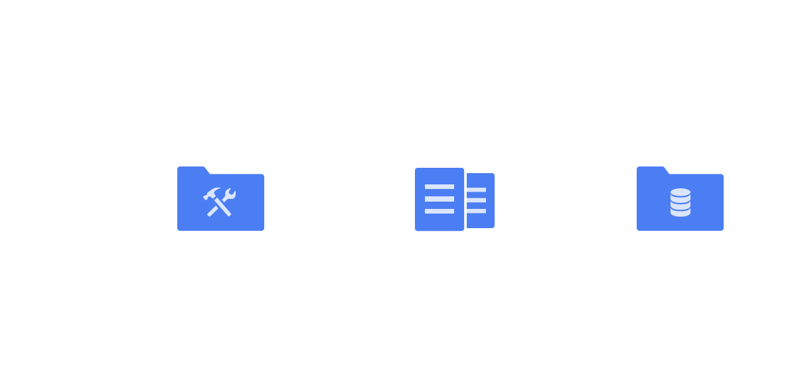

# Basic Git Workflow

Git is a software that allows you to keep track of changes made to a project over time. Git works by recording the changes you make to a project, storing those changes, then allowing you to reference them as needed.

## Git init

To turn a code directory into a Git project. We do this with:

```bash
git init
```

The word `init` means initialize. The command sets up all the tools Git needs to begin tracking changes made to the project.

The output after executing `git init` should look like this:

```bash
Initalized empty Git repository in /home/xxx/xxx/
```

## Git workflow



Nice! We have a Git project. A Git project can be thought of as having three parts:

1. A _Working Directory_: where you’ll be doing all the work: creating, editing, deleting and organizing files

2. A _Staging Area_: where you’ll list changes you make to the working directory

3. A _Repository_: where Git permanently stores those changes as different versions of the project

The Git workflow consists of editing files in the working directory, adding files to the staging area, and saving changes to a Git repository. In Git, we save changes with a _commit_.

### Git status

You can check the status of the changes you make with the command `git status`:

```bash
git status
```

### Git add

In order for Git to start tracking a file, the file needs to be added to the staging area.

We can add a file to the staging area with:

```bash
git add filename
```

where filename here refers to the name of the file you are editing.

### Git diff

Imagine that we edit a file. Since the file is tracked, we can check the differences between the working directory and the staging area with:

```bash
git diff filename
```

Changes to the file are marked with a `+` and are indicated in `green`.

### Git commit

A _commit_ is the last step in our Git workflow. A commit permanently stores changes from the staging area inside the repository.

Here’s an example:

```bash
git commit -m "Complete first line of dialogue"

```

Standard Conventions for Commit Messages:

- Must be in quotation marks
- Written in the present tense
- Should be brief (50 characters or less) when using `-m`

The message should describe the point of the commit, reflect on how the project has changed since it began.

### Git log

Often with Git, you’ll need to refer back to an earlier version of a project. Commits are stored chronologically in the repository and can be viewed with:

```bash
git log
```

```bash
commit 612acdxxxxxx
Author: user <user@gmail.com>
Date:   Fri Jul 14 17:33:49 20xx -0400

    chore: update xxxx
```

In the output, notice:

- A 40-character code, called a SHA, that uniquely identifies the commit. This appears in orange text.
- The commit author (you!)
- The date and time of the commit
- The commit message

## Summary

- `git init` creates a new Git repository
- `git status` inspects the contents of the working directory and staging area
- `git add` adds files from the working directory to the staging area
- `git diff` shows the difference between the working directory and the staging area
- `git commit` permanently stores file changes from the staging area in the repository
- `git log` shows a list of all previous commits
