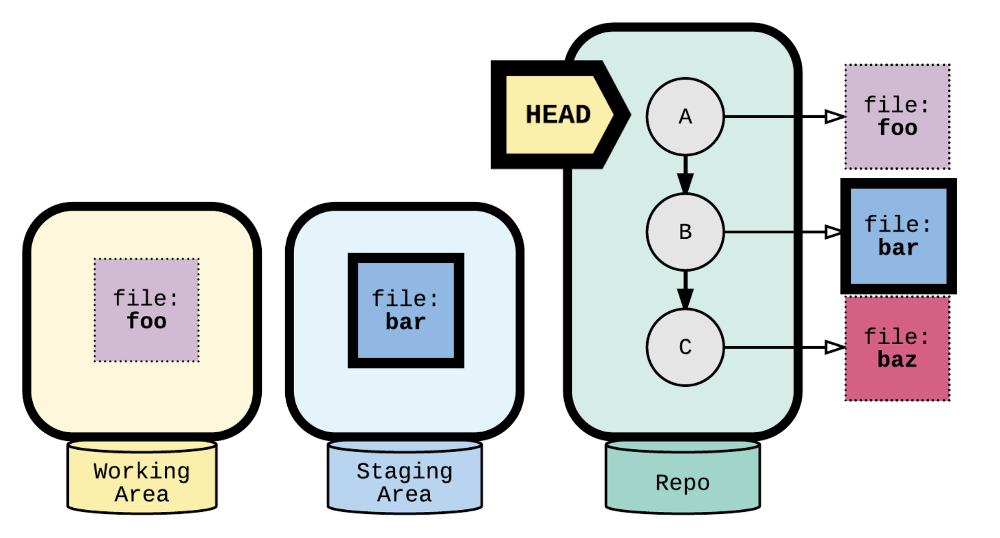

# HOW TO BACKTRACK

## Backtracking

When working on a Git project, sometimes we make changes that we want to get rid of. Git offers a few eraser-like features that allow us to undo mistakes during project creation.

### head commit

In Git, the commit you are currently on is known as the `HEAD` commit. In many cases, the most recently made commit is the `HEAD` commit.

To see the `HEAD` commit, enter:

```bash
git show HEAD
```

The output of this command will display everything the `git log` command displays for the `HEAD` commit, plus all the file changes that were committed.

### git checkout


What happens when you `git checkout` a branch ?

1. Change `HEAD` to point to the new branch
2. Copy the commit snapshot to the staging area
3. Update the working area with the branch contents


What happens when you `git checkout --file` a file ?

- Replace the working area copy with the version from the current staging area


The command :

```bash
git checkout -- <file_path>
```

What happens when you git checkout `<COMMIT>` -- file?

1. Update the staging area to match the commit
2. Update the working area to match the staging area.


you can also checkout a file from a specific commit :

- it copies to both working area & staging area

the command is :

```bash
git checkout <commit> -- <file_path>
```

if you want to restore a deleted file :

```bash
git checkout <deleting_commit>^ -- <file_path>
```

⚠️ `Warning` :
_This operation will overwrite
files in the working directory and staging area with no warning!_

The command :

```bash
git checkout HEAD filename
```

will restore the file in your working directory to look exactly as it did when you last made a commit. Filename refers to the actual name of the file.

### git clean

Git clean will clear your working area by deleting untracked
files.

⚠️ `Warning` :
_This operation can't be undone_

you can use :

- the `—dry-run` flag to see what would be deleted
- The `-f` flag to do the deletion

- The `-d` flag will clean directories

```bash
# shows a message saying "Would remove a-note.txt"
❯ git clean --dry-run

# shows a message saying "Would remove a-note.txt and scratch/
❯ git clean -d --dry-run

# Removing a-note.txt without warning
# Removing scratch/ without warning
❯ git clean -d -f

❯ git status
nothing to commit, working tree clean
```


### git reset I

What if, before you commit, you accidentally delete an important line? What if you added a file to the staging area and you don’t want to include it in the commit ?

We can _unstage_ that file from the staging area using

```bash
git reset filename
```

This command _resets_ the file in the staging area to be the same as the `HEAD` commit. It does not discard file changes from the working directory, it just removes them from the staging area.

Without a path :

- By default, git performs a `git reset —mixed`

For commits :

- Moves the `HEAD` pointer, optionally modifies files

For file paths:

- Does not move the HEAD pointer, modifies files

There are 3 options for reset

- soft
- mixed (default)
- hard

Note :
`~` : default to the first parent

`RESET --SOFT`: MOVE HEAD (not used frequently)

```bash
git reset --soft HEAD~
```


Moves the head pointer :


`RESET --MIXED`: MOVE HEAD, COPY FILES TO STAGE

```bash
git reset HEAD~
git reset --mixed HEAD~
```


Moves the head pointer and copy the file `bar` to the staging area (working dir remained the same) :


`RESET --HARD`: MOVE HEAD, COPY FILES TO STAGE & WORKING

```bash
git reset --hard HEAD~
```

⚠️ `Warning` :
_this overwrites files and cannot be undone!_

.

Moves the head pointer, copy the file `bar` to the staging area and the working directory :


- You can undo A git reset WITH `ORIG_HEAD`

In case of an accidental `git reset -`, Git keeps the previous value of `HEAD` in variable called `ORIG_HEAD`.

To go back to the way things were:

```bash
git reset ORIG_HEAD
```


### git reset II

Git enables you to rewind to the part before you made the wrong turn. You can do this with:

```bash
git reset commit_SHA
```

This command works by using the first 7 characters of the SHA of a previous commit. For example, if the SHA of the previous commit is `5d692065cf51a2f50ea8e7b19b5a7ae512f633ba`, use

```bash
git reset 5d69206
```

`HEAD` is now set to that previous commit.

## git revert - THE “SAFE” RESET

- The original commit stays in the repository.

- Tip: Use revert if you’re undoing a commit that has already been shared.

- Revert does not change history.

```bash
git log --oneline

# Show 2 commits
2b0b3f2 (HEAD -> tech_posts) New blog post about python
cd0b57c (tag: v1.0, tag: my-first-commit, master) Initial commit

❯ git revert 2b0b3f2

# creates a new commit
[tech_posts a08a108] Revert "New blog post about python"
1 file changed, 0 insertions(+), 0 deletions(-)
delete mode 100644 posts/python.txt

git log --oneline


# Show 3 commits
a08a108 (HEAD -> tech_posts) Revert "New blog post about python"
2b0b3f2 New blog post about python
cd0b57c (tag: v1.0, tag: my-first-commit, master) Initial commit
```

Git revert creates a new commit that introduces the opposite changes from the specified commit :


