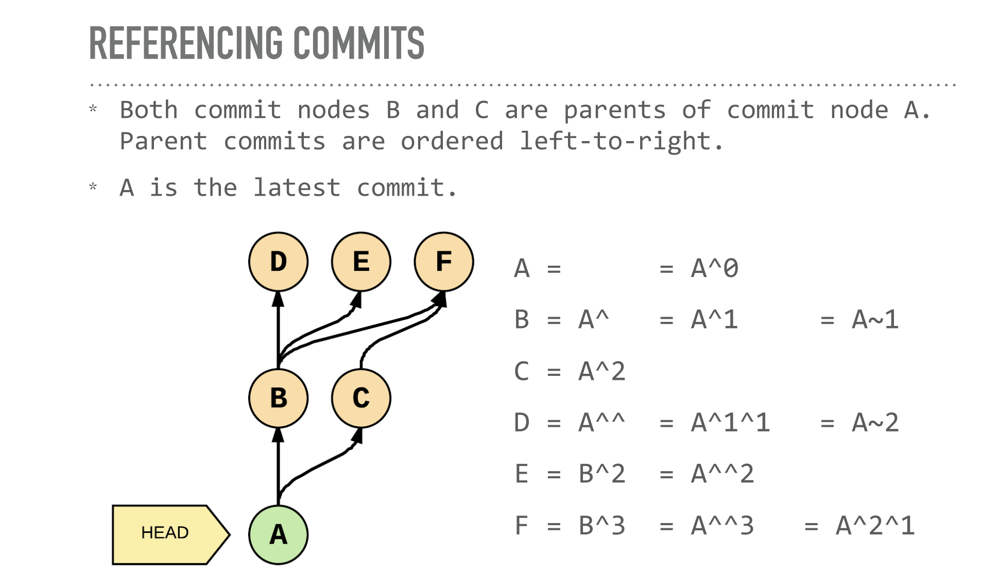

# Handy git operations

## Git stash

Let’s say you’re working on experimental code on a fresh branch and realize that you forgot to add something to a previous commit in order to continue your work. In order to go to a different branch, one must always be at a clean commit point. In this case you don’t want to commit your experimental code since it’s not ready but you also don’t want to lose all the code you’ve been working on.

A good way to handle this is by using `git stash`, which allows you to get back to a clean commit point with a synchronized working tree, and avoid losing your local changes in the process. You’re “stashing” your local work temporarily in order to update a previous commit and later on retrieve your work

The flow when using `git stash` might look something like this:

While working on a file, you find a small bug in a separate file from a previous commit that needs to be fixed before you continue.

```bash
git stash
```

Running the command above will store your work temporarily for later use in a hidden directory.

At this point, you can switch branches and do work elsewhere.
Once the bug is fixed, you want to retrieve the code you were working on previously, you can “pop” the work that was stored when you used `git stash`.

```bash
git stash pop
```

From here, you can continue your work and commit it when ready.

## Git log

At this point you might be familiar with the command `git log`, which allows you to view the commit history of the branch you currently have checked out.

There are other ways you can use git log in order to view recorded changes. Here are a few examples :

- `git log --oneline` shows the list of commits in one line format.

- `git log -S "keyword"` displays a list of commits that contain the keyword in the message. In the screenshot below, we use git log -S "Add" to find any commits with “Add” in the message.

- `git log --oneline --graph` - : the flag `--graph` Displays a visual representation of how the branches and commits were created in order to help you make sense of your repository history. When used alone, the description can be very lengthy, so you can combine the command with `--oneline` in order to shorten the description.

- `git log --since="yesterday/2weeks"` displays a list of commits made yesterday/2weeks ago.

- `git log —grep <regexp>` search for commit messages that match a regular expression. Can be mixed & matched with other git flags :

```bash
❯ git log --grep=mail --author=nina --since=2.weeks
```

- `git log --name-status --follow --oneline  -- <file_name>`

- `git --nopager log --name-status --follow --oneline  -- <file_name>` : no pager to see the ouput in the terminal (not in vim)

### GIT LOG: REFERENCING COMMITS

- ^ or ^n
- no args: ==^1: the first parent commit
- n: the nth parent commit
- ~ or ~n
- no args: == ~1: the first commit back, following 1st parent
- n: number of commits back, following only 1st parent
  note: ^ and ~ can be combined



## git show

show commit and contents:

- git show `<commit>`
- show files changed in commit:
- git show `<commit>` --stat
- look at a file from another commit:
- git show `<commit>:<file>`

```bash
git show b6c771
```

## Git commit amend

`--amend` flag is extremely useful when updating a commit, it allows you to correct mistakes and edit commits easily instead of creating a completely new one.

Shortly after, you realize you missed a few semicolons in one of your functions. You could technically create a new commit, but ideally, you want to keep all commits specific, clean, and succinct.

To avoid creating a new one, you could create your changes, stage them with `git add` and then type the command `git commit --amend` to update your previous commit.

It’s important to note that although it seems like `--amend` is simply updating the commit, what Git actually does is replace the whole previous commit. For this reason, when you execute the command `git commit --amend`, your terminal editor asks you to update your commit message.

However, if you want to keep the same commit message, you can simply add the flag `--no-edit`

## Git alias commands

When grouping commands together, you can end up writing very long lines of Git commands in the terminal such as:

```bash
git log --pretty=format:"%h %s" --graph
```

Fortunately, Git offers a helpful feature that can make your Git experience simpler, easier, and more familiar: aliases.

If you have a set of commands that you use regularly and want to save some time from typing them, you can easily set up an alias for each command using Git config.

Below are a couple of examples:

```bash
git config --global alias.co "checkout"
git config --global alias.br "branch"
git config --global alias.glop "log --pretty=format:"%h %s" --graph"
```

Once the aliases are configured, next time you want to check out to another branch you could type the command:

```bash
git co example_branch
```

Using Git aliases can create a much more fluid and efficient workflow experience when using Git. By getting creative with your aliases, you’re able to wrap a sequence of Git commands into one in order to save time and effort.
