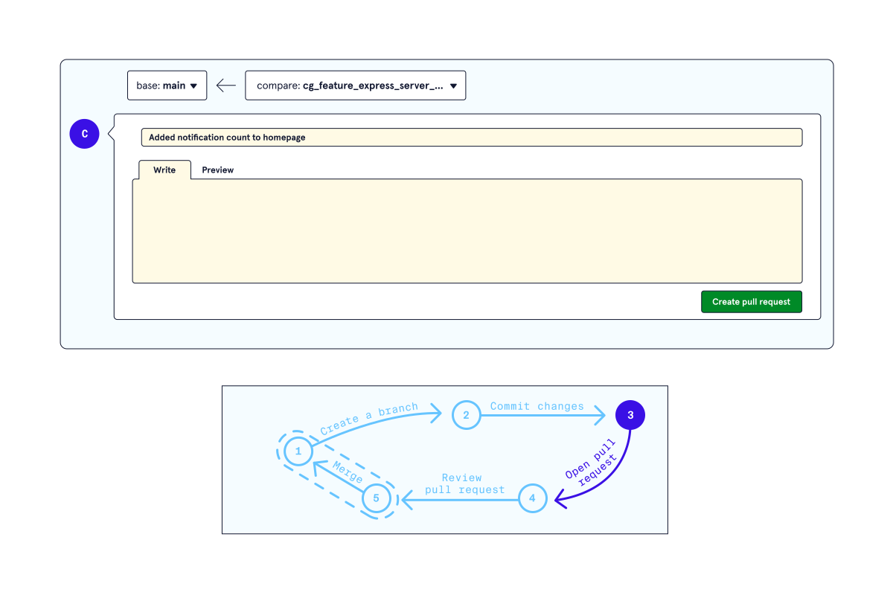
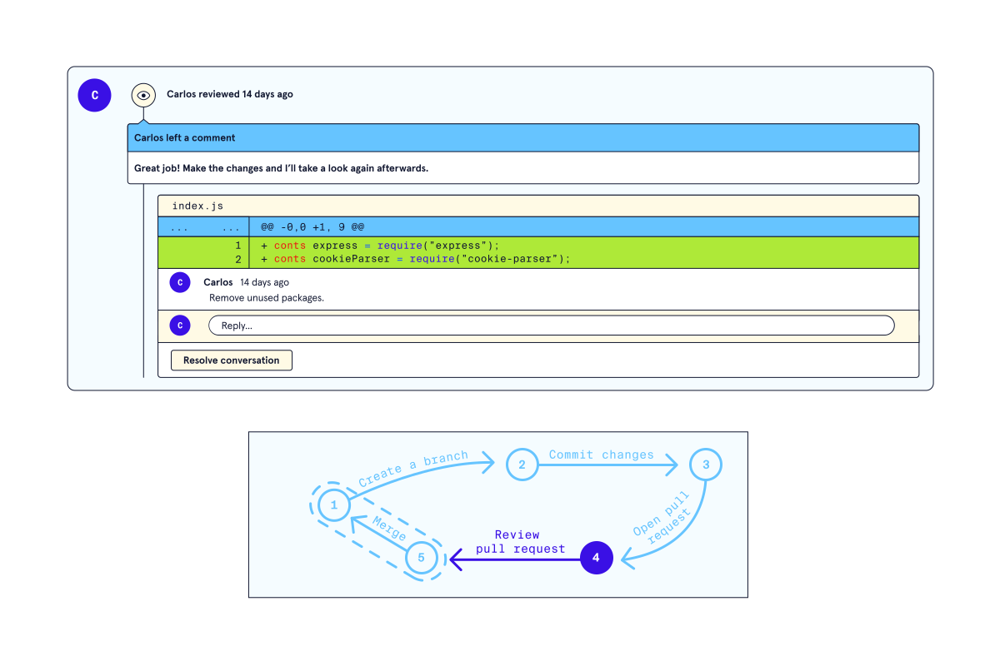
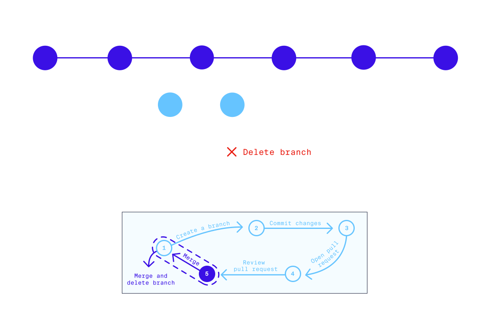

# THE GITHUB FLOW

## Introduction

When working on a project, things can scale rather quickly. Following a specific workflow allows the project to move in more orderly way.

Remember that Git is defined as a version control system that’s maintained on your local system. It helps you manage and record your source code history.

GitHub, on the other hand, is a hosting service for repositories. Simply put, Git is the tool and GitHub is the service for projects that use Git.

We’ll take a look at the basic workflow used with GitHub, which goes like this:

1. Create a branch
2. Commit changes
3. Create a pull request
4. Review pull request
5. Merge and delete branch

By sticking to that workflow, team members are able to isolate their work and avoid any conflicting code from being merged.

## Managing Branches

Whenever we’re working on a team creating multiple versions of a project code, it’s important to _isolate_ each teammate’s work in order to avoid any conflicts.

With Git, each teammate can create their own branch off of the main project in order to work on bug-fixes, new features, experimental code, etc.

A branch is essentially a divergence from the main project. ​​When you branch out, git is essentially making a new state of your current code, upon which you can work, without affecting the important main state of the code. One can create as many branches as they wish and even create branches off of other branches.

By using separate branches, the main project remains intact and unaffected before the changes are reviewed and merged into the project.

Each repository can have one or more branches. The main branch — the one where all changes eventually get merged back into, is called `main`. The `main` branch is usually the working version of a project and contains the production code, so it’s very important to only merge clean and correct code into it!

When someone wants to create a new feature, fix a bug, or just experiment, they should always create their own branch with a descriptive name.

Each team will adopt their own best practices when working together and figuring out naming conventions. For example, the branch name `carlos_feature_dashboard_notifications` includes the author, branch type, and short branch description. Other teams may pick branch names to correspond to ticket numbers from their project management tool.

## Adding and Committing Changes

Let’s assume you were recently assigned to a team to develop a feature for an app. You clone (download) the entire app repository from GitHub and create a branch for your feature of the `main` branch, and begin coding a new file in your local Git environment.

After testing your code and ensuring that everything is running correctly, it’s time to push those changes with a commit!

As a refresher, the git commit command records change to one or more files in your branch, assigning the commit a unique ID that identifies who created the changes, what changes were created, and when the changes were created.

You can commit along with a message describing your work, and lastly, push the commit to the remote Github repository.

## Creating a Pull Request

At this point, your work is ready to be reviewed before it’s integrated into the official project.

`Pull Requests` on GitHub allow collaborators to review and give feedback on proposed code changes before they are merged to the main branch.

Through a process of discussion and potentially some extra code changes, the pull request can be ultimately approved, which means you can merge the changes into the official project on the `main` branch.

When creating pull requests, it’s imperative that you include as much relevant detail in the description as possible in order to save review time. Add any comments or images that might be useful for your reviewer.

It’s also important to ensure that your code is running properly with the updated repository in order to prevent anything from crashing.Lastly, you don’t want to submit a pull request with 50 files containing a plethora of changes, instead, stick to smaller-sized pull requests since they’re easier and faster to review.

## Reviewing and Merging a Pull Request

Once you’ve created a pull request, other members in your team can review it up on GitHub.

The pull request should include a description and GitHub will display all the files with the changes created. Each line of code will have a clickable “+” button where you can add a comment in regards to the line.

While reviewing, it’s important to be constructive with feedback and be precise about what needs to be changed. Here are few best practices when reviewing code:

- Don’t only comment on _what_ should be changed, but _why_ it should be changed. Feel free to provide resources to make your point.

- Be as clear as possible with your comments and make sure to be clear as to what to modify.

- Look at the bigger picture and try to spot potential errors. Would the submitted code produce any obstacles if the project scales?

Once all the feedback is added, collaborators can click on “Submit Review” and wait for a response. If all goes well, the pull request will eventually be merged into `main`!

## Deleting a Branch and Review

Once changes are merged, in order to keep things organized and managed, it’s imperative to only keep active branches and delete the closed ones.

With that in place, this wraps up the flow of working on a project using Github. We explored:

- The importance of creating branches and isolating work from the main branch.

- Best practices of naming branches and making commits on branches.

- What a pull request is: a discussion page for a set of code changes between one branch and another.

- Merging a branch and delete it once it’s merged.

This covers the main steps of working with a team and managing the workflow using Github.

Github provides us with a number of useful tools that expand on Git functionality, especially if we’re collaborating with teammates!

