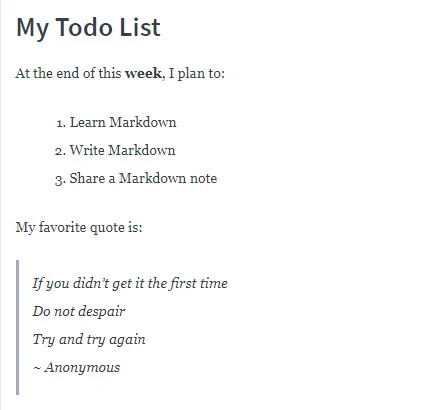

# GitHub and Markdown

## What is Markdown?

Markdown provides a lightweight syntax to style any text document so that it can be converted to HTML for viewing and publishing.

## Differences between HTML and Markdown

Markdown translates to HTML, but Markdown is not a replacement for HTML. Markdown’s syntax can be converted to a small subset of HTML tags to do things like format text, add links, display images, and more. You can even incorporate HTML elements inside a Markdown document. To render Markdown in HTML, though, you would need a tool called a Markdown parser

## Benefits of Using Markdown

Why would you use Markdown? Compared to HTML, writing text in Markdown is much faster because the syntax is simpler.

Imagine that we are writing down some important text on a sheet of paper. If we wanted to emphasize the text we might underline it, twice even! Similarly, in Markdown, we could write:

```md
# Title of My Document
```

Furthermore, a Markdown document without any HTML tags can be published as is because its syntax is already made for easy viewing. For example, the following Markdown document has:

- styled a heading ,
- emphasized week in bold with double asterisks (\*\*),
- bulleted a list by prefacing each item with a number and a period,
- and marked several lines as separate quotes with an angle bracket (>) per quote.

```md
# My Todo List

At the end of this **week**, I plan to:

1. Learn Markdown
2. Write Markdown
3. Share a Markdown note

My favorite quote is:

> If you didn't get it the first time
> Do not despair
> Try and try again
> ~ Anonymous
```

The HTML equivalent to the above would be:

```html
<h1>My Todo List</h1>
<p>At the end of this <strong>week</strong>, I plan to:</p>
<ol>
  <li>Learn Markdown</li>
  <li>Write Markdown</li>
  <li>Share a Markdown note</li>
</ol>
<p>My favorite quote is:</p>
<blockquote>
  <p>
    If you didn't get it the first time<br />
    Do not despair<br />
    Try and try again<br />
    ~ Anonymous
  </p>
</blockquote>
```

When viewed on a Markdown parser :



## When to use Markdown?

After knowing the many benefits of Markdown, you might want to consider using Markdown if you ever find yourself in any of these scenarios:

- The only editor available to you supports just plain text.
- Time is of the essence and you can’t afford to learn how to use an unfamiliar rich-text editor.
- You need to quickly outline your ideas in a structured but presentable manner.
- You want your document to be portable so that it can convert to HTML, PDF, EPUB, and/or MOBI.

## The Markdown Flavors

Because the core Markdown language supports only a subset of HTML features, many independent developers have extended the Markdown syntax to incorporate more HTML compatibilities and customize it for their own organizations. Here are a few popular flavors of Markdown:

- [CommonMark](https://commonmark.org/) is a body of special-interest developers who work side-by-side on a proposal to standardize the Markdown syntax and offer extensive test suites to validate Markdown implementations against this specification. This standard has been used by other developers to base their code upon.

- GitHub Flavored Markup, or [GFM](https://github.github.com/gfm/) is GitHub’s expanded dialect of Markdown based on CommonMark and is used throughout the GitHub platform by its active community.

- [Trello](https://help.trello.com/article/821-using-markdown-in-trello), a popular collaborative tool that organizes and tracks information through virtual boards and cards, implements a custom version of Markdown as well.

## How To Write a Good README for Your Project

### What Is a README File?

You may have noticed that when a GitHub repo is initialized, you see a prompt to create a README.md file immediately. As implied in its name, a [README](https://docs.github.com/en/repositories/managing-your-repositorys-settings-and-features/customizing-your-repository/about-readmes) file is a text file that is meant to be read as soon as someone views the repository. This file contains text to introduce, explain, and share the information required to understand what the project is about.

Since a README file is often the first thing a visitor sees, it should tell the viewer how to install and use the project. There is no one good way to structure a README but there is only one bad way: not to include a README at all.

### Conventions of a Good README File

Your README file should be as good as your project itself.

Make your project stand out and look professional by at least including the following elements in your README:

- `Project Title`: the name of your project

- `Description`: This is an extremely important component of the README. You should describe the main purpose of your project. Answer questions like “why did you build this project?” and “what problem(s) does it solve?”. It also helps to include your motivations for the project and what you learned from it.

- `Features`: If your project has multiple features, list them here. Don’t be afraid to brag if your project has unique features that make it stand out. You can even add screenshots and gifs to show off the features.

- `How to use`: Here, you should write step-by-step instructions on how to install and use your project. Any software or package requirements should also be listed here.

- `Technologies`: List all the technologies and/or frameworks you used and what purpose they serve in your project.

- `Collaborators`: If others have contributed to your project in any way, it is important to give them credit for their work. Write your team members’ or collaborators’ names here along with a link to their GitHub profile.

- `License`: It’s also important to list a license on your README so other developers can understand what they can and cannot do with your project. You can use this [guide](https://choosealicense.com/) to help you choose a license.

Keep READMEs brief but detailed. README should always be up-to-date and self-explanatory. If you have spent a lot of time on your project, you should also spend a good chunk of time on the README. It can help your future self as well when you step away for a while and need to get reacquainted with your project. Not to mention it’ll leave a positive impression on future interviewers who look at your GitHub profile.

For more information on GitHub’s formatting syntax, take a look at their [docs](https://docs.github.com/en/get-started/writing-on-github/getting-started-with-writing-and-formatting-on-github/basic-writing-and-formatting-syntax).
