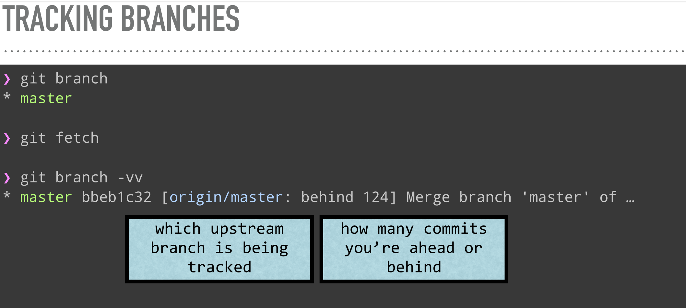
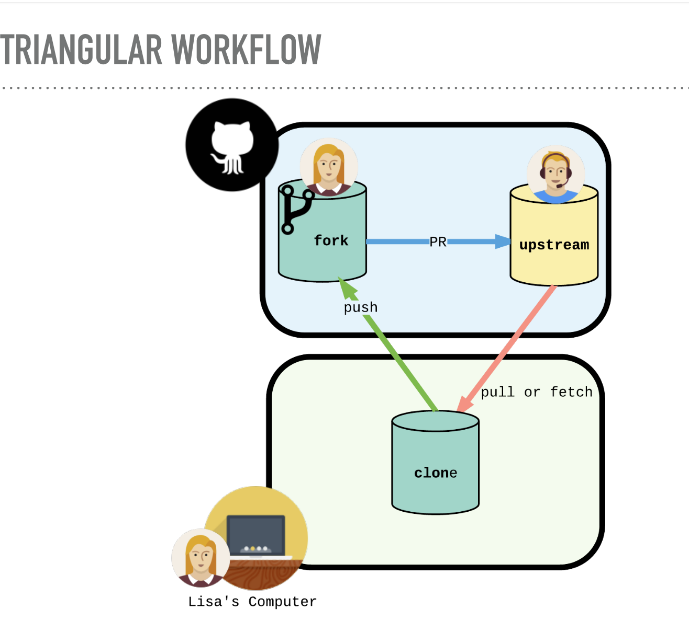
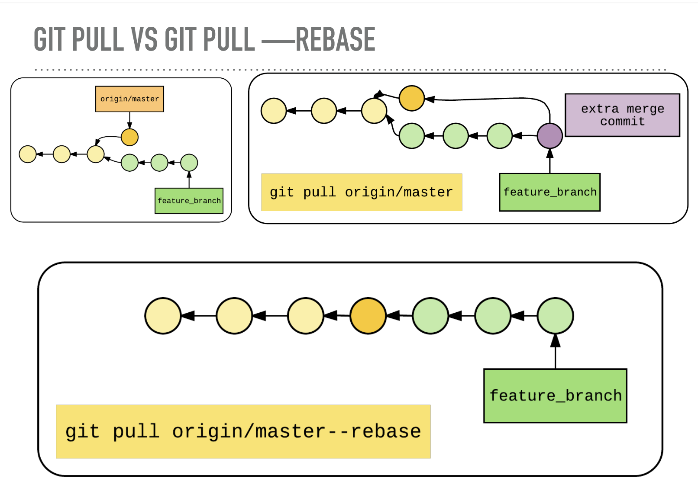

# GIT TEAMWORK

So far, we’ve learned how to work on Git as a single user. Git also offers a suite of collaboration tools to make working with others on a project easier.

Imagine that you’re a science teacher, developing some quizzes with Sally, another teacher in the school. You are using Git to manage the project.

In order to collaborate, you and Sally need:

- A complete copy of the project on your own computers
- A way to keep track of and review each other’s work
- Access to a definitive project version

You can accomplish all of this by using _remotes_.

A remote is a shared Git repository that allows multiple collaborators to work on the same Git project from different locations. Collaborators work on the project independently, and merge changes together when they are ready to do so.

## git clone

Sally has created the remote repository, **science-quizzes** in the directory **curriculum**, which teachers on the school’s shared network have access to. In order to get your own replica of **science-quizzes**, you’ll need to clone it with:

```bash
git clone remote_location clone_name
```

In this command:

- `remote_location` tells Git where to go to find the remote. This could be a web address, or a filepath, such as:

```bash
/Users/teachers/Documents/some-remote
```

- `clone_name` is the name you give to the directory in which Git will clone the repository.

## git remote -v

Nice work! We have a clone of Sally’s remote on our computer. One thing that Git does behind the scenes when you clone science-quizzes is give the remote address the name _origin_, so that you can refer to it more conveniently. In this case, Sally’s remote is _origin_.

You can see a list of a Git project’s remotes with the command:

```bash
git remote -v
```

Notice the output:

```bash
origin    /home/ccuser/workspace/curriculum/science-quizzes (fetch)
origin    /home/ccuser/workspace/curriculum/science-quizzes (push)
```

- Git lists the name of the remote, origin, as well as its location.
- Git automatically names this remote origin, because it refers to the remote repository of origin. However, it is possible to safely change its name.
- The remote is listed twice: once for `(fetch)` and once for `(push)`. We’ll learn about these later in the lesson.

## git fork

A fork is a copy of a repository that’s stored in your GitHub account.

You can clone your fork to your local computer.

It means that you can push changes to forked repo.

- If you want to merge changes back to original repo you've forked from, you can submit a pull request.

- If you want your forked repo to stay up to date with the source repo, set up an `upstream`

The upstream repository is the base repository you created a
fork from.

- This isn’t set up by default, you need to set it up manually.
- By adding an upstream remote, you can pull down changes that have been added to the original repository after you forked it.

```bash
git remote add upstream https://github.com/ORIG_OWNER/REPO.git

```

## Tracking branches

Track a branch to tie it to an upstream branch.

- Bonus: Use git push / pull with no arguments
- To checkout a remote branch, with tracking: `git checkout -t origin/feature`
- Tell Git which branch to track the first time you push: `git push -u origin feature`



## git fetch

What if, while you were teaching, Sally changed the **science-quizzes** Git project in some way. If so, your clone will no longer be up-to-date.

An easy way to see if changes have been made to the remote and bring the changes down to your local copy is with:

```bash
git fetch
```

Git fetch is important for keeping your local repository up to
date with a remote.

- It pulls down all the changes that happened on the server
- But, it doesn’t change your local repository!

## git merge

Even though Sally’s new commits have been fetched to your local copy of the Git project, those commits are on the `origin/main branch`. Your local `main` branch has not been updated yet, so you can’t view or make changes to any of the work she has added.

Now we’ll use the `git merge` command to integrate `origin/main` into your local main branch. The command:

```bash
git merge origin/main
```

## git pull

Pulling will pull down the changes from the remote repository
to your local repository, and merging them with a local branch.

Under the hood:

- git pull = git fetch && git merge
- If changes happened upstream, git will create a merge commit.
- Otherwise, it will fast-forward.

## Git workflow

Now that you’ve merged `origin/main`into your local `main` branch, you’re ready to contribute some work of your own. The workflow for Git collaborations typically follows this order :

1. Fetch and merge changes from the remote
2. Create a branch to work on a new project feature
3. Develop the feature on your branch and commit your work
4. Fetch and merge from the remote again (in case new commits were made while you were working)
5. Push your branch up to the remote for review

Steps 1 and 4 are a _safeguard_ against merge conflicts, which occur when two branches contain file changes that cannot be merged with the git merge command. Step 5 involves `git push`, a command.

Another workflow (contributing to open source) :



1. You forked the source repo
2. you clone a copy on your local repository
3. you fetch or pull changes made on source repo
4. you push changes to your forked repo
5. if you want to push changes to the source repo, you submit a pull request.

## git push

Now it’s time to share our work with Sally.

The command:

```bash
git push origin <your_branch_name>

```

will push your branch up to the remote, `origin`. From there, Sally can review your branch and merge your work into the master branch, making it part of the definitive project version.

Pushing sends your changes to the remote repository. git only allows you to push if your changes won’t cause a
conflict

Tip:
To see commits which haven’t been pushed upstream yet, use:

- `git cherry -v`

## Git pull rebase

- Git pull `—rebase` will fetch, update your local branch to copy the upstream branch, then replay any commits you made via rebase.

- Bonus: When you open a PR, there will be no unsightly merge commits!



## Advanced github

## Summary

- A remote is a Git repository that lives outside your Git project folder. Remotes can live on the web, on a shared network or even in a separate folder on your local computer.

- The Git Collaborative Workflow are steps that enable smooth project development when multiple collaborators are working on the same Git project.

We also learned the following commands :

- `git clone`: Creates a local copy of a remote.
- `git remote -v`: Lists a Git project’s remotes.
- `git fetch`: Fetches work from the remote into the local copy.
- `git merge origin/master`: Merges origin/master into your local branch.
- `git push origin` `<branch_name>`: Pushes a local branch to the origin remote.

Git projects are usually managed on Github, a website that hosts Git projects for millions of users. With Github you can access your projects from anywhere in the world by using the basic workflow you learned here.
