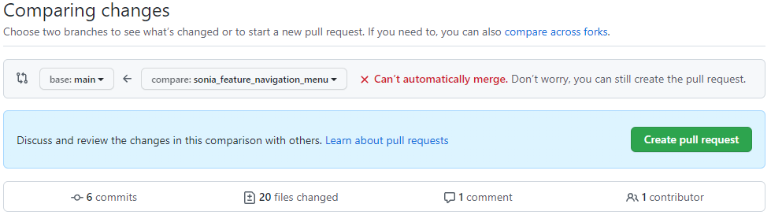

# How to write a good pull request?

## What Is a Pull Request?

Sonia, a new member of the engineering team, has just finished a snazzy navigation menu on a branch titled, “sonia_feature_navigation_menu”. Her changes will not be merged to the main branch until her pull request is approved.

A [pull request](https://docs.github.com/en/github/collaborating-with-pull-requests/proposing-changes-to-your-work-with-pull-requests/about-pull-requests) is a `feature` of GitHub and other source code management tools <u>to review code before merging it from one branch to another, usually the main branch</u>.

When Sonia creates a new pull request, her repository will automatically be set as the source repository and the project’s repository will be set as the destination repository. She will get the option to specify the source branch and the destination branch. She will be greeted with a preview of the changes between the two codebases and whether the branches can be merged automatically depending on code conflicts. In the Pull Request description field, Sonia must describe the code changes and what feature(s) this merge will add to the main branch.

Sonia’s proposed changes can then be accepted or rejected by her teammates. Each pull request has its own discussion forum, creating a place for collaborators to leave feedback. They will review Sonia’s code, suggest what should be removed or changed, and how her code can be simplified or improved. Any further commits Sonia makes to the source branch will automatically be reflected in the pull request. Once her changes are accepted by the project’s collaborators, her branch can be merged into the repository’s main branch. GitHub will keep this pull request in history as a record of the code change, Sonia’s contribution, and the discussion that took place.

This pull request process is not only a way to increase group knowledge or improve product quality but also an exceptional way to develop professional skills through group critique

## How To Make a Good Pull Request?

### Follow a Pull Request Structure – What, Why, and How?

If the pull request adds a new feature, go for something like “Add frontend component for settings page”. If it’s to fix a typo, be specific and say “Fix name typos on the Contact Us page”.

The description is where all the juicy details are. You want the reviewers to know the thought process behind code changes and the options you have considered. It also helps to embed screenshots, GIFs, or even videos of your application so reviewers can anticipate what the code change in the pull request looks like.

Some developers even have preconfigured templates or checklists on their repositories to ensure all pull requests contain just the relevant information. Following these guidelines help speed up collaborative critiques so the code can get merged faster!

### Make Commit Messages Clear and Use Comments

Even having self-explanatory commit messages and comments in the code makes reviewers’ jobs much easier. Consider the commit message, `“OMG! It finally worked”` versus the message, `“Fix typos: add missing @ symbols in emails”`.

Moreover, adding comments in the code is always a good practice to help other developers understand the function of specific lines. It helps the reviewer in this case!

One feature of GitHub pull requests on the web interface is the ability to add discussion comments to any single line of code or chunk of code. This allows separation of concerns over multiple discussions.

### Keep Pull Requests Small and Fast

Reduce the size of pull requests and respond to reviews quickly. Splitting big features into smaller parts is the best way to speed up review time. Not only does it result in less wasted work if the pull request gets rejected, but it will be easier to merge and review more thoroughly. Quickly respond to any feedback or requested changes. You want to ship code fast and make sure reviewers aren’t stuck discussing an open pull request for ages!
