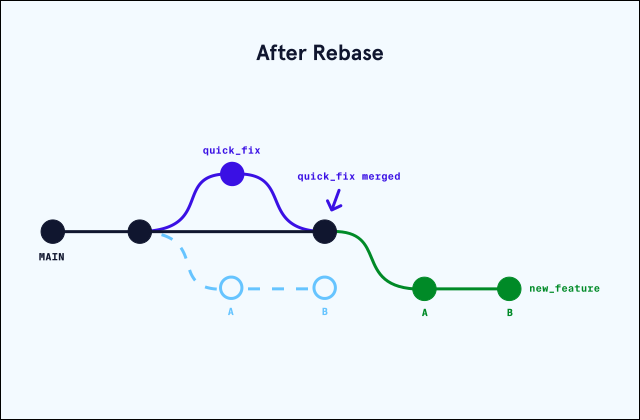

# How To Use Git Rebase - rewrite history

## git amend

Amend is a quick and easy shortcut that lets you make changes to the previous commit.

The reason why the `Sha1` is different is because commits can't be edited!

- A commit is referenced by the SHA of all its data.

- Even if the tree the commit points to is the same, and the author is the same, the date is still different!

- A new commit is created.

## What is Git Rebase?

_The problem_ :
When working with a Git repository, there will be <u> a time when we need to combine changes from a working branch into another one</u>. This can be accomplished with the use of the commands merge or rebase. We’ll focus on rebase and see how it can work some magic in order to manage the future development of a product by simplifying git history.

At a high level, rebasing can be understood as “moving the base of a branch onto a different position”. Think of it like a redo — “I meant to start here.”

Consider that a team just completed a production release. While working on a completely new feature branch called `new_feature`, a co-worker finds a bug in the production release (`main` branch). In order to fix this, a team member creates a `quick_fix` branch, squashes the bug, and merges their code in to the `main` branch. At this point, the main branch and the `new_feature` branch have diverged and they each have a different commit history. We can visualize this in the image below:

Divergence between new branch and base branch :

- New branch is created
- Base branch contained new commits

If we want to bring the updated changes from `main` into `new_feature` one could use the `merge` command, but with `rebase` we can keep the Git commit history clean and easy to follow.
By “rebasing” the new_feature branch onto the main one, we move all the changes made from new_feature to the front of main and incorporate the new commits by rewriting its history. We can see how this is done below:

We can see above that the new “base” of our `new_feature` branch is the updated `main` branch with the previous changes from the bug fix implemented.

`rebase` means give a commit a new parent

In the example above, we we've create a new branch `tech_posts` but in the meantime time master had one new commit `25b38`.

If we execute the command `git rebase master` the previous commit `4080a` gets garbage collected and a copy of the new commit `25b38` is created. `tech posts` commit history was changed. The head will also point to the copy of the new commit.

One of the major benefits of using Git rebase is that it eliminates unnecessary merge commits required by `git merge`. Most importantly, the history of the changes made in the main repository remains linear and follows a clear path of changes. This allows us to navigate the changes easier when viewing the changes in a `log` or `graph`.

## Merge vs Rebase

Although `git rebase` is an extremely useful tool to keep a Git repository clean and easy to follow, it doesn’t mean that one should _always_ stick to that command when integrating code changes. Let’s go over the definitions of `rebase` and `merge` one more time:

- `Git rebase`: reapplies commits on top of another base branch.

- `Git merge`: joins two or more development histories together (creating a new merge commit).

In other words, Git merge preserves history as it happened, whereas rebase rewrites it.

Generally, if one is dealing with numerous branches, and the commit graph becomes really difficult to read, it can be very useful to use rebase instead of merge. Since Git rebase creates a linear history, it can be a lot easier to visualize the changes made and get a cleaner graph.

In the end, each team will develop their preferred method of integrating changes and preserving history. Generally, it’s useful to use merge whenever we want to add changes of a branch back into the base branch. And rebase is useful whenever we want to add changes of a base branch back to a branched out branch.

## Interactive rebase (REBASE -I OR REBASE --INTERACTIVE)

Interactive rebase opens an editor with a list of “todos” :

- in the format of: `<command>` `<commit>` `<commit msg>`
- git will pick the commits in the specified order, or stop to take an action when editing or a conflict occurs.

interactive rebase with a shortcut:

- `git rebase -i <commit_to_fix>^`
- (the ^ specifies the parent commit)

`REBASE OPTIONS`:

- `pick` : keep this commit
- `reword` : keep the commit, just change the message
- `edit` : keep the commit, but stop to edit more than the message
- `squash` : combine this commit with the previous one. stop to edit the message
- `fixup` : combine this commit with the previous one. keep the previous commit message
- `exec`: run the command on this line after picking the previous commit
- `drop`: remove the commit (tip: if you remove this line, the commit will be dropped too!)

Editing a commit can also split it up into multiple commits!

1. Start an interactive rebase with rebase -i
2. mark the commit with an edit
3. git reset HEAD^
4. git add
5. git commit
6. repeat (4) & (5) until the working area is clean!
7. git rebase --continue

## TIP: “AMEND” ANY COMMIT WITH FIXUP & AUTOSQUASH

What if we want to amend an arbitrary commit?

1. git add new files
2. `git commit --fixup <SHA>`
3. this creates a new commit, the message starts with ‘fixup!’
4. `git rebase -i --autosquash <SHA>^`
5. git will generate the right todos for you! just save and quit.

At any time before rebase is done, if things are going wrong:

-`git rebase --abort`

## Disadvantages of using rebase

As useful as Git rebase can be, it doesn’t come without risks. When using git rebase in our workflow it’s imperative to understand that rebase is a destructive operation and creates new commits, which can make it complicated to track the context of any changes made. One common rule when using rebase is to only use it locally. That is to say, once something has been pushed then do not rebase it after that. Otherwise, things can get convoluted when rewriting history on a remote.

Since we’re rewriting history we will also have to solve more commit conflicts. When we merge a branch, we only need to solve the conflicts once straight into the merge commit. However, when using rebase we might end up having to solve similar conflicts in previous commits that are being rewritten because rebase practically cherry-picks each commit individually and attempts to merge it in. If a commit introduces a conflict, rebase will complain about it even if the conflict is fixed in subsequent commits. In order to reduce the number of merge conflicts, it’s suggested to rebase often and to also squash changes into one commit as much as possible.

Moreover, make sure that the branch we’re working on is not a shared branch. A shared branch meaning a branch that exists on the distant repository and that other people on our team could pull. Why should we avoid this? Well, remember that rebasing changes commit history. So if we share our commits publicly, and others start additional work based on those commits, our trees are no longer in sync after rebasing. As a golden rule, it’s important to only use rebase on a local branch that we’re working on individually.

## Conclusion

Git rebase can be a very powerful tool when working with numerous people and branches, if used correctly it allows everyone to view a very clean commit history and track what commits fixed given defects or whether or not a commit was included in a release. However, it’s critical to understand how it works and the risks that come with it since it’s a destructive operation. If done so correctly, it can result in a very fluid and effective workflow.
