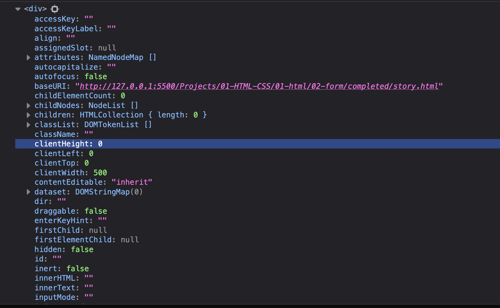

# State and View, JS and Events

`TLDR`:

- The DOM is a representation of the elements rendered on the page. It's a tree-like model of a web page that allows for scripting languages (like javascript) to access elements on that page.

- Javascript allows us to create and save data(state)

- The `Document` object allows us (developers) to interact in javascript with the DOM

- Event handlers allow us to let the user change data in javascript.

## UI development overview

### Almost every piece of technology needs a visual UI

What's a UI ?

It's the content displayed on a screen that a user can _interact_ with. For example : Tik Tok allows you to watch videos, create video, like and comment videos, etc..

Everything we see on the screen is related to some data under the hood :

- Videos
- Number of views
- Number of likes
- Photos
- Comments etc..

There are two goals to `UI engineering` :

1. display content (state/data) on the screen
2. allow users to interact with that content (i.e change the underlying data)

We will focus on the `web browser`, but there are many others "machine" that display content and allow users to interact with that content :

- Pilot dashboard
- Microwave etc..

### _First problem_: How do we display content in the web browser?

- Using only HTML

It's a 3 steps process :

`index.html`

1. first, we add in an html document, a list of elements that we want to display on the page like so :

```html
<h1>What's on your mind?</h1>
<input />
<button>Publish</button>
<p>Happy new year!</p>
<p>♥️7</p>
```

⤵️

2. This list of HTML elements above produces a list of elements in C++, called the _DOM_ (**D**ocument **O**bject **M**odel). The DOM is a _tree-like_ model (or representation) of the elements rendered on a web page. An element is referred to as a **Node**. We can _imagine_ that this list would look something like the following:

```c++
[
NODES :
 - input
 - button
   -- 'publish'
 -p
   --'Happy new year!'
 -p
   --'♥️ 7'
]
```

3. Finally, this list of elements in C++ is converted by the _layout and render engine_ into actual pixels rendered on a page.

⤵️ Layout and render engine


What if we want display dynamic data on the screen? We use `javascript`.

Here’s an example :

```html
<!-- index.html -->
<input />
<div></div>
<script src="app.js"></script>
```

⤵️

Again, the list of elements in HTML produces a list of elements in C++. We can _imagine_ that this list would look something like the following:

```c++
DOM - Model (representation) of the page
[
NODES :
 - input
 - div
 - script --> <App.js>
]
```

```js
// app.js
let post = 'hi!'

const jsdiv = document.querySelector('div')

jsdiv.textContent = post
```

This is how it works :

- Our HTML code is loaded into the browser and parsed by the HTML parser.

- Three nodes are added in the DOM.

- Adding the `script node` triggers the `javascript` engine.

- In our `js` file :

  - We defined a variable `post` and assign to it the string '`hi`'

  - We also defined a constant `jsdiv` and assign to it the return value of calling the `querySelector` method on the `document` object, passing in the string '`div`'. The `querySelector` method will query(search) the first `<div>` element in the DOM. However, we cannot bring back in `javascript` something that was written in C++ (remember that the browser language is C++). That's why under the hood, `querySelector` will create an _object_ in `javascript` which will have an hidden link to the `<div>` node in C++. This object will also be populated with a lot of _methods and properties_ (like `textContent`) to interact with the _selected_ DOM node (`<div>`).



- On the next line, we access the `jsdiv` object and we set the value of the `textContent` property to be the value of `post`, which is the string `hi`. This will update the DOM and finally the string `'hi'` is displayed on the screen.


This is how we use `javascript` to create and save data(state) and the `DOM` to display data on the screen.

### _Second problem_: How do we enable users to add data on the page and use it to update the DOM ?

Again, what a user sees on the screen is under the hood stored as data. To enable users to change the content they see, we need to enable them to change the underlying data. We can do this with `HTML`, `javascript` and the `DOM event API`.

Here’s an example of how that might work:

```html
<!-- index.html -->
<input />
<div></div>
<script src="app.js"></script>
```

⤵️

```c++
DOM - Model (representation) of the page
[
NODES :
 - input
 - div
 - script --> <App.js>
]
```

```js
// app.js
let post = ''
const jsInput = document.querySelector('input')

const jsdiv = document.querySelector('div')

function handleInput() {
  post = jsInput.value // affect js
  jsDiv.textContent = post
}

jsInput.onInput = handleInput
```

This is how it works :

- Same steps as before, HTML gets loaded into the browser and parsed

- Three nodes are added to the DOM(list)

- Adding the `script node` triggers the `javascript` engine

- In our `js` file :

  - We defined a variable `post` and assign to it an empty string

  - We defined a constant `jsInput` and assigned to it the _return value_ of calling the `querySelector` method passing in string 'input'. The ouput is an accesor _object_ with an hidden link to the `<input/>` element on the DOM. This object is also full of methods and properties (such as `value`, `onInput`) that allow us to interact with the _selected_ DOM node .

  - On the next line, we defined a constant `jsDiv` and assigned to it the return value of calling the `querySelector` method passing in the string `div`. The ouput is also an accesor _object_ with an hidden link to the first `<div>` element on the DOM. This object is also full of methods and properties (such as `textContent`) that allow us to interact with the _selected_ DOM node.

  - Next, we defined a function called `handleInput`

  - Finally, we access the object `jsInput` and we set the value of the property `onInput` to be the function `handleInput`. (The technical term for handleInput is an _event handler_). This means that whenever a user enters or deletes any character inside the `<input>`, `handleInput` will be called back and executed.

For example, if a user type '`hi`' in the input element :

- The _value_ property of the `<input>` element in the DOM will be set to '`hi`'.

- The function `handleInput` will be automatically called :

  - `post` is reassigned the value entered by the user
  - the value of the `textContent`'s property of the object `jsDiv` is reassigned to the value of `post` which is the string '`hi`'

- The DOM is updated with the new value from `javascript` and the page re-renders.


**Note**:

Notice that every change of data (like user input) will to require a back and forth between C++ (DOM) and JavaScript (app.js). There's no permanent bond in JS memory and in C++ memory.

Every single change will to require a manual running of a handler function `handleInput` which will to change data in `js` :

```js
let post = '' // -> 'hi'
function handleInput() {
  post = jsInput.value // change data js
  ...
}
```

and a manual execution of a setter (like `textContent`) to change data in C++ and update the DOM :

```js
const jsdiv = document.querySelector('div')
let post = '' // -> 'hi'
function handleInput() {
  ...
  jsDiv.textContent = post  // update the DOM
}
```

In the next lesson we're going to discuss the challenges of data binding in the UI.

[Next Lesson ⏩](https://github.com/hermkan/code-journey-notes/blob/main/notes/04-building-UI/01-build-ui-with-vanilla-js/2.%20data-binding-ui.md)
