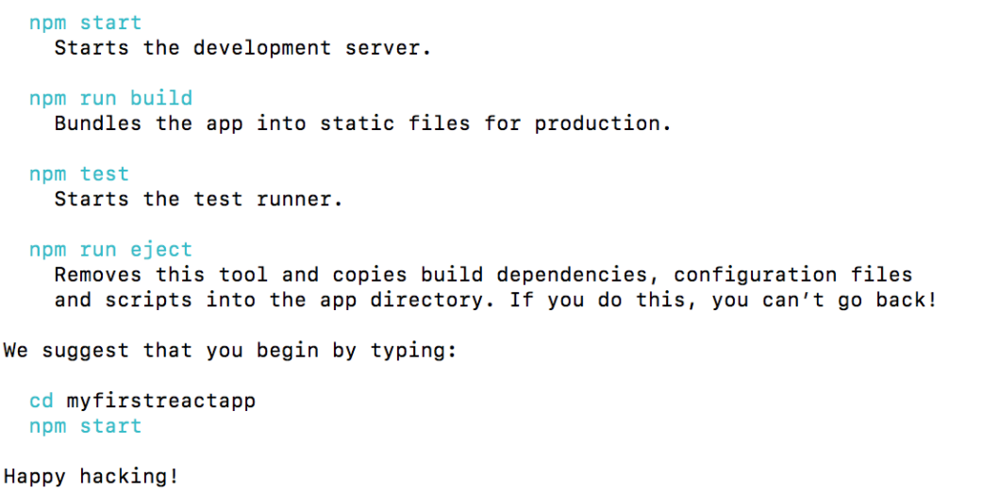
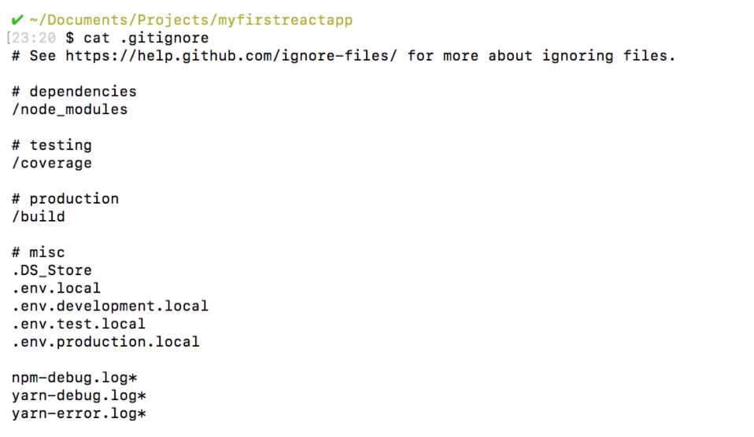
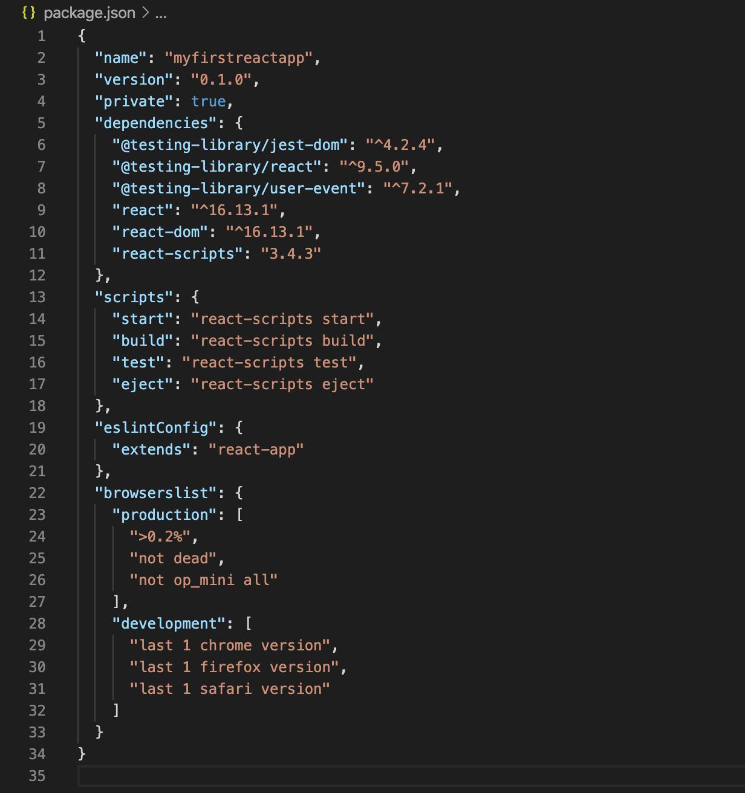
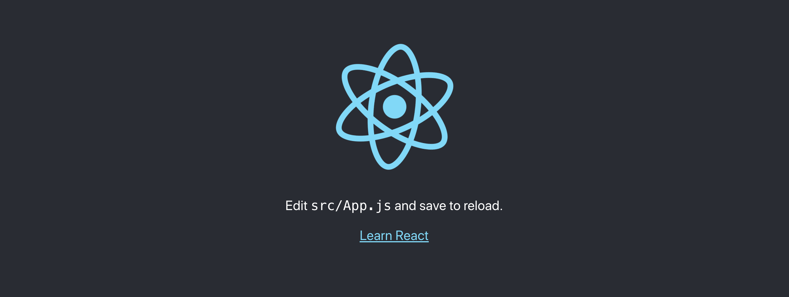

# React Components

_TLDR_:

- React applications are made up of components.

- Components are responsible for rendering pieces of the user interface.

- To create components and render them, react and reactDOM must be imported.

- React components can be defined with Javascript functions to make function components.

- Function component names must start with a capitalized letter, and Pascal case is the adopted naming convention.

- Function components must return some React elements in JSX syntax.

- React components can be exported and imported from file to file.

- A React component can be used by calling the component name in an HTML-like self-closing tag syntax.

- Rendering a React component requires using .createRoot() to specify a root container and calling the .render() method on it.

- Function components can return multiple JSX lines by nesting the elements in a parent element.

- Variable attributes can be used inside of a React component with JavaScript injections.

- React components support logic by putting the logic statements above the return statements.

- Components can conditionally return JSX elements by putting conditional statements inside of the components.

- Components can respond to events by defining event handlers and passing them to the JSX elements.

## What's a component?

React applications are made of **components**.

What’s a component?

A component is a small, reusable chunk of code that is responsible for one job. That job is often to render some HTML and re-render it when some data changes.

This code will create and render a new React component :

```jsx
import React from 'react'
import ReactDOM from 'react-dom/client'

function MyComponent() {
  return <h1>Hello world</h1>
}

ReactDOM.createRoot(document.getElementById('app')).render(<MyComponent />)
```

## Import React

The first React component we created in the last exercise started with importing react. The line that did this is:

```jsx
import React from 'react'
```

This creates an object named `React`, which contains methods necessary to use the `React` library. `React` is imported from the '`react`' package, which should be installed in your project as a dependency. With the object, we can start utilizing features of the react library!

## Import ReactDOM

Another import we need in addition to React is `ReactDOM`:

```jsx
import ReactDOM from 'react-dom/client'
```

The methods imported from 'react-dom' interact with the DOM.

The methods imported from 'react' do not deal with the DOM at all. They don’t engage directly with anything that isn’t part of React.

To clarify: the DOM is _used_ in React applications, but it isn’t _part_ of React.

After all, the DOM is also used in countless non-React applications. Methods imported from '`react`' are only for pure React purposes, such as creating components or writing JSX element

## Create a Function Component

It’s useful to think of components as smaller pieces of our interface. Combined, they are the building blocks that make up a React application. In a website, we can create a component for the search bar, another component for the navigation bar, and another component for the dashboard content itself.

Here’s another fact about components: we can use JavaScript functions to define a new React component. This is called a **function component**.

In the past, React components were defined using Javascript _classes_. But since the introduction of _Hooks_ (something we’ll discuss later), function components have become the standard in modern React applications.

After we define our functional component, we can use it to create as many instances of that component as we want.

Let’s take a look at the example from the first exercise:

```jsx
import React from 'react'

function MyComponent() {
  return <h1>Hello, I'm a functional React Component!</h1>
}

export default MyComponent
```

A function is defined with the name `MyComponent`. Inside, the function returns a React element in JSX syntax:

```jsx
return <h1>Hello, I'm a functional React Component!</h1>
```

## Name a Functional Component

Function component names must start with capitalization and are conventionally created with PascalCase! Due to how JSX tags are compiled, capitalization indicates that it is a React component rather than an HTML tag.

This is a React-specific nuance! If you are creating a component, be sure to name it starting with a capital letter so it interprets it as a React component. If it begins with a lowercase letter, React will begin looking for a built-in component such as div and input instead and fail

## Function Component Instructions

Let’s review what you’ve learned so far!

1. `import React from 'react'` creates a JavaScript object. This object contains properties that are needed to make React work, such as React.createElement()

2. `import ReactDOM from 'react-dom/client'` creates another JavaScript object. This object contains methods that help React interact with the DOM, such as ReactDOM.createRoot()

3. by writing a JavaScript function, a function component was defined. We can’t see this component quite yet, as it’s more of a factory that produces instances of itself when used. If we want to see it, we need to render it into the DOM.

4. Whenever you create a function component, you need to give that function component a name. That name should be written in Pascal case like this: UpperCamelCase.

Something that we haven’t _talked_ about yet is the body of your function component:

Here’s what your function body would look like on its own, without the rest of the function declaration syntax

```jsx
return <h1>Hello, this is a function component body.</h1>
```

That doesn’t look like a set of instructions explaining how to build a React component! Yet that’s exactly what it is.

## The Return Keyword in Functional Components

When we define a functional component, we essentially define a factory that `can build the appropriate combination of elements every time we reference its name`. It builds it by consulting a set of instructions that you must provide.

Functional components can be thought of in a very similar vein to regular Javascript functions, except that their job `is to assemble a portion of the interface based on instructions given`!

Our instructions can include a combination of markup, CSS, and JavaScript to produce the desired result. The one thing we must always include is a **return** statement.

The function is expected to produce JSX code that can be used to render something onto the browser screen. Thus, when we define functional components, we must return a `JSX` element.

```jsx
return <button>Back To Home</button>
```

Of course, this doesn’t quite make `<button>Back To Home</button>` render onto the browser screen yet. We’ve only defined our component.

## Importing and Exporting React Components

There’s a little bit more work we have to do _before_ we can use our defined component and have it _rendered_ onto the DOM.

A React application typically has two core files: `App.js` and `index.js`.`App.js` file is the _top level_ of your application, and `index.js` is the _entry point_.

That means that typically, you define the component inside of `App.js`, but because `index.js` is the entry point, we have to export it to `index.js` to render.

We can keep our component pieces separated, organized, and reusable by putting them into separate files and exporting them to where we need them.

To export them, we can prefix it with the `export` declaration and specify if it is a default or named export. In this case, we’ll stick with `default`.

After the function component definition, in `App.js`, we can default export our component like so :

```jsx
export default MyComponent
```

We can head into our`index.js` file to import our component from './App':

```jsx
import MyComponent from './App'
```

This will allow us to use `MyComponent` in `index.js`.

## Using and Rendering a Component

Now that we have a defined function component, we can start using it.

We can use it with an HTML-like syntax that resembles a self-closing tag:

```jsx
<MyComponent />
```

If you need to nest other components in between, you may also use an opening and corresponding closing tag structure:

```jsx
<MyComponent>
  <OtherComponent />
</MyComponent>
```

However, to render our component to the browser, we must rely on the `.createRoot()`and `.render()` methods from the `react-dom` library. This should be done in our entry point, `index.js`.

First, we call the `createRoot` method to create a React root container for displaying content. React applications typically have a single root DOM node, and everything inside it is managed by React DOM.

In other words, we give `createRoot` a DOM element to render in, and React will take over managing the DOM inside it

Here’s an example:

```jsx
ReactDOM.createRoot(document.getElementById('app'))
```

- `document.getElementById('app')` returns a DOM element from **index.html**.

- `.createRoot()` receives the DOM element as the first argument and creates a root for it.

- .createRoot() returns a reference to the root container on which you can call methods like `.render()`.

After the root is created, all that’s left to do is call the `.render()` method on the returned root and display the React component like so:

```jsx
ReactDOM.createRoot(document.getElementById('app')).render(<MyComponent />)
```

From here, React will display `<MyComponent />` in the root and make it appear on the screen.

In an application fully built with React, you will only need to do this once. Once this is set up, React will manage the DOM of your application, and any updates to the UI is taken care of efficiently. Adding more components should take place in your top-level **App.js** file.

## Use Multiline JSX in a Component

Take a look at this HTML:

```html
<blockquote>
  <p>
    The world is full of objects, more or less interesting; I do not wish to add
    any more.
  </p>
  <cite>
    <a target="_blank" href="https://en.wikipedia.org/wiki/Douglas_Huebler">
      Douglas Huebler
    </a>
  </cite>
</blockquote>
```

How might you make a React component return this HTML?

```jsx
function QuoteMaker() {
  return (
    <blockquote>
      <p>
        The world is full of objects, more or less interesting; I do not wish to
        add any more.
      </p>
      <cite>
        <a target="_blank" href="https://en.wikipedia.org/wiki/Douglas_Huebler">
          Douglas Huebler
        </a>
      </cite>
    </blockquote>
  )
}
```

The key thing to notice in is the _parentheses_ in the return statement. A multi-line JSX expression should always be wrapped in parentheses!

## Use a Variable Attribute in a Component

Take a look at this JavaScript object named `redPanda`:

```js
const redPanda = {
  src: 'https://upload.wikimedia.org/wikipedia/commons/b/b2/Endangered_Red_Panda.jpg',
  alt: 'Red Panda',
  width: '200px',
}
```

How could you render a React component with an image of `redPanda` and its properties?

```jsx
const redPanda = {
  src: 'https://upload.wikimedia.org/wikipedia/commons/b/b2/Endangered_Red_Panda.jpg',
  alt: 'Red Panda',
  width: '200px',
}

function RedPanda() {
  return (
    <div>
      <h1>Cute Red Panda</h1>
      
    </div>
  )
}
```

Note all the curly brace JavaScript injections inside the return statement. You can, and often will, inject JavaScript into `JSX` inside the return statement.

## Putting Logic in a Function Component

A function component must have a `return` statement. However, that isn’t _all_ that it can have.

You can also _put simple calculations that need to happen before returning your JSX element within the function component_.

Here’s an example of some calculations that can be done inside a function component:

```jsx
function RandomNumber() {
  //First, some logic that must happen before returning
  const n = Math.floor(Math.random() * 10 + 1)
  //Next, a return statement using that logic:
  return <h1>{n}</h1>
}
```

Watch out for this common mistake :

```jsx
function RandomNumber() {
  return (
    const n = Math.floor(Math.random() * 10 + 1);
    <h1>{n}</h1>
  )
}
```

In the above example, the line with the `const n`declaration will cause a syntax error, as it should come before the `return`.

## Use a Conditional in a Function Component

How might you use a conditional statement inside of a function component?

```jsx
function TodaysPlan() {
  let task
  let apocalypse = false
  if (!apocalypse) {
    task = 'learn React.js'
  } else {
    task = 'run around'
  }
  return <h1>Today I am going to {task}!</h1>
}
```

Notice that the if statement is located _inside_ of the function component, but _before_ the return statement.

## Event Listener and Event Handlers in a Componen

Your function components can include event handlers. With event handlers, we can run some code in response to interactions with the interface, such as clicking.

```jsx
function MyComponent() {
  function handleHover() {
    alert('Stop it.  Stop hovering.')
  }
  return <div onHover={handleHover}></div>
}
```

In the above example, the event handler is `handleHover()`. It is passed as a `prop` to the JSX element `<div>`. We’ll discuss more on `props` in a later lesson, but for now, understand that `props` are _information_ passed to a JSX tag.

The logic for what should happen when the `<div>` is hovered on is contained inside the `handleHover()` function. The function is then passed to the`<div>` element.

Event handler functions are defined _inside_ the function component and, by convention, start with the word “handle” followed by the type of event it is handling.

There’s a small quirk you should watch out for. Take a look at this line again:

```jsx
return <div onHover={handleHover}></div>
```

The handleHover() function is passed _without_ the parentheses we would typically see when calling a function. This is because passing it as `handleHover` indicates it should only be called once the event has happened. Passing it as `handleHover()`would trigger the function immediately, so be careful!

## How do you create a react app?

Note: We recommend using `create-react-app` or `vite` to focus on learning React. You will be able to take what you learn here and apply it to React frameworks like `Next.js`. We will use `create-react-app`

### Getting Ready

We will be using the Node package manager (npm), so you will need to have Node installed on your computer. To check if you have Node installed, run this command in your terminal:

```sh
node -v
```

If you have Node installed, this command will return a version number, like `v12.18.1`.

When you install Node, you automatically get npm installed on your computer as well. However, npm is a separate project from Node.js, and tends to update more frequently. As a result, even if you’ve just installed Node (and therefore npm), it’s a good idea to update your npm. Luckily, npm knows how to update itself!

To upgrade to the latest version of npm on \*nix (OSX, Linux, etc.), you can run this command in your terminal:

```sh
sudo npm install -g npm@latest
```

To upgrade on windows follow the steps found in in the [npm documentation.](https://docs.npmjs.com/try-the-latest-stable-version-of-npm)

### Setting Up the Boilerplate Application

Facebook has created a Node package [create-react-app](https://create-react-app.dev/) to generate a boilerplate version of a React application.

Besides providing something that works out-of-the-box, this has the added benefit of providing a consistent structure for React apps that you will recognize as you move between React projects. It also provides an out-of-the-box build script and development server.

We will use npx, a package runner tool that comes with npm 5.2+ and higher, to install and run [create-react-app](https://create-react-app.dev/). This will ensure that the latest version of [create-react-app](https://create-react-app.dev/) is used.

Open up your terminal.

- If you’ve previously installed create-react-app globally via npm install -g create-react-app, it is recommended that you uninstall the package first. In your terminal run these commands:

```sh
npm uninstall -g create-react-app
npx create-react-app myfirstreactapp
```

- If you’ve never installed create-react-app before, you can simply run this command:

```sh
npx create-react-app myfirstreactapp

```

- If you have `Yarn` installed, [create-react-app](https://create-react-app.dev/) will use it by default to create new projects. If you would prefer to use npm, you can append --use-npm to the creation command. It will look like this:

```sh
npx create-react-app myfirstreactapp --use-npm
```

(Feel free to replace myfirstreactapp with whatever name you want, as long as it doesn’t contain capital letters :-))

Upon completion, you will get some quick tips on how to use the application:



Before we run the app, let’s take a look around the app structure and see what it contains.

### React App Structure

Change directories into the app you just created, and open the app in the text editor of your choice. You should see the following file structure:

```sh
myfirstreactapp
├── node_modules
├── public
│   ├── favicon.ico
│   ├── index.html
│   ├── logo192.png
│   ├── logo512.png
│   ├── manifest.json
│   └── robots.txt
├── src
│   ├── App.css
│   ├── App.js
│   ├── App.test.js
│   ├── index.css
│   ├── index.js
│   ├── logo.svg
│   ├── serviceWorker.js
│   └── setupTests.js
├── .gititgnore
├── package.json
├── package-lock.json
└── README.md
```

[create-react-app](https://create-react-app.dev/) has taken care of setting up the main structure of the application as well as a couple of developer settings. Most of what you see will not be visible to the visitor of your web app. React uses a tool called `webpack` which transforms the directories and files here into `static assets`. Visitors to your site are served those static assets.

Don’t worry if you don’t understand too much about webpack for now. One of the benefits of using [create-react-app](https://create-react-app.dev/) to set up our React application is that we’re able to bypass any sort of manual configuration for webpack. If you’re interested in delving deeper into it on your own, you can find a [high-level overview of webpack’s core concepts here](https://webpack.js.org/concepts/).

#### .gitignore

This is the standard file used by the source control tool `git` to determine which files and directories to ignore when committing code. While this file exists, [create-react-app](https://create-react-app.dev/) did not create a git repo within this folder. If you take a look at the file, it has taken care of ignoring a number of items (even .DS_Store for Mac users):



#### package.json



This file outlines all the settings for the React app.

- `name` is the name of your app
- `version` is the current version
- "`private`": true is a failsafe setting to avoid accidentally publishing your app as a public package within the npm ecosystem.
- `dependencies` : contains all the required Node modules and versions required for the application. In the picture above, you’ll see six dependencies. The first three, as you may have guessed, are for the purpose of testing. The next two dependencies allow us to use react and react-dom in our JavaScript. Finally, react-scripts provides a useful set of development scripts for working with React.
- `scripts` specifies aliases that you can use to access some of the react-scripts commands in a more efficient manner. For example, running npm test in your command line will run `react-scripts test --env=jsdom` behind the scenes.

- You will also see two more attributes, eslintConfig and browserslist. Both of these are Node modules having their own set of values. browserslist provides information about browser compatibility of the app, while eslintConfig takes care of the [code linting](https://stackoverflow.com/questions/8503559/what-is-linting).

#### node_modules

This directory contains dependencies and sub-dependencies of packages used by the current React app, as specified by package.json. If you take a look, you may be surprised by how many there are.

Running `ls -1 | wc -l` within the **node_modules/** directory will yield more than 800 subfolders. This folder is automatically added to the `.gitignore` for good reason! Don’t worry, even with all these dependencies, the basic app will only be around `50 KB` after being minified and compressed for production.

#### package-lock.json

This file contains the exact dependency tree installed in **node_modules/**. This provides a way for teams working on private apps to ensure that they have the same version of dependencies and sub-dependencies. It also contains a history of changes to `package.json`, so you can quickly look back at dependency changes.

#### public

This directory contains assets that will be served directly without additional processing by webpack. `index.html` provides the entry point for the web app. You will also see a favicon (header icon) and a `manifest.json`.

The manifest file configures how your web app will behave if it is added to an Android user’s home screen (Android users can “shortcut” web apps and load them directly from the Android UI). You can read more about it [here](https://developers.google.com/web/fundamentals/engage-and-retain/web-app-manifest/)

#### src

This contains the JavaScript that will be processed by webpack and is the heart of the React app. Browsing this folder, you see the main App JavaScript component (`App.js`), its associated styles (`App.css`), and test suite (`App.test.js`). index.js and its styles (`index.css`) provide an entry into the App and also kick off the `registerServiceWorker.js`. This service worker takes care of caching and updating files for the end-user. It allows for offline capability and faster page loads after the initial visit. More of this methodology is available [here](https://developers.google.com/web/fundamentals/primers/service-workers).

As your React app grows, it is common to add a **components/** directory to organize components and component-related files and a **views/** directory to organize React views and view-related files.

### Starting the React App Development Server

when you ran [create-react-app](https://create-react-app.dev/), you just need to run `npm start` in your app directory to begin serving the development server. It should auto-open a tab in your browser that points to `<http://localhost:3000/>` (if not, manually visit that address). You will find yourself looking at a page resembling the following image:



As stated, any changes to the source code will live-update here. Let’s see that in action.

Leave the current terminal tab running (it’s busy serving the React app) and open **src/App.js** in your favorite text editor. You’ll see what looks like a mashup of JavaScript and HTML. This is JSX, which is how React adds XML syntax to JavaScript. It provides an intuitive way to build React components and is compiled to JavaScript at runtime. We’ll delve deeper into this in other content, but for now, let’s make a simple edit and see the update in the browser.

Change the main paragraph text to read Hello world! in App.js and save the file.

If you left the terminal running, you should be able to switch over to your browser and see the update. Congratulations! You’re now up and running with React. You can now begin adding functionality for your application.
