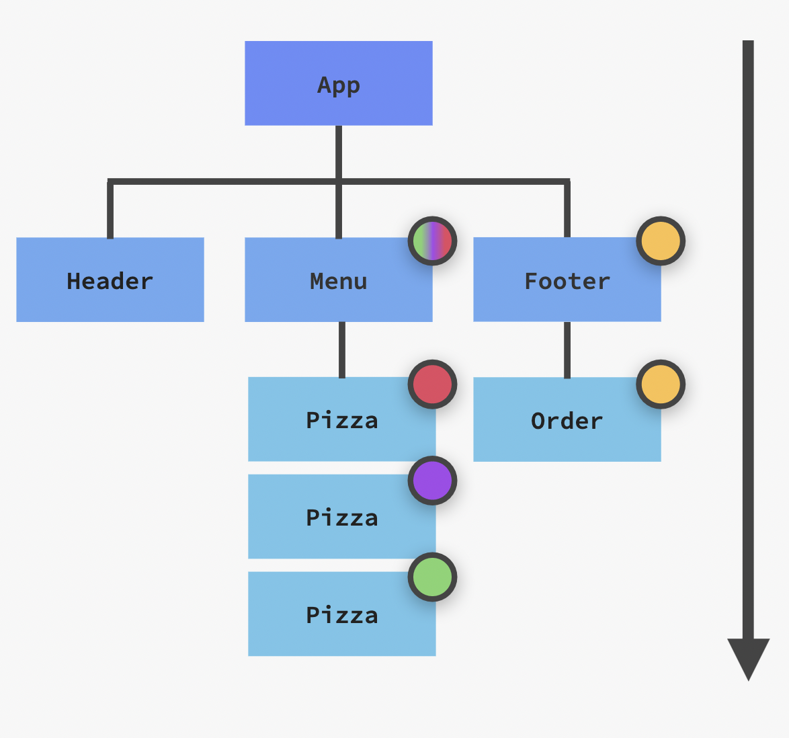
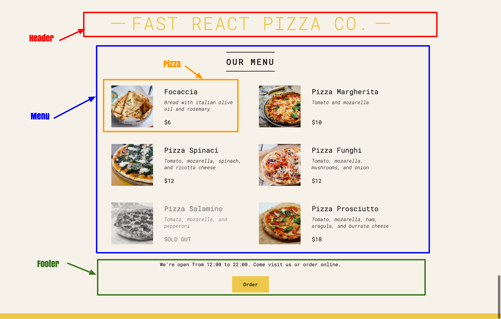
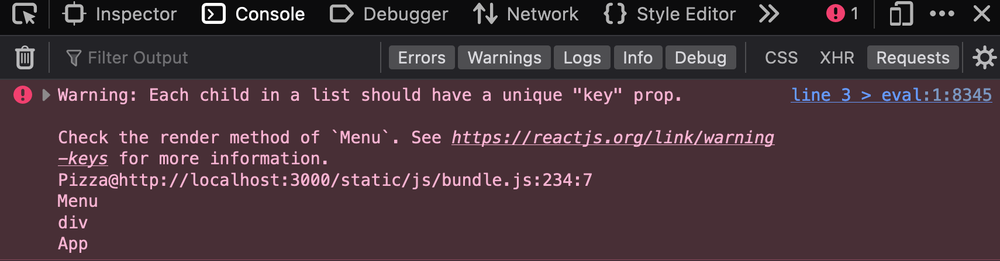

# WORKING WITH COMPONENTS, PROPS, AND JSX

Overview of application components tree.



## The `App` component

- React applications are made up of [components](https://github.com/hermkan/code-journey-notes/blob/main/notes/04-building-UI/02-react/01-react-introduction/Part%20I/3.react-components.md#whats-a-component).

- Components are responsible for rendering pieces of the user interface.

For our project, we will be break the `app` component into 3 smaller components :

- Header
- Menu
- Footer

Menu will render the `Pizza` component.
Footer will render `Order` component.



We can render `Header`, `Menu`, and `Footer` components inside `App` like so :

```jsx
function App() {
  return (
    <div className="container">
      <Header />
      <Menu />
      <Footer />
    </div>
  )
}
```

## The `Header` component

The `header` component render some [jsx](https://github.com/hermkan/code-journey-notes/blob/main/notes/04-building-UI/02-react/01-react-introduction/Part%20I/2.jsx-virtual-dom.md#what-is-jsx).

```jsx
function Header() {
  return (
    <header className="header">
      <h1>Fast React Pizza Co.</h1>
    </header>
  )
}
```

## The `Menu` component

- The `menu` component displays a list of pizzas.

```jsx
function Menu() {
  return (
    <main className="menu">
      <h2>Our menu</h2>
      <ul className="pizzas">
      <Pizza>
      <Pizza>
      <Pizza>
      </ul>
    </main>
  )
}
```

- But we also want to render the list conditionally. If the list is empty we want to display a message saying `"We're still working on our menu. Please come back later"`. If the list is not empty, then we will display the list of pizzas. We will use the [ternary operator](https://github.com/hermkan/code-journey-notes/blob/main/notes/02-language-mastery/JS/01-fundamentals/1-fundamentals.md#conditionals) to accomplis this, because of the _compact syntax_ for writing a conditional expression:

```jsx
function Menu() {
  // save the pizza array in the constant pizzas
  const pizzas = pizzaData

  // save the array's length in the constant numPizzas
  const numPizzas = pizzas.length

  return (
    <main className="menu">
      <h2>Our menu</h2>

      {numPizzas > 0 ? (
        <ul className="pizzas">
          <Pizza />
          <Pizza />
          <Pizza />
          <Pizza />
        </ul>
      ) : (
        //
        <p>We're still working on our menu. Please come back later </p>
      )}
    </main>
  )
}
```

You can read it as "if `numPizza` is _greater_ than 0" (i.e the list is not empty, so the condition is true) then `(?)` display the list, otherwise `(:)` render `<p>We're still working on our menu. Please come back later </p>`

- In react, when you want to display multiple similar components from a collection of data, you can use a JavaScript array method like `map()`. We only need to show several instances of the same component using different data : the `pizza name`, `the image`, the `ingredients`, `the price`.

1. Our pizzas array look like this:

```js
const pizzaData = [
  {
    name: 'Focaccia',
    ingredients: 'Bread with italian olive oil and rosemary',
    price: 6,
    photoName: 'pizzas/focaccia.jpg',
    soldOut: false,
  },
  {
    name: 'Pizza Margherita',
    ingredients: 'Tomato and mozarella',
    price: 10,
    photoName: 'pizzas/margherita.jpg',
    soldOut: false,
  },
  {
    name: 'Pizza Spinaci',
    ingredients: 'Tomato, mozarella, spinach, and ricotta cheese',
    price: 12,
    photoName: 'pizzas/spinaci.jpg',
    soldOut: false,
  },
  {
    name: 'Pizza Funghi',
    ingredients: 'Tomato, mozarella, mushrooms, and onion',
    price: 12,
    photoName: 'pizzas/funghi.jpg',
    soldOut: false,
  },
  {
    name: 'Pizza Salamino',
    ingredients: 'Tomato, mozarella, and pepperoni',
    price: 15,
    photoName: 'pizzas/salamino.jpg',
    soldOut: true,
  },
  {
    name: 'Pizza Prosciutto',
    ingredients: 'Tomato, mozarella, ham, aragula, and burrata cheese',
    price: 18,
    photoName: 'pizzas/prosciutto.jpg',
    soldOut: false,
  },
]
```

2. We can map over `pizzaData` and render a `Pizza` component for each pizza object.

Before :

```jsx
{
  numPizzas > 0 ? (
    <ul className="pizzas">
      <Pizza />
      <Pizza />
      <Pizza />
      <Pizza />
    </ul>
  ) : (
    //
    <p>We're still working on our menu. Please come back later </p>
  )
}
```

After :

```jsx
{
  numPizzas > 0 ? (
    <ul className="pizzas">
      {pizzas.map((pizza) => (
        <Pizza />
      ))}
    </ul>
  ) : (
    <p>We're still working on our menu. Please come back later </p>
  )
}
```

if we check our console in the browser we notice this error message :



This is because JSX elements directly inside a `map()` call always need _keys_! We need to give each array item a key (a string or a number) that uniquely identifies it among other items in that array (we'll use the `name` property).

```jsx
{
  numPizzas > 0 ? (
    <ul className="pizzas">
      {pizzas.map((pizza) => (
        <Pizza key={pizza.name} />
      ))}
    </ul>
  ) : (
    <p>We're still working on our menu. Please come back later </p>
  )
}
```

4. Finally, for each `pizza` component we'll pass the `pizzaObj` [props](https://github.com/hermkan/code-journey-notes/blob/main/notes/04-building-UI/02-react/01-react-introduction/Part%20I/4.components-interaction.md#props), which is an object full of information about each pizza.

pizzaObj :

```js
{
    name: 'Pizza Prosciutto',
    ingredients: 'Tomato, mozarella, ham, aragula, and burrata cheese',
    price: 18,
    photoName: 'pizzas/prosciutto.jpg',
    soldOut: false,
  }
```

passing `pizzaObj` props:

```jsx
{
  numPizzas > 0 ? (
    <ul className="pizzas">
      {pizzas.map((pizza) => (
        <Pizza key={pizza.name} pizzaObj={pizza} />
      ))}
    </ul>
  ) : (
    <p>We're still working on our menu. Please come back later </p>
  )
}
```

The final version of our `menu component` :

```jsx
function Menu() {
  const pizzas = pizzaData
  const numPizzas = pizzas.length
  return (
    <main className="menu">
      <h2>Our menu</h2>

      {numPizzas > 0 ? (
        <ul className="pizzas">
          {pizzas.map((pizza) => (
            <Pizza key={pizza.name} pizzaObj={pizza} />
          ))}
        </ul>
      ) : (
        <p>We're still working on our menu. Please come back later </p>
      )}
    </main>
  )
}
```

Recap :

- In react we can generate a set of similar components with JavaScript’s `map()`
- We need to set a _key_ on each component in a collection of items, so React can keep track of each of them even if their position or data changes.
- In react, you can conditionally render some JSX using the ternary operator or `&&` shortcut :
  - `{cond ? <A /> : <B />}` means “if cond, render `<A />`, otherwise `<B />`”.
  - `{cond && <A />}` means “if cond, render `<A />`, otherwise nothing”.
- Props are used to pass data from parent components to child components (down the component tree).

## The `pizza` component

In this component we read the props object and used the values to display information about each pizza :

- First, we need to read the `pizzaObj` [props](https://github.com/hermkan/code-journey-notes/blob/main/notes/04-building-UI/02-react/01-react-introduction/Part%20I/4.components-interaction.md#props) inside `pizza` component :

```jsx
function Pizza(props) {
  const {
    pizzaObj: { name, photoName, ingredients, price, soldOut },
  } = props
}
```

We used [object destructuring](https://github.com/hermkan/code-journey-notes/blob/main/notes/02-language-mastery/JS/01-fundamentals/5-objects.md#advanced-objects) syntax, to unpack the `props` object and the `pizzaObj` props

- Then inside the return statement, we can apply style conditionnally like so :

```jsx
{
 <li className={`pizza ${soldOut ? 'sold-out' : ''}`}>
}
```

You can read it as "if `soldOut` is `true` apply `"sold-out"` css rules otherwise nothing”

we used the same technique to display the string `'SOLD OUT'` or the `price`

```jsx
<span>{soldOut ? 'SOLD OUT' : `$${price}`}</span>
```

The final version of our `menu component` :

```jsx
function Pizza(props) {
  // destructure the components props and the pizza obj
  const {
    pizzaObj: { name, photoName, ingredients, price, soldOut },
  } = props
  return (
    <li className={`pizza ${soldOut ? 'sold-out' : ''}`}>
      
      <div>
        <h3>{name}</h3>
        <p>{ingredients}</p>
        <span>{soldOut ? 'SOLD OUT' : `$${price}`}</span>
      </div>
    </li>
  )
}
```

## The `Footer` component

## The `Order` component
