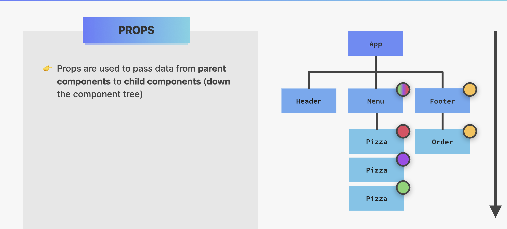
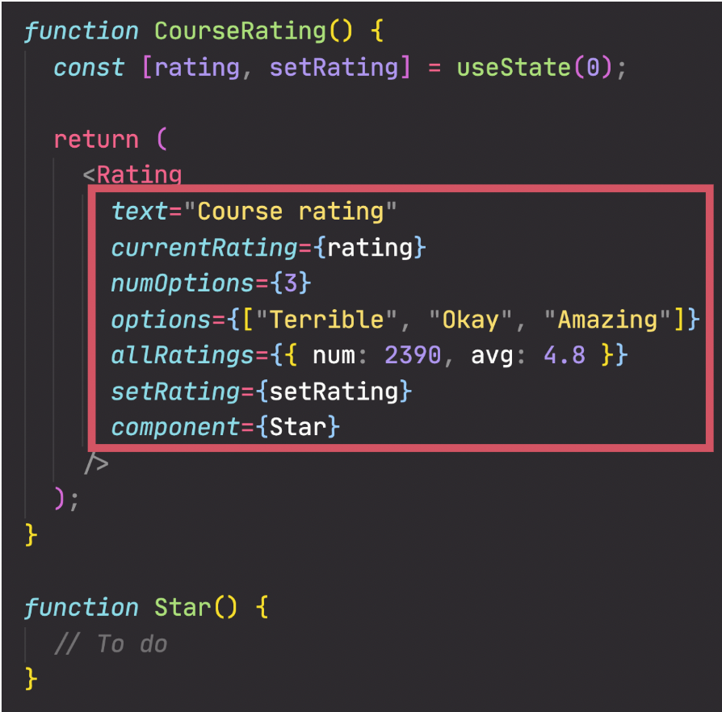
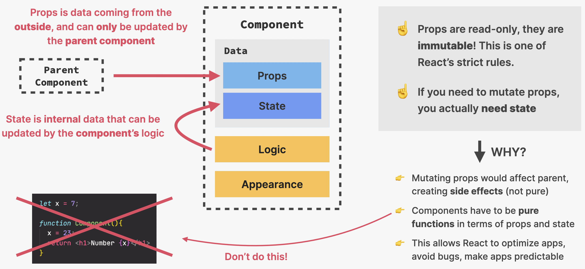
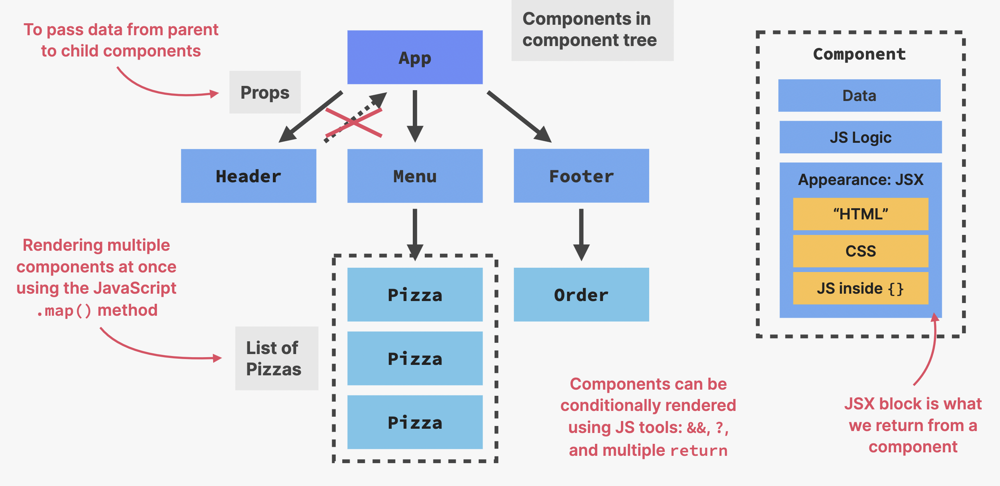

# WORKING WITH COMPONENTS, PROPS, AND JSX

Key Ideas :

- Props are used to pass data from parent to components

- Anything can be passed as props: single values, arrays, objects, functions, even other components

- Props vs state

- Summary

