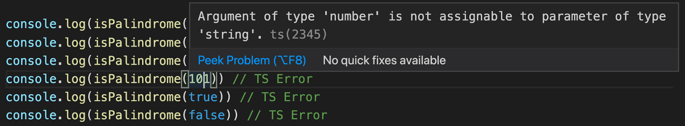

# React

## CHAP I

### Differentiating between declarative and imperative programming

In declarative programming, programmers describe what task they want to achieve without listing all the steps needed to accomplish that task.  
In imperative programming, developers describe step by step how to accomplish a task.

Ex :

```jsx
// Declarative
const toUpperCase = (input) => input.map((value) => value.toUpperCase())

// Imperative
const toUpperCase = (input) => {
  const output = []

  for (let i = 0; i < input.length; i++) {
    output.push(input[i].toUpperCase())
  }

  return output
}
// declarative

// To turn on the Toggle
<Toggle on />
// To turn off the toggle
<Toggle />

// Imperative

const toggleButton = document.querySelector('#toggle')
toogleButton.addEventListener('click', () => {
  if (toggleButton.classList.contains('on')) {
    toggleButton.classList.remove('on')
    toggleButton.classList.add('off')
  } else {
    toggleButton.classList.remove('off')
    toggleButton.classList.add('on')
  }
})


```

### How React elements work

React follows the declarative style. One implementation of this in React is that you don't have need to tell React how to interact with the DOM. You just tell React what you want to see on the screen and under the hood React takes care of updating the DOM.

To achieve this (updating DOM = creation and destruction of DOM elements), React uses an object called Element.

```jsx
  {
    type: Title,
    props: {
      color: 'red',
      children: 'Hello, Title!'
    }
  }
```

This object has a couple of properties, the most important ones are type and props. Type is An important one. If type is a string then React knows that the element is a DOM node. But if type is a function then React knows that the element is a component.

1. if it's a component react will call the function
2. Pass in the props as arguments to get the underlying elements
3. keeps on performing the same operation recursively until it gets a tree of DOM node that is then render on the screen.

This process is called Reconciliation. It is the process by which react controls the UI Flow.

[Component Vs Elements Vs Instance](https://stackoverflow.com/questions/30971395/difference-between-react-component-and-react-element#42939845)

### Iterative approach to JS Fatigue

1. Simple app with react scripts
2. Core library not enough because jsx not supported in browser : Introduce Transpiler
3. App grows you need display multiple pages : introduce router
4. App grows, you need to load some data from an API : introduce external lib and npm package to perform complex abstract tasks
5. App grows, you need to split your app into different files/ modules : introduce Module bundler

`The best way to get lost is use a boilerplate that has 100 deps and 10 npm packages`

**Conclusion : Declarative code is code that describe what task we want to accomplish without listing step by step how to accomplish that task. React implements this approach by updating the dom under the hood for us through a process called reconciliation. A component is an object whose type property is a function. An element is object whose type property is a string. React mixes Html an js because it suggests a component-based approach.**

## CHAP II

### Convert JavaScript code into TypeScript

```js
function isPalindrome(word) {
  const lowerCaseWord = word.toLowerCase()
  const reversedWord = lowerCaseWord.split('').reverse().join('')
  return lowerCaseWord === reversedWord
}
```

```ts
function isPalindrome(word: string): boolean {
  const lowerCaseWord = word.toLowerCase()
  const reversedWord = lowerCaseWord.split('').reverse().join('')
  return lowerCaseWord === reversedWord
}
```

- We just specified the string type as word and boolean type to the function returned value,

- If we try to run the function with some value that is different from a string, you will get a TypeScript error

```sh
 console.log(isPalindrome('Level')) // true
 console.log(isPalindrome('Anna')) // true
 console.log(isPalindrome('Carlos')) // false
 console.log(isPalindrome(101)) // TS Error
 console.log(isPalindrome(true)) // TS Error
 console.log(isPalindrome(false)) // TS Error
```



- That's why TypeScript is very useful because it will force you to be more strict and explicit with your code.

### Types

- How can we specify types for an object or an array with more details ? Types can help us to describe our objects or arrays in a better way.

- a good practice to follow is to add a prefix of T, so, for example, the User type will become TUser. In this way, you can quickly recognize that it is type and you don't get confused thinking it is a class or a React component.

```ts
type User = {
  username: string
  email: string
  name: string
  age?: number
  website: string
  active: boolean
}
```

### Interfaces

- Interfaces can be used to describe the shape of an object or function signature just like types,

```ts
interface User {
  username: string
  email: string
  name: string
  age?: number
  website: string
  active: boolean
}
```

- a good practice to follow is to add a prefix of I, so, for example, the User interface will become IUser. In this way, you can quickly recognize that it is an interface and you don't get confused thinking it is a class or a React component.

An interface can also be extended, implemented, and merged.

#### Extending interfaces and types

by using the `&` character, you can extend a type, while you extend an interface using the `extends` keyword.

```ts
// Extending an interface
interface IWork {
  company: string
  position: string
}
interface IPerson extends IWork {
  name: string
  age: number
}
// Extending a type
type TWork = {
  company: string
  position: string
}
type TPerson = TWork & {
  name: string
  age: number
}
// Extending an interface into a type
interface IWork {
  company: string
  position: string
}
type TPerson = IWork & {
  name: string
  age: number
}
```

#### Implementing interfaces and types

```ts
// Implementing an interface
interface IWork {
  company: string
  position: string
}
class Person implements IWork {
  name: 'Carlos'
  age: 35
}
// Implementing a type
type TWork = {
  company: string
  position: string
}
class Person2 implements TWork {
  name: 'Cristina'
  age: 34
}
// You can't implement a union type
type TWork2 =
  | { company: string; position: string }
  | { name: string; age: number }
class Person3 implements TWork2 {
  company: 'Google'
  position: 'Senior Software Engineer'
}
```

#### Merging interfaces

Unlike a type, an interface can be defined multiple times and will be treated as a single interface (all declarations will be merged),

```ts
interface IUser {
  username: string
  email: string
  name: string
  age?: number
  website: string
  active: boolean
}
interface IUser {
  country: string
}
const user: IUser = {
  username: 'czantany',
  email: 'carlos@milkzoft.com',
  name: 'Carlos Santana',
  country: 'Mexico',
  age: 35,
  website: 'http://www.js.education',
  active: true,
}
```

This is very useful when you need to extend your interfaces in different scenarios by just re-defining the same interface.

### Enums

Enums allow a developer to define a set of named constants.

- make it easier to document intent,
- or create a set of distinct cases.

```ts
export enum blue = {
 blue050 = '#DBEDFF',
 blue100 = '#DBEDFF',
 blue150 = '#DBEDFF',
}
```

- Namespaces

`Namespaces` are JavaScript objects in the global scope, very useful to organize variables, functions, interfaces or classes and group them together within a local scope in order to avoid naming conflicts between components in the global scope.

Very useful to group styles when using styled-components, for example:

```jsx

  import styled from 'styled-components'
  export namespace CSS {
    export const InputWrapper = styled.div`
      padding: 10px;
      margin: 0;
      background: white;
      width: 250px;
    `
    export const InputBase = styled.input`
      width: 100%;
      background: transparent;
      border: none;
      font-size: 14px;
    `
   }
```

```jsx
import React, { ComponentPropsWithoutRef, FC } from 'react'
import { CSS } from './Input.styled'
export interface Props extends ComponentPropsWithoutRef<'input'> {
  error?: boolean;
}
const Input: FC<Props> = ({
  type = 'text',
  error = false,
  value = '',
  disabled = false,
  ...restProps
}) => (
  <CSS.InputWrapper style={error ? { border: '1px solid red' } : {}}>
    <CSS.InputBase
      type={type}
      value={value}
      disabled={disabled}
      {...restProps}
    />
  </CSS.InputWrapper>
)
```

We don’t need to worry about exporting multiple styled components, we just export the CSS namespace and we can use all the styled components defined inside that namespace.

### Template literals

based on string literals types and may be expanded into many strings using unions.

```ts
type Theme = 'light' | 'dark'
```

```ts
type Size = 'sm' | 'md' | 'lg' | 'xl'
```

### TypeScript Configuration File

- The `tsconfig.json` file specifies the root files and the compiler options required to compile the project.

We can separate them into two files :

1. `tsconfig.common.json` which will contain all the shared compiler options and then the
2. `tsconfig.json` which will extend the tsconfig.common.json file and add some specific options for that project, this is very useful when you work with MonoRepos.

```json
// tsconfig.common.json
{
  "compilerOptions": {
    "allowSyntheticDefaultImports": true,
    "alwaysStrict": true,
    "declaration": true,
    "declarationMap": true,
    "downlevelIteration": true,
    "esModuleInterop": true,
    "experimentalDecorators": true,
    "jsx": "react-jsx",
    "lib": ["DOM", "DOM.Iterable", "ESNext"],
    "module": "commonjs",
    "moduleResolution": "node",
    "noEmit": false,
    "noFallthroughCasesInSwitch": false,
    "noImplicitAny": true,
    "noImplicitReturns": true,
    "outDir": "dist",
    "resolveJsonModule": true,
    "skipLibCheck": true,
    "sourceMap": true,
    "strict": true,
    "strictFunctionTypes": true,
    "strictNullChecks": true,
    "suppressImplicitAnyIndexErrors": false,
    "target": "ESNext"
  },
  "exclude": ["node_modules", "dist", "coverage", ".vscode", "**/__tests__/*"]
}
```

```json
// tsconfig.json
{
  "extends": "./tsconfig.common.json",
  "compilerOptions": {
    "baseUrl": "./packages",
    "paths": {
      "@web-builder/*": ["*/src"]
    }
  }
}
```

### Using JSX

To use JSX we need `Babel` because, the target environment for our code is the browser. The browser does not support `JSX`. `Babel` takes our JSX and ES6 code and transpile into ES5 which is supported by the browser

This is how you would create a div element with the `_jsx function`:

```jsx
_jsx('div', {})
```

This is the JSX for creating a div element:

```jsx
<div />
```

- JSX is only syntactic sugar, and it gets transpiled into JavaScript before being executed in the browser.

- our `<div />` element is translated into `_jsx('div', {})` when we run Babel, which is something we should always keep in mind when we write our templates.

### DOM elements VS React components

With JSX, we can create both HTML elements and React components; the only difference is whether or not they start with a capital letter

For example, to render an HTML button, we use `<button />`, while to render the Button component, we use `<Button />`. The first button is transpiled into :

```js
_jsx('button', {})
```

The second one

```js
_jsx(Button, {})
```

### Props

JSX is very convenient when your DOM elements or React components have props. Using XML is pretty easy to set attributes on elements:

```js

```

The equivalent in JavaScript would be as follows:

```js
_jsx('img', {
  src: 'https://www.ranchosanpancho.com/images/logo.png',
  alt: 'Cabañas San Pancho',
})
```

### Children

JSX allows you to define children to describe the tree of elements and compose complex UIs. A basic example is a link with text inside it, as follows:

```xml
<a href="https://ranchosanpancho.com">Click me!</a>
```

This would be transpiled into the following:

```js
_jsx('a', { href: 'https://ranchosanpancho.com' }, 'Click me!')
```

Our link can be enclosed inside a div element for some layout requirements, and the JSX snippet to achieve that is as follows:

```js
<div>
  <a href="https://ranchosanpancho.com">Click me!</a>
</div>
```

The JavaScript equivalent is as follows:

```js
_jsx(
  'div',
  null,
  _jsx('a', { href: 'https://ranchosanpancho.com' }, 'Click me!')
)
```

We are not limited to having elements as children of elements, but we can use JavaScript expressions, such as functions or variables.

To do this, we have to enclose the expression within curly braces:

```jsx
<div>
  Hello, {variable}. I'm a {() => console.log('Function')}.
</div>
```

The same applies to non-string attributes, as follows:

```jsx
<a href={this.createLink()}>Click me!</a>
```

### Differences with HTML

#### Root

One important difference with HTML worth mentioning is that `since JSX elements get translated into JavaScript functions, and you cannot return two functions in JavaScript, whenever you have multiple elements at the same level, you are forced to wrap them in a parent`.

```jsx
<div />
<div />
```

This gives us the following error:

```sh
Adjacent JSX elements must be wrapped in an enclosing tag.
```

Before, React forced you to return an element wrapped with an <div> element or any other tag; since React 16.2.0, it is possible to return an array directly as follows:

```jsx
return [
  <li key="1">First item</li>,
  <li key="2">Second item</li>,
  <li key="3">Third item</li>,
]
```

### Spread attributes

A common practice that leads to fewer bugs is not to pass entire JavaScript objects down to children by reference, but to use their primitive values, which can be easily validated, making components more robust and error-proof.

```jsx
const attrs = {
  id: 'myId',
  className: 'myClass',
}

return <div {...attrs} />
```

The preceding code gets transpiled into the following:

```js
var attrs = {
  id: 'myId',
  className: 'myClass',
}
return _jsx('div', attrs)
```

### Common patterns

#### Multilines

Always remember to wrap your elements inside parentheses when you write them on multiple lines because JSX always gets replaced by functions.

The following example works fine because the div element is on the same line as the return

```jsx
return <div />
```

The following, however, is not right:

```jsx
return
;<div />
```

The reason for this is that you would then have the following:

```jsx
return
_jsx('div', null)
```

This is why you have to wrap the statement in parentheses, as follows:

```jsx
return (<div /> <div />)
```

#### Multi-properties

When an element has multiples attributes, don't write write all the attributes on the same line. Instead, write each attribute on a new line, with one level of indentation, and then align the closing bracket with the opening tag:

```jsx
<button
  foo="bar"
  veryLongPropertyName="baz"
  onSomething={this.handleSomething}
/>
```

#### Conditionals

There are many different ways to express conditions in JSX, and it is important to understand the benefits and problems of each one of these to write code that is both readable and maintainable.

Suppose we want to show a logout button only if the user is currently logged in to our application.

A simple snippet to start with is as follows:

```jsx
let button

if (isLoggedIn) {
  button = <LogoutButton />
}

return <div>{button}</div>
```

This works, but it is not very readable, especially if there are multiple components and multiple conditions.

In JSX, we can use an inline condition:

```jsx
<div>{isLoggedIn && <LoginButton />}</div>
```

This works because if the condition is`false`, nothing gets rendered, but if the condition is `true`, the `createElement` function of`LoginButton` gets called, and the element is returned to compose the resulting tree.

If the condition has an alternative (the classic if...else statement) and we want, for example, to show a logout button if the user is logged in and a login button otherwise, we can use JavaScript's if...else statement

```jsx
let button
if (isLoggedIn) {
  button = <LogoutButton />
} else {
  button = <LoginButton />
}

return <div>{button}</div>
```

better still, we can use a ternary condition that makes the code more compact:

```jsx
<div>{isLoggedIn ? <LogoutButton /> : <LoginButton />}</div>
```

Let's now look at the best solution for when things get more complicated and, for example, we have to check more than one variable to determine whether to render a component or not:

```jsx
<div>{dataIsReady && (isAdmin || userHasPermissions) && <SecretData />}</div>
```

In this case, it is clear that using the inline condition is a good solution, but the readability is strongly impacted. Instead, we can create a helper function inside our component and use it in JSX to verify the condition:

```jsx
const canShowSecretData = (props) => {
  const { dataIsReady, isAdmin, userHasPermissions } = props
  return dataIsReady && (isAdmin || userHasPermissions)
}

return <div>{this.canShowSecretData() && <SecretData />}</div>
```

The same applies to computed properties. Suppose you have two single properties for currency and value. Instead of creating the price string inside render, you can create a function:

```jsx
const getPrice = () => {
  return `${props.currency}${props.value}`
}

return <div>{getPrice()}</div>
```

This is better because it is isolated and you can easily test it if it contains logic.

#### Loops

the most common way to generate an array of elements, given an array of objects, is to use map.
Suppose you have a list of users, each one with a name property attached to it.

To create an unordered list to show the users, you can do the following:

```jsx
<ul>
  {users.map((user) => (
    <li>{user.name}</li>
  ))}
</ul>
```

### Styling code

_learning goal_: How to implement EditorConfig and ESLint to improve your code quality by validating your code style?

#### EditorConfig

`EditorConfig` helps developers to maintain consistent coding styles between different `IDEs`.

EditorConfig is supported by a lot of editors. You can check whether your editor is supported or not on the official website, [Editor config](https://www.editorconfig.org).

You need to create a file called `.editorconfig` in your root directory – the configuration :

```.editorconfig
root = true
[*]
indent_style = space
indent_size = 2
end_of_line = lf
charset = utf-8
trim_trailing_whitespace = true
insert_final_newline = true
[*.html]
indent_size = 4
[*.css]
indent_size = 4
[*.md]
trim_trailing_whitespace = false
```

You can affect all the files with [*], and specific files with [.extension]

#### Prettier

you can configure the options you want in your .prettierrc file – the configuration :

```.prettierrc
{
 "arrowParens": "avoid",
 "bracketSpacing": true,
 "jsxSingleQuote": false,
 "printWidth": 100,
 "quoteProps": "as-needed",
 "semi": false,
 "singleQuote": true,
 "tabWidth": 2,
 "trailingComma": "none",
 "useTabs": false
}
```

#### ESLint

ESLint is an `open-source` project released in 2013 that became popular thanks to the fact that it is highly configurable and extensible. It helps us check the correctness of our code as soon as we type it. These tools are not able to tell us whether our code is going to do what it's supposed to do, but they can help us to avoid `syntactical errors`.

It's a tool that can be easily extended with plugins, and rules that can be enabled and disabled when needed.

It is very hard to read the code in a code base where different files, or even various functions, are written using inconsistent styles. For that reason, let's look at ESLint in more detail

##### Installation

```sh
npm install -g eslint eslint-config-airbnb eslint-config-prettier eslint-plugin-import eslint-plugin-jsx-a11y eslint-plugin-prettier eslint-plugin-react
```

```sh
eslint source.ts
```

The output will tell us if there are errors within the file.

##### configuration

It can be configured using a .eslintrc file that lives in the root folder of the project.

```.eslintrc
{
  "parser": "@typescript-eslint/parser",
  "plugins": ["@typescript-eslint", "prettier"],
  "extends": [
    "airbnb",
    "eslint:recommended",
    "plugin:@typescript-eslint/eslint-recommended",
    "plugin:@typescript-eslint/recommended",
    "plugin:prettier/recommended"
  ],
  "settings": {
    "import/extensions": [".js", ".jsx", ".ts", ".tsx"],
    "import/parsers": {
      "@typescript-eslint/parser": [".ts", ".tsx"]
    },
    "import/resolver": {
      "node": {
        "extensions": [".js", ".jsx", ".ts", ".tsx"]
      }
    }
  },
  "rules": {
    "semi": [2, "never"]
  }
}
```

- "semi" is the name of the rule and [2, "never"] is the value. It is not very intuitive the first time you see it.

ESLint rules have three levels that determine the severity of the problem:

```mdx
    `off` (or 0): The rule is disabled.
    `warn` (or 1): The rule is a warning.
    `error` (or 2): The rule throws an error.
```

We are using the `2` value because we want `ESLint` to throw an error every time our code does not follow the rule. The second parameter tells`ESLint` that we want the semicolon to `never be used` (the opposite is `always`).
If we run eslint index.js, we get the following:

```sh
Extra semicolon (semi)
```

`Full list`:

```.eslintrc
"rules": {
    "semi": [2, "never"],
    "@typescript-eslint/class-name-casing": "off",
    "@typescript-eslint/interface-name-prefix": "off",
    "@typescript-eslint/member-delimiter-style": "off",
    "@typescript-eslint/no-var-requires": "off",
    "@typescript-eslint/ban-ts-ignore": "off",
    "@typescript-eslint/no-use-before-define": "off",
    "@typescript-eslint/ban-ts-comment": "off",
    "@typescript-eslint/explicit-module-boundary-types": "off",
    "no-restricted-syntax": "off",
    "no-use-before-define": "off",
    "import/extensions": "off",
    "import/prefer-default-export": "off",
    "max-len": [
      "error",
      {
        "code": 100,
        "tabWidth": 2
      }
    ],
    "no-param-reassign": "off",
    "no-underscore-dangle": "off",
    "react/jsx-filename-extension": [
      1,
      {
        "extensions": [".tsx"]
      }
    ],
    "import/no-unresolved": "off",
    "consistent-return": "off",
    "jsx-a11y/anchor-is-valid": "off",
    "sx-a11y/click-events-have-key-events": "off",
    "jsx-a11y/no-noninteractive-element-interactions": "off",
    "jsx-a11y/click-events-have-key-events": "off",
    "jsx-a11y/no-static-element-interactions": "off",
    "react/jsx-props-no-spreading": "off",
    "jsx-a11y/label-has-associated-control": "off",
    "react/jsx-one-expression-per-line": "off",
    "no-prototype-builtins": "off",
    "no-nested-ternary": "off",
    "prettier/prettier": [
      "error",
      {
        "endOfLine": "auto"
      }
    ]
  }
```

#### Git Hooks

To avoid having unlinted code in our repository, we can use Git Hooks.

For example, we can use `husky` to run our linter in a Git Hook called `pre-commit`, and it is also useful to run our unit tests on the Hook called `pre-push`.

To install husky, you need to run the following command:

```sh
npm install --save-dev husky
```

Then, in our package.json file, we can add this to configure the tasks we want to run in the Git Hooks.

Edit package.json > prepare script and run it once:

```sh
  npm set-script prepare "husky install"
  npm run prepare
```

Add a hook:

```sh
  npx husky add .husky/pre-commit "npm run lint"
  git add .husky/pre-commit
```

Make a commit:

```sh
  git commit -m "Keep calm and commit"
  # `npm run lint` will run every time you commit
```

### Functional programming

There is one more thing we can do to clean up our code: follow an FP style.

FP is a declarative paradigm, where side effects are avoided and data is considered immutable to make the code easier to maintain and reason about.

Let's explore some concepts that are commonly used in React of which you should be aware.

#### First-class functions

-> Check FP

### Popular Composition patterns

_learning goal:_

- How components communicate with each other using props and children
- The container and presentational patterns and how they can make our code more maintainable
- What higher-order components (HOCs) are and how, thanks to them, we can structure our applications in a better way
- What the function of the child component pattern is and what its benefits are.

### Using the children prop

Components can also be defined with nested components inside them, and they can access those children using the `children prop`

Consider that we have a Button component that has a text property representing the text of the button:

```jsx
const Button = ({ text }) => <button className="btn">{text}</button>
```

The component can be used in the following way:

```jsx
<Button text="Click me!" />
```

And this will render the following code:

```jsx
<button class="btn">Click me!</button>
```

Now, suppose we want to use the same button with the same class name in multiple parts of our application, and we also want to be able to display more than a simple string.

Our UI consists of :

- buttons with text
- buttons with text and icons
- buttons with text and labels.

Button could just be a wrapper, and we are able to render any element inside it and use the children property:

```jsx
const Button = ({ children }) => <button className="btn">{children}</button>
```

By passing the children prop, we are not limited to a simple single text property, but we can pass any element to Button, and it is rendered in place of the children property.
Any element that we wrap inside the Button component will be rendered as a child of the button element with btn as the class name.

For example, if we want to render an image inside the button and some text wrapped into a span tag, we can do this:

```jsx
<Button>
  
  <span>Click me!</span>
</Button>
```

The snippet gets rendered in the browser as follows:

```jsx
<button class="btn">
  
  <span>Click me!</span>
</button>
```

This is a pretty convenient way to allow components to accept any children elements and wrap those elements inside a predefined parent.

## Exploring the container and presentational patterns

React components typically contain a mix of logic and presentation. By logic, we refer to anything that is unrelated to the UI, such as API calls, data manipulation, and event handlers. The presentation is the part inside render where we create the elements to be displayed on the UI.

The container and presentational patterns aims to separate those two concerns.

Why Would you do that? Because creating well-defined boundaries between logic and presentation not only makes components more reusable, but also provides many other benefits, which you will learn about in this section.

- In this pattern, every component is split into two smaller ones, each one with its clear responsibilities. The container knows everything about the logic of the component and is where we make the API calls. It also deals with data manipulation and event handling.

- The presentational component is where the UI is defined, and it receives data in the form of props from the container. Since the presentational component is usually logic-free, we can create it as a functional, stateless component. It does not mean that the presentational component must not have a state (for example, it could keep a UI state inside it).

Suppose we have a component that uses geolocation APIs to get the position of the user and displays the latitude and longitude on the page in the browser.

### Container component

First of all, We will create a new file called `GeolocationContainer.tsx`. we should also name our Geolocation component to `GeolocationContainer`

```tsx
  const GeolocationContainer = () => {...}
```

This rule is not strict, but it is a best practice that's widely used in the React community to append Container to the end of the Container component name and give the original name to the presentational one.

We also have to change the implementation of render and remove all the UI parts of it, as follows:

```tsx
return <Geolocation latitude={latitude} longitude={longitude} />
```

As you can see, instead of creating the HTML elements inside the return of the container, we just use the presentational component (which we will create next), and we pass the state to it. The states are latitude and longitude.

### Presentational component

```tsx
import { FC } from 'react'
type Props = {
  latitude: number
  longitude: number
}
const Geolocation: FC<Props> = ({ latitude, longitude }) => (
  <div>
    <h1>Geolocation:</h1>
    <div>Latitude: {latitude}</div>
    <div>Longitude: {longitude}</div>
  </div>
)
export default Geolocation
```

Functional components are an incredibly elegant way to define UIs. They are pure functions that, given a state, return the elements . In this case, our function receives latitude and longitude from the owner, and it returns the markup structure to display it.

Following the container and presentational pattern, we created a reusable component (presentational) that we can put in our `Style Guide` so that we can pass fake coordinates to it.

If in some other parts of the application we need to display the same data structure, we do not have to create a new component; we just wrap this one into a new container that, for example, could load the latitude and longitude from a different endpoint.

At the same time, other developers in our team can improve the container that uses geolocation by adding some error-handling logic, without affecting its presentation.

we should think carefully when we decide that a component has to be refactored following the container and presentational patterns. In general, the right path to follow `is starting with a single component and splitting it only when the logic and the presentation become too coupled where they shouldn't be`.

The following points should help you make that decision:

The following are the characteristics of container components:

- They render their presentational components.

- They make API calls and manipulate data.

- They define event handlers.

The following are the characteristics of presentational components:

- They render the HTML markup (or other components).

- They receive data from the parents in the form of props.

- They are often written as stateless functional components

## Understanding FunctionAsChild

The idea is that instead of passing a child in the form of a component, `we define a function that can receive parameters from the parent`.

```jsx
const FunctionAsChild = ({ children, methods }) => children()
```

- FunctionAsChild is a component that takes a children property defined as a function and, instead of being used as a JSX expression, it gets called.

It can be used in the following way:

```jsx
<FunctionAsChild>{() => <div>Hello, World!</div>}</FunctionAsChild>
```

the children function is called in the render method of the parent (we have to use the curly because its a function call), and it returns the Hello, World! text wrapped in a div tag, which is displayed on the screen.

- Let'see an example where the parent component passes some parameters to the children function

```jsx
const Name = ({ children }) => children('world')
```

The component `Name` can be used in the following way:

```jsx
<Name>{(name) => <div>Hello, {name}!</div>}</Name>
```

It renders Hello, World! again, but this time the name is passed by the parent. It should be clear how this pattern works, so let's look at the advantages of this approach.

- the benefit of this approach is that the wrapper is highly reusable because it does not make any assumptions about children it receives—it just expects a function. The FunctionAsChild component can be used in different parts of the application, serving various children components.

## Writting code for the browser

- Using different techniques to create forms with React
- Listening to DOM events and implementing custom handlers
- A way of performing imperative operations on DOM nodes using refs
- Creating simple animations that work across different browsers
- The React way of generating SVG

### Understanding and implementing forms

#### Uncontrolled components

- regular HTML form inputs
- you are not able to manage the value
- the DOM will take care of handling the value
- you can get this value by using a React ref.

```jsx
import { useState, ChangeEvent, MouseEvent } from 'react'
const Uncontrolled = () => {
  const [value, setValue] = useState('')
  return (
    <form>
      <input type="text" />
      <button>Submit</button>
    </form>
  )
}
export default Uncontrolled
```

This is an example of an uncontrolled component, where we do not set the value of the input field, but we let the component manage its own internal state.

##### Onchange listener

Most likely, we want to do something with the value of the element when the Submit button is clicked. For example, we may want to send the data to an API endpoint.

We can do this easily by adding an onChange listener

```jsx
const handleChange = (e: ChangeEvent<HTMLInputElement>) => {
  console.log(e.target.value)
}
```

- The event listener is receiving an event object,
- the target represents the field that generated the event
- We are interested in its value.
- In the body of the function we just logging it

Finally, we render the form:

```jsx
return (
  <form>
    <input type="text" onChange={handleChange} />
    <button>Submit</button>
  </form>
)
```

- The handleChange listener is fired every time the value of the input changes.
- Therefore, our function is called once for each typed character.

```sh
R
Re
Rea
Reac
React
```

- The next step is to store the value that's entered by the user and make it available when the user clicks the Submit button.

- We just have to change the implementation of the handler to store it in the state instead of logging it, as follows :

```jsx
const handleChange = (e: ChangeEvent<HTMLInputElement>) => {
  setValue(e.target.value)
}
```

##### OnSubmit listener

```jsx
const handleSubmit = (e: MouseEvent<HTMLButtonElement>) => {
  e.preventDefault()

  console.log(value)
}
```

What if we have multiple fields? Suppose we have tens of different fields?
Our goal is to use a single change handler so that we can add an arbitrary number of fields without creating new listeners.

```jsx
const [values, setValues] = useState({ firstName: '', lastName: '' })
```

```jsx
const handleChange = ({ target: { name, value } }) => {
  setValues({
    ...values,
    [name]: value,
  })
}
```

- the target property of the event we receive represents the input field that has fired the event, so we can use the name of the field and its value as variables

We then have to set the name for each field:

```jsx
return (
  <form onSubmit={handleSubmit}>
    <input type="text" name="firstName" onChange={handleChange} />
    <input type="text" name="lastName" onChange={handleChange} />
    <button>Submit</button>
  </form>
)
```

That's it! We can now add as many fields as we want without creating additional handlers.

#### Controlled components

We are going to look at how we can prefill the form fields with some values, which we may receive from the server or as props from the parent

The first example shows a predefined value inside the input field:

```jsx
const Controlled = () => (
  <form>
    <input type="text" value="Hello React" />
    <button>Submit</button>
  </form>
)
```

- If we run this component inside the browser, we realize that it shows the default value as expected, but `it does not let us change the value or type anything else inside it`.

- Now, if we just want the input field to have a default value and we want to be able to change, we can use the defaultValue property:

```jsx
import { useState } from 'react'
const Controlled = () => {
  return (
    <form>
      <input type="text" defaultValue="Hello React" />
      <button>Submit</button>
    </form>
  )
}
export default Controlled
```

- In this way, the field is going to show Hello React when it is rendered, but then the user can type anything inside and change its value.

```jsx
const [values, setValues] = useState({
  firstName: 'Carlos',
  lastName: 'Santana',
})
```

The handlers are the same as the previous ones:

```jsx
const handleChange = ({ target: { name, value } }) => {
  setValues({
    [name]: value,
  })
}

const handleSubmit = (e) => {
  e.preventDefault()

  console.log(`${values.firstName} ${values.lastName}`)
}
```

- In fact, we will use the value attributes of the input fields to set their initial values, as well as the updated one

```jsx
return (
  <form onSubmit={handleSubmit}>
    <input
      type="text"
      name="firstName"
      value={values.firstName}
      onChange={handleChange}
    />
    <input
      type="text"
      name="lastName"
      value={values.lastName}
      onChange={handleChange}
    />
    <button>Submit</button>
  </form>
)
```

- The first time the form is rendered, React uses the initial values from the state as the value of the input fields. When the user types something into the field, the handleChange function is called and the new value for the field is stored in the state

- When the state changes, React re-renders the component and uses it again to reflect the current values of the input fields. We now have full control over the values of the fields, and we call this pattern controlled components

### Handling events

React introduced the concept of the synthetic event. A synthetic event is an object that wraps the original event object provided by the browser, and it has the same properties, no matter where it is created.

```jsx
const Button = () => {}
export default Button
```

Then we define the event handler:

```jsx
const handleClick = (syntheticEvent) => {
  console.log(syntheticEvent instanceof MouseEvent)
  console.log(syntheticEvent.nativeEvent instanceof MouseEvent)
}
```

- we check the type of the event object we receive from React and the type of native event attached to it.

- We expect the first to return false and the second to return true.

- Finally, we define the button with the onClick attribute to which we attach our event listener:

```jsx
return <button onClick={handleClick}>Click me!</button>
```

- suppose we want to attach a second handler to the button that listens to the double-click event

- a common practice is to write a single event handler for each component, which can trigger different actions according to the event type.

```jsx
const handleEvent = (event) => {
  switch (event.type) {
    case 'click':
      console.log('clicked')
      break

    case 'dblclick':
      console.log('double clicked')
      break

    default:
      console.log('unhandled', event.type)
  }
}
```

- The generic event handler receives the event object and switches on the event type to fire the right action. This is particularly useful if we want to call a function on each event (for example, analytics) or if some events share the same logic.

- Finally, we attach the new event listener to the onClick and onDoubleClick attributes:

```jsx
return (
  <button onClick={handleEvent} onDoubleClick={handleEvent}>
    Click me!
  </button>
)
```

- From this point on, whenever we need to create a new event handler for the same component, instead of creating a new method and binding it, we can just add a new case to the switch.
