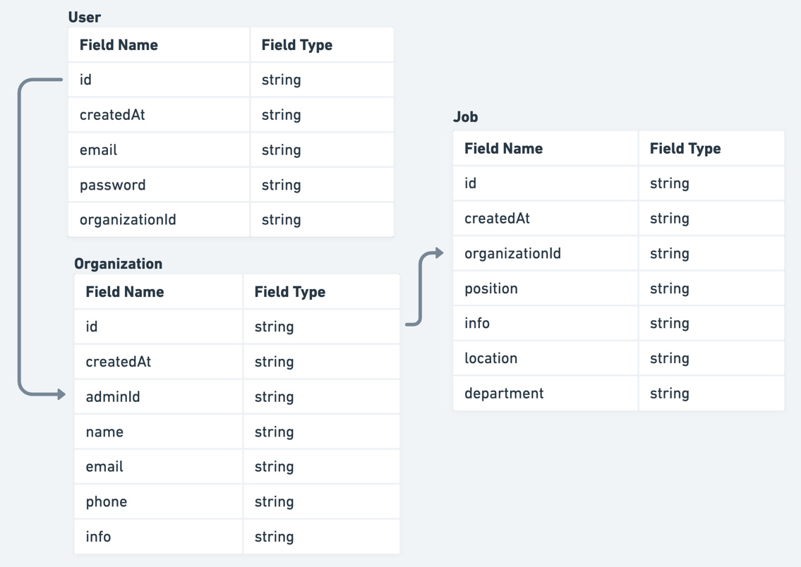

# Understanding the architecture of React applications

## Table of contents

- [📖 Resources](#resources)
- [📚 Other Useful resources](#other-useful-resources)
- [🎯 Learning Objectives](#learning-objectives)
- [📝 Notes](#notes)
- [Benefits of having a good app architecture](#benefits-of-having-a-good-application-architecture)
  - [Good foundation for the project](#a-good-foundation-for-the-project)
  - [Easier project management](#easier-project-management)
  - [Increased development speed and productivity](#increased-development-speed-and-productivity)
- [Exploring the architectural challenges of React applications](#exploring-the-architectural-challenges-of-react-applications)
  - [What are the challenges when building a React application?](#what-are-the-challenges-when-building-a-react-application)
    - [What project structure are we using?](#what-project-structure-are-we-using)
    - [What rendering strategy are we using?](#what-rendering-strategy-are-we-using)
    - [What state management solution are we using?](#what-state-management-solution-are-we-using)
    - [What styling solution are we using?](#what-styling-solution-are-we-using)
    - [How are we going to handle user authentication?](#how-are-we-going-to-handle-user-authentication)
    - [What testing strategies are we going to use?](#what-testing-strategies-are-we-going-to-use)
- [Understanding architectural decisions when building React applications](#understanding-architectural-decisions-when-building-react-applications)
  - [Bad architectural decisions](#bad-architectural-decisions)
    - [Flat project structure](#flat-project-structure)
    - [Large, tightly coupled components](#large-tightly-coupled-components)
    - [Unnecessary global state](#unnecessary-global-state)
    - [Using the wrong tools to solve problems](#using-the-wrong-tools-to-solve-problems)
    - [Putting the entire application in a single component in a single file](#putting-the-entire-application-in-a-single-component-in-a-single-file)
    - [Not sanitizing user inputs](#not-sanitizing-user-inputs)
    - [Using unoptimized infrastructure to serve our application](#using-unoptimized-infrastructure-to-serve-our-application)
  - [Good architectural decisions](#good-architectural-decisions)
    - [Better structured project structure based on domain and features](#better-structured-project-structure-based-on-domain-and-features)
    - [Better state management](#better-state-management)
    - [Smaller components](#smaller-components)
    - [Separation of concerns](#separation-of-concerns)
    - [Static code analysis](#static-code-analysis)
    - [Deploying the application over a CDN](#deploying-the-application-over-a-cdn)
- [Planning our application](#planning-our-application)
  - [What are we building?](#what-are-we-building)

## Resources

> ☞ TODO: Add resources links

## Other Useful resources

> ☞ TODO: Add resources links

## Learning Objectives

- What are the Benefits of having a good application architecture ?

- What are the architectural challenges of React applications ?

- What are architectural decisions when building React applications?

- How to plan your application?

**Learn to think a bit more from the architectural point of view when starting React application development.**

## Notes

### Benefits of having a good application architecture

`Learning Objectives Recap`

> What are the Benefits of having a good application architecture ?

- What are the architectural challenges of React applications ?

- What architectural decisions when building React applications

- How to plan your application

---

1. A good foundation for the project
2. Easier project management
3. Increased development speed and productivity
4. Cost-effectiveness
5. Better product quality

#### A good foundation for the project

[⬆️ Back to top](#table-of-contents)

Multiple factors cause various changes during a project’s lifetime, such as changes in requirements, organization, technologies, market, finance, and more. Being built on solid foundations will make it resilient to all those changes.

#### Easier project management

[⬆️ Back to top](#table-of-contents)

Having `different components organized properly` will make `organizing and delegating tasks much easier`, especially if a larger team is involved.

`Good component decoupling` will allow `better splitting of work between teams and team members and faster iterations` without team members being blocked by each other.

It also allows `better estimates` to be made regarding how much time is required for a feature to be completed.

#### Increased development speed and productivity

[⬆️ Back to top](#table-of-contents)

Having a good architecture defined `allows developers to focus on the product` they are building `without overthinking the technical implementations since most of the technical decisions should have already been made`.

Besides that, it will provide a smoother onboarding process for new developers, who can be productive quickly after familiarizing themselves with the overall architecture.

#### Cost-effectiveness

[⬆️ Back to top](#table-of-contents)

In most cases, the most expensive cost of every project is people and their work and time. Therefore, by allowing them to be more efficient, we can reduce some redundant costs a bad architecture could bring.

It will also allow better financial analysis and planning of pricing models for software products. It will make it easier to predict all the costs the platform requires to be functional.

#### Better product quality

[⬆️ Back to top](#table-of-contents)

Making all team members productive gives them time to focus and spend more time on important things, such as the business requirements and the needs of users, rather than spending most of the time fixing bugs and reducing technical debt.

- Better product quality will also make our users more satisfied, which should be the end goal

### Exploring the architectural challenges of React applications

[⬆️ Back to top](#table-of-contents)

`Learning Objectives Recap`

- What are the Benefits of having a good application architecture ? ✅

> What are the architectural challenges of React applications ?

- What architectural decisions when building React applications

- How to plan your application

---

#### What are the challenges when building a React application?

[⬆️ Back to top](#table-of-contents)

Some of the most frequent questions when starting with a new React application are as follows:

1. What project structure are we using?
2. What rendering strategy are we using?
3. What state management solution are we using?
4. What styling solution are we using?
5. What data fetching approach are we using?
6. How are we going to handle user authentication?
7. What testing strategies are we going to use?

##### What project structure are we using?

[⬆️ Back to top](#table-of-contents)

Dan Abramov, one of the maintainers of React, says on this:

`"Move files around until it feels right"`

And that is a very good point. It will mostly depend on the nature of the application. For example, we wouldn’t organize a social network application and a text editor application in the same way because they have different needs and different problems to solve.

##### What rendering strategy are we using?

[⬆️ Back to top](#table-of-contents)

It depends on the nature of our application.

1. If we are building an internal dashboard application, a single-page application is more than enough.

2. On the other hand, if we are building a customer-facing application that should also be public and SEO-friendly, we should think about `server-side rendering or static generation`, depending on how often the data on the pages are being updated.

##### What state management solution are we using?

[⬆️ Back to top](#table-of-contents)

React comes with built-in state management mechanisms with its hooks and Context API, but for more complex applications, we often reach for external solutions such as Redux, MobX, Zustand, Recoil, and others.

Choosing the right state management solution is something that depends a lot on the application’s needs and requirements. We will not reach for the same tools if we are building a to-do app or an e-commerce application.

It mostly depends on

1. `the amount of state that needs to be shared across the entire application`
2. `the frequency of updating those pieces of state`.

- Will our application have a lot of `frequent updates`(How much is frequent)? If that is the case, we might consider `atom-based` solutions such as `Recoil` or `Jotai`.

- If our application requires a lot of `different components to share the same state`, then `Redux with Redux Toolkit` is a good option.

- On the other hand, if `we do not have a lot of global states` and `don’t update it very often`, then `Zustand or React Context API`, in combination with `hooks`, are good choices.

At the end of the day, it all depends on the application’s needs and the nature of the problem we are trying to solve.

**Understanding what state is and how to manage state (understand the scope of the state) is essential.**

##### What styling solution are we using?

[⬆️ Back to top](#table-of-contents)

This one mostly `depends on preference`. Some people prefer vanilla CSS, some people love utility-first CSS libraries such as Tailwind, and some developers can’t live without CSS in JS.

Making this decision `should also depend on whether our application will be re-rendered very often`. If that is the case, we might consider `build-time solutions` such as vanilla CSS, SCSS, Tailwind, and others. Otherwise, we can use `runtime styling solutions` such as Styled Components, Emotion, and more.

We should also keep in mind whether we want to use a pre-built component library or if we want to build everything from scratch.

##### How are we going to handle user authentication?

[⬆️ Back to top](#table-of-contents)

This depends on the `API implementation`.

- Are we using token-based authentication?
- Does our API server support cookie-based authentication?

It is considered to be safer to use cookie-based authentication with httpOnly cookies to prevent cross-site scripting (XSS) attacks.

##### What testing strategies are we going to use?

[⬆️ Back to top](#table-of-contents)

This `depends on the team structure`, so if we have `QA engineers available`, we will be able to let them do end-to-end tests.

It also `depends on how much time we can devote to testing` and other aspects.
Keep in mind that we should always consider having some level of testing, at least integration, and end-to-end testing for the most critical parts of our application.

### Understanding architectural decisions when building React applications

[⬆️ Back to top](#table-of-contents)

`Learning Objectives Recap`

- What are the Benefits of having a good application architecture ? ✅

- What are the architectural challenges of React applications ? ✅

> What architectural decisions when building React applications

- How to plan your application

---

#### Bad architectural decisions

[⬆️ Back to top](#table-of-contents)

Let’s look at some of the bad architectural decisions that might slow us down.

##### Flat project structure

[⬆️ Back to top](#table-of-contents)

Imagine having a lot of components, all living in the same folder. The simplest thing to do is to place all the React components within the components folder, which is fine if our components count does not exceed 20 components. After that, it becomes difficult to find where a component should belong because they are all mixed.

##### Large, tightly coupled components

[⬆️ Back to top](#table-of-contents)

Having large and coupled components have a couple of downsides.

1. They are difficult to test in isolation
2. they are difficult to reuse
3. they may also have performance issues in some cases because the component would need to be re-rendered entirely instead of us re-rendering just the part that needs to be re-rendered.

##### Unnecessary global state

[⬆️ Back to top](#table-of-contents)

Having a global state is fine, and often required. But keeping too many things in a global state can be a bad idea. It might affect performance, but also maintainability because it makes it difficult to understand the scope of the state.

##### Using the wrong tools to solve problems

[⬆️ Back to top](#table-of-contents)

The number of choices in the React ecosystem makes it easier to choose the wrong tools to solve a problem – for example, `caching server responses in the global store`. It may be possible, and we have been doing this in the past, but that doesn’t mean we should keep doing that because there are tools to solve this problem, such as `React Query`, `SWR`, `Apollo Client`, and so on.

##### Putting the entire application in a single component in a single file

[⬆️ Back to top](#table-of-contents)

This is something that shouldn’t ever happen, but it is still worth mentioning. Nothing is preventing us from creating a complete application in a single file. It could be thousands of lines long – that is, a single component that would do everything. But for the same reason as having large components, it should be avoided.

##### Not sanitizing user inputs

[⬆️ Back to top](#table-of-contents)

Many hackers on the web are trying to steal our user’s data. Therefore, we should do everything possible to prevent such things from happening. By sanitizing user inputs, we can prevent hackers from executing some malicious piece of code in our application and stealing user data. For example, we should prevent our users from inputting anything that could be executed in our application by removing any parts of the input that might be risky.

##### Using unoptimized infrastructure to serve our application

[⬆️ Back to top](#table-of-contents)

Using unoptimized infrastructure to serve our application will make our application slow when accessed from different parts of the world.

#### Good architectural decisions

[⬆️ Back to top](#table-of-contents)

Let’s look at some of the good decisions we can make to make our application better.

##### Better structured project structure based on domain and features

[⬆️ Back to top](#table-of-contents)

Splitting the application structure into different features or domain-specific modules, each responsible for its own role, will allow better separation of concerns of different application pieces, better modularity of different parts of the application, better flexibility, and scalability.

##### Better state management

[⬆️ Back to top](#table-of-contents)

Instead of putting everything in a global state, we should start by defining a piece of a state as close as possible to where it is being used in the component and lift it only if necessary.

##### Smaller components

[⬆️ Back to top](#table-of-contents)

Having smaller components will make them more testable, easier to track changes, and easier to work in larger teams.

##### Separation of concerns

[⬆️ Back to top](#table-of-contents)

Have each component do as little as possible. This makes components easy to understand, test, modify, and even reuse.

##### Static code analysis

[⬆️ Back to top](#table-of-contents)

Relying on static code analysis tools such as ESLint, Prettier, and TypeScript will improve our code quality without us having to think too much about it. We just need to configure these tools, and they will let us know when something is wrong with our code. These tools also `introduce consistency` in the code base regarding formatting, code practices, and documentation

##### Deploying the application over a CDN

[⬆️ Back to top](#table-of-contents)

Having users worldwide means our application should be functional and accessible from all over the world. By deploying the application on a CDN, users all over the world can access the application in the most optimal way.

### Planning our application

[⬆️ Back to top](#table-of-contents)

`Learning Objectives Recap`

- What are the Benefits of having a good application architecture ? ✅

- What are the architectural challenges of React applications ? ✅

- What architectural decisions when building React applications ✅

> How to plan your application

Now, let’s apply the principles we just learned about to a real-world scenario where we will be planning the application that we will be building.

#### What are we building?

[⬆️ Back to top](#table-of-contents)

We will be building `an application that allows organizations to manage their job boards`.

The organization `admins can create job postings` for their organizations, and `the candidates can apply for the jobs`.

We will be `building an MVP version` of the application `with the minimum set of features`, but it should be extendable for more features in the future. At the end of this book, we will cover the features that the final application could have, but to keep things simple, we will be focusing on the MVP version.

Proper application planning starts with gathering the requirements of the application.

#### Application requirements

```mdx
    Functional requirements
    Non-functional requirements
```

##### Functional requirements

Functional requirements `should define what the application should do`. They are descriptions of all the features and functionalities of an application that our users would use.

Our application can be split into two parts:

1. Publicly facing part
2. Organization admin dashboard

###### Publicly facing part

```md
- Landing page with some basic information about our application.

- Public organization view where the visitors can find information about the given organization. Besides the basic organization information, it should also include the list of jobs of the organization.

- A public job view where the visitors can view some basic information about the given job. Besides this information, it should also include the action for applying for the job.
```

###### Organization admin dashboard

```md
- Authentication system for the dashboard that should allow organization admins to authenticate into the dashboard. For our MVP, we will just implement the login functionality with an existing test user.

- Jobs list view where the admin can view all the jobs of the organization.

- Create a job view that contains the form for creating new jobs.

- Job details view, which contains all the information about the job.
```

##### Non-functional requirements

Non-functional requirements should define how the application should work from the technical side:

```md
- Performance: The application must be interactive within 5 seconds. By that, we mean that the user should be able to interact with the page within 5 seconds from when the request to load the application was made until the user can interact with the page.

- Usability: The application must be user-friendly and intuitive. This includes implementing responsive design for smaller screens. We want the user experience to be smooth and straightforward.

- SEO: The public-facing pages of the application should be SEO-friendly.
```

#### Data model overview

To better understand how our application will work under the hood, it is helpful to understand its data model, so we will dive into that in this section.

In the following diagram, we can see what our data model looks like from the database perspective :


there are three main models in the application:

1. User
2. Organisation
3. Job

Defining the application requirements and data model should give us a good understanding of what we are building. Now, let’s explore the technical decisions for our application.

#### Exploring the technical decisions

##### Project structure

We will be using a `feature-based project structure` that allows`good feature isolation` and `good communication between the features`.

This means we will create a feature folder for every larger functionality, which will make the application structure more scalable.

It will scale very well when the number of features increases because we only need to worry about a specific feature and not the entire application at once, where the code is scattered all over the place.

##### Rendering strategy

When it comes to the rendering strategy, we are referring to the way the pages of our application are being created.

There are different types of rendering strategies:

```md
- `Server-side rendering`:

In the early days of the web, this was the most common way to generate pages with dynamic content. The page content is created on the fly, inserted into the page on the server, and then returned to the client.

The benefits of this approach are that the pages are easier to crawl by search engines, which is important for SEO, and users might get faster initial loads of the page compared to single-page apps.

The downside of this approach is that it might require more server resources.

In our scenario, `we will be using this approach for the pages that can be updated frequently and should be SEO optimized at the same time`, such as `the public organization page` and `public job page`.

- `Client-side rendering`:

The existence of client-side JavaScript libraries and frameworks, such as React, Angular, Vue, and others, allows us to create complex client-side applications completely on the client.

The benefit of this is that once the application is loaded in the browser, the transition between pages seems very fast.

On the other hand, for the application to load, we need to download a lot of JavaScript to use the application. This can be improved by code splitting and lazy loading.

It is also more difficult to crawl the page’s content using search engines, which can impact SEO scores.

We can use this approach `for protected pages`, which is `every page in the dashboard` of our application.

- `Static generation`:

This is the most straightforward approach. Here, we can generate our pages while building the application and serve them statically.

It is very fast, and `we can use this approach for pages that never update` but `need to be SEO optimized`, such as the `landing page of our application`.
```

Since our application requires multiple rendering strategies, `we will use Next.js`, which supports each of them very well.

##### State management

State management is probably one of the most discussed topics in the React ecosystem. It is very fragmented, meaning there are so many libraries that handle state that it makes it difficult for the developers to make a choice.

To make state management easier for us, we need to understand that there are multiple types of states:

```md
- `Local state:`

This is the simplest type of state.

It is the state that is being used in a single component only and is not required anywhere else.

We will use the `built-in React hooks` to handle that.

- `Global state:`

This is the state that is shared across multiple components in the application.

It is used to avoid prop drilling.

We will be using a lightweight library called `Zustand `for this.

- `Server state:`

This state is used to store data responses from the API.

Things such as loading states, request de-duplications, polling, and others are very challenging to implement from scratch. Therefore, we will be using `React Query` to handle this elegantly so that we have less code to write.

- `Form state:`

This should handle form inputs, validation, and other aspects.

We will be using the `React Hook Form` library to handle forms in our application.

- `URL state:`

This type of state is often overlooked yet very powerful.

URL and query params can also be considered as pieces of state.

This is especially useful when we want to deep-link some part of the view. Capturing the state in the URL makes it very easy to share it.
```

##### Styling

Styling is also a big topic in the React ecosystem. There are many great libraries for styling React components.

To style our application, we will use the Chakra UI component library, which uses Emotion under the hood, and it comes with a variety of nice-looking and accessible components that are very flexible and easy to modify.

The reason for choosing Chakra UI is that it has a great developer experience. It is very customizable, and its components are accessibility-friendly out of the box.

##### Authentication

The authentication of our application will be cookie-based, meaning that on a successful auth request, a cookie will be attached to the headers, which will handle user authentication on the server. We are choosing cookie-based authentication because it is more secure.

##### Testing

Testing is a very important method of asserting that our application is working as it’s supposed to.

We don’t want to ship our product with bugs in it. Also, manual testing takes more time and effort to discover new bugs, so we want to have automated tests for our application.

There are multiple types of tests:

```md
- `Unit tests:`

Unit tests only test the smallest units of an application in isolation.

We will be using Jest to unit-test the shared components of our application.

- `Integration tests:`

Integration tests test multiple units at once.

They are very useful for testing the communication between multiple different parts of the application.

We will be using React Testing Library to test our pages.

- `End-to-end tests:`

End-to-end tests allow us to test our application’s most important parts end to end, meaning we can test the entire flow.

Usually, the most important end-to-end tests should test the most critical features.

For this kind of testing, we will be using `Cypress`.
```

### Summary

React is a very popular library for building user interfaces, and it leaves most of the architectural choices to developers, which can be challenging.

In this chapter, we learned that some of the benefits of setting up a good architecture are a good project foundation, easier project management, increased productivity, cost-effectiveness, and better product quality.

We also learned about the challenges to consider, such as

- project structure (flat?, featured-based? etc..)
- rendering strategies(server-side?, client-side?, static generation? etc..),
- state management(how do you manage local state, global state, server state(data responses from API), Form state, URL state, etc.),
- styling (What styling solution are we using? utility-first CSS, CSS-In-JS,pre-built component library ),
- authentication (How are we going to handle user authentication? Cookie-based, JWT?),
- testing, and others.

Then, we covered the planning phase of the application that we will be building, which is an application for managing job boards and job applications by gathering requirements. We did that by defining the data model of the application and choosing the right tools to overcome the architectural challenges.

This has given us a good foundation to implement our architecture in a real-world scenario, as we will see in the following chapters.

In the next chapter, we will cover the entire setup that we will be using for building the application.
