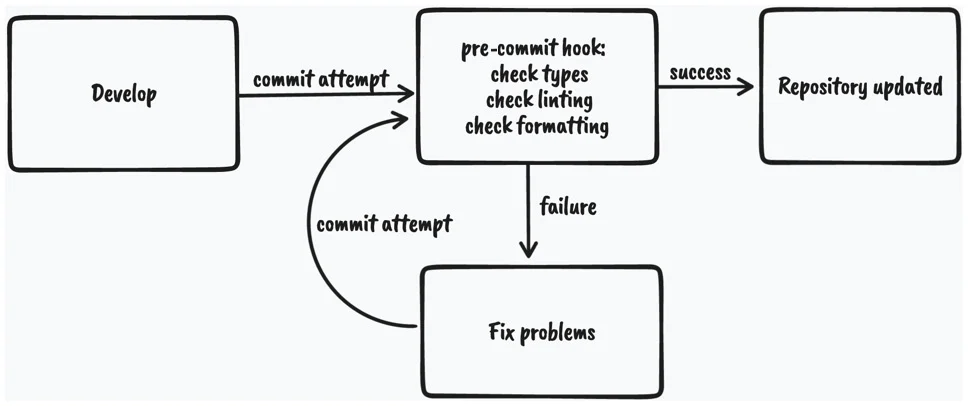
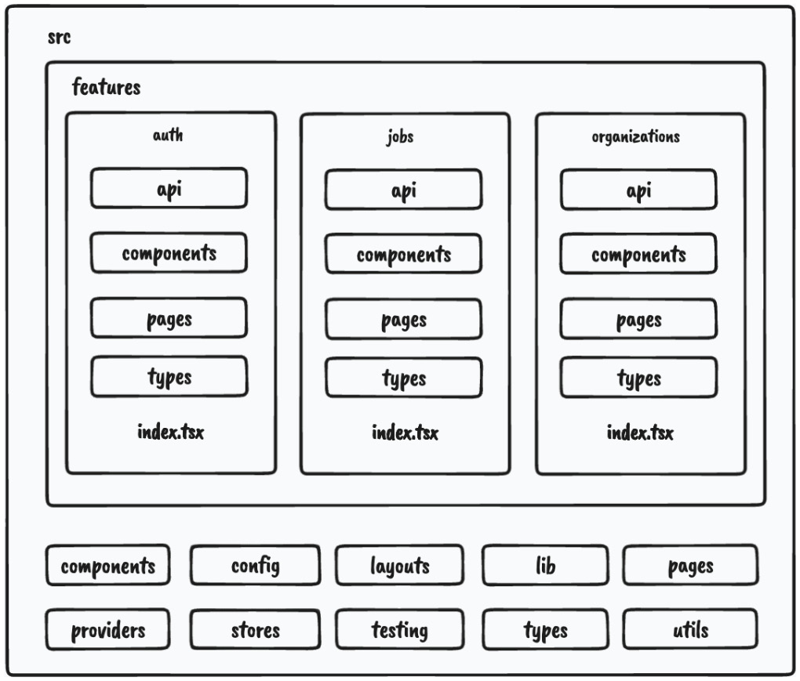

# Setup and project structure overview

## Table of contents

- [📖 Resources](#resources)
- [📚 Other Useful resources](#other-useful-resources)
- [🎯 Learning Objectives](#learning-objectives)
- [📝 Notes](#notes)

## Resources

> ☞ TODO: Add resources links

## Other Useful resources

> ☞ TODO: Add resources links

## Learning Objectives

- Next.js application overview
- TypeScript setup overview and usage
- ESLint setup overview
- Prettier setup overview
- Pre-committing checks setup overview
- Project structure overview

- **Having good understanding of the tools we will be using for the project setup and the feature-based project structure to make organizing our code more manageable.**

## Notes

### Next.js Application overview

- web framework built on top of React and Node.js, allowing us to build web applications. Because `it can run on the server`, it can be used as a full-stack framework.

#### Why Next?

- Very easy to get started with: In the early days of React, it was very challenging to start a project. To get a simple page on the screen, we had to deal with many tools such as Webpack, Babel, and others. We still use those tools today, `but fortunately`, most tooling configuration is hidden from us with an interface to extend the configuration if required.

- Besides the challenges of setting up the project, it is very challenging to `maintain all those dependencies over time`. Next.js hides all those complexities away from developers and allows them to get started quickly with a new project

- `Multiple rendering strategies`: Being able to use multiple rendering strategies is probably the main reason why we want to use Next.js, although it comes with other great benefits. First, it allows us to define the behavior of page rendering at the page level, meaning we can define how we want to render each page individually. It also supports multiple rendering strategies, such as : Client-side rendering, : Server-side rendering, Static site generation, Incremental static regeneration.

We will be using different strategies based on the application’s needs.

- `Performance optimizations`: Next.js is built with web performance in mind. It implements performance optimization techniques such as the following: Code splitting, Lazy loading, Prefetching, Image optimization.

#### Next application structure

- The easiest way to get started with Next.js is to use the create-next-app CLI to generate a new application.

Since we have already generated the application as part of the code samples, we do not need to use the CLI, but if we were generating the application from scratch, we would execute the following command :

```sh
npx create-next-app@latest jobs-app --typescript
```

By executing this command, we would generate a new Next.js application with TypeScript configured out of the box.

- There are a couple of things that are specific to Next.js. Let’s look at the following file and folder structure of a simple Next.js application:

```sh
- .next
- public
- src
  - pages
    - _app.tsx
- next.config.js
- package.json
```

1. `.next`: Contains production-ready files generated by running the build command of Next.js.

2. `public`: Contains all static assets of the application.

3. `src/pages`: This is a special folder in Next.js where `all pages defined here become available at corresponding routes.` `This is possible thanks to the filesystem-based routing system`. The pages folder can also live in the root of the project, but it is nice to keep everything in the src folder.

4. `src/pages/_app.tsx`: The \_app.tsx file is a special file that `exports a React component that wraps every page when rendered`. By wrapping pages with this special component, we `can add custom behavior for our application`, such as `adding any global configurations`, providers, styles, layouts, and more to all the pages.

5. `src/pages/index.tsx`: This is how we declare pages of the application. This shows how the root page is defined.

6. `next.config.js`: This is where we can `extend the default functionalities` such as Webpack configuration and other things in a simple way.

7. `package.json` : Every Next.js application includes the following npm scripts:

- `dev`: Starts a development server on localhost:3000
- `build`: Builds the application for production
- `start`: Starts the production build on localhost:3000

### Typescript setup overview and usage

JavaScript is a dynamically typed programming language, meaning it doesn’t catch any type errors during build time. That’s where TypeScript comes into play.

TypeScript is a programming language that acts as a superset of JavaScript, which allows us to write JavaScript with some behaviors of a statically typed language. This comes in handy as we can catch many potential bugs before they get into production.

#### Why Typescript?

- TypeScript is especially `useful for large applications built by large teams` :Code written in TypeScript is much better documented than code written in vanilla JavaScript. By looking at the type definitions, we can figure out how a piece of code is supposed to work.

- `TypeScript makes refactoring much easier` because most of the issues can be caught before running the application.

- `TypeScript also helps us utilize our editor’s IntelliSense`, which shows us intelligent code completion, hover information, and signature information, which speeds up our productivity.

#### TypeScript setup

Our project already has TypeScript configured. The TypeScript configuration is defined in the `tsconfig.json` file at the root of the project. It allows us to configure how strict we want it to be based on our needs:

```json
{
  "compilerOptions": {
    "target": "es5",
    "lib": ["dom", "dom.iterable", "esnext"],
    "allowJs": true,
    "skipLibCheck": true,
    "strict": true,
    "forceConsistentCasingInFileNames": true,
    "noEmit": true,
    "esModuleInterop": true,
    "module": "esnext",
    "moduleResolution": "Node",
    "resolveJsonModule": true,
    "isolatedModules": true,
    "jsx": "preserve",
    "incremental": true,
    "baseUrl": ".",
    "paths": {
      "@/_": ["./src/_"]
    }
  },
  "include": ["next-env.d.ts", "src"],
  "exclude": ["node_modules"]
}
```

We will not dive too deeply into every configuration property since most of the properties have been auto-generated. However, there is one thing that was also provided:

```json
   "baseUrl": ".",
    "paths": {
      "@/*": ["./src/*"]
    }
```

- This will tell the TypeScript compiler that anything `imported via @/*` will refer to the `src` folder.

Previously, we had to perform messy imports, like so:

```tsx
import { Component } from '../../../components/component'
```

Now, we can import components like so :

```tsx
import { Component } from '@/components/component'
```

No matter how many nested levels we have, we can always import with absolute paths, and we will not be required to change our import statement should we decide to move the consumer file somewhere else.

#### Basic TypeScript usage

##### Primitive types

```ts
let numberVar: number
numberVar = 1 // OK
numberVar = '1' // Error

let stringVar: string
stringVar = 'Hi' // OK
stringVar = false // Error
```

- As we can see, we are only allowed to assign values with the corresponding type. Assigning to any other type except the `any` type, will cause a TypeScript error.

##### Any

The `any` type `is the loosest type` in TypeScript and using it will disable any type checking.`We can use it when we want to bypass errors` that would usually occur. However, we should only use it as a last resort and try to use other types first:

```ts
let anyVar: any
anyVar = 1 // OK
anyVar = 'Hello' // OK
anyVar = true // OK
numberVar = anyVar // OK
```

- As we can see, variables with the `any` type `can accept and be assigned to a value of any other type`, which makes it very flexible.

##### Unknown

Sometimes, we can’t know upfront which types we will have. This might happen with some dynamic data where we don’t know its type yet. Here, we can use the `unknown` type :

```ts
let unknownVar: unknown
unknownVar = 1 // OK
unknownVar = '123' // OK

let unknownVar2: unknown
unknownVar = unknownVar2 // OK
anyVar = unknownVar2 // OK
numberVar = unknownVar2 // Error
stringVar = unknownVar2 // Error
booleanVar = unknownVar2 // Error
```

- As we can see, we can assign values of any type to the variable with unknown type
- we can assign values with type unknown to the variables with any and unknown types
- We cannot assign values with type unknown to the variables with any other types.

##### Arrays

There are two ways to define array types with TypeScript:

```ts
type numbers = number[]
type strings = Array<string>
```

##### Objects

Object shapes can be defined in two ways:

```ts
type Person = {
  name: string
  age: number
}
interface Person {
  name: string
  age: number
}
```

The first one is called type alias, while the second is called interface.

There are a few differences between type aliases and interfaces, but we won't get into them right now. For any object shape type we define, we can use type aliases

##### Unions

The basic types we just mentioned are great, but sometimes, `we want to allow a variable to be one of many types`. Let’s look at the following example :

```ts
type Content = string | number
let content: Content
content = 1 // OK
content = 'Hi' // OK
content = false // Error
```

- As we can see, the content variable can now be either string or number.

- We can also add literal types in the union, as shown in the following example:

```ts
type Color = 'red' | 'green' | 'blue'
let color: Color
color = 'red' // OK
color = 'yellow' // Error
```

- Here, we are defining colors as strings, but `we want to add more constraints so that we can only take one of those three colors`. If we try to add anything else, TypeScript will warn us with an error.

##### Intersections

Intersection types allow us to combine the properties of two different objects into a single type. Consider this example:

```ts
type Foo = {
  x: string
  y: number
}
type Bar = {
  z: boolean
}
type FooBar = Foo & Bar
```

- The FooBar type will now contain the x, y, and z properties

##### Generics

- Generics is a `mechanism of creating reusable types by parameterizing them`. They can help us `reduce code repetition`. Consider the following type:

```ts
type Foo = {
  x: number
}
```

Let’s see what happens if we need the `same structure but with x as a string`:

```ts
type Foo = {
  x: string
}
```

Here, we can see that there is some code duplication going on. We can simplify this by making it generic so that it accepts the type as T. This would be assigned as the type of the x property:

```ts
type Foo<T> = {
  x: T
}
let x: Foo<number>
let y: Foo<string>
```

Now, we have a nice way to `reuse the structure` by passing different types to the generic.

- We can also use generics with functions:

```ts
function logger<T>(value: T) {
  console.log(value)
}
logger<number>(1) // OK
logger<string>(1) // Error
```

##### TypeScript and React

- Every TypeScript file that uses JSX must have the `.tsx extension.`

Typing React components is very straightforward:

```tsx
type InfoProps = {
  name: string
  age: number
}
const Info = (props: InfoProps) => {
  return (
    <div>
      {props.name}-{props.age}
    </div>
  )
}
```

### ESLINT setup overview

Linting is a `process where linters analyze source code and detect any potential issues` in the code base.

The ESLint configuration is defined in the `.eslintrc.js` file at the root of the project. We can add different rules, extend them with different plugins, and override which files to apply the rules to so that they suit our application’s needs.

Sometimes, we don’t want to lint every folder and file, so we can tell ESLint to ignore folders and files by defining them in the `.eslintignore file`.

ESLint has great integration with editors and IDEs so that we can see any potential issues in the file while we are coding.

To run our linter, we have defined the linting script in `package.json`:

```json
"lint": "eslint --ext .ts,.tsx ./src",
```

By running `npm run lint`, we will lint every `.ts` and `.tsx` file in the `src directory`, and the linter will notify us about any potential issues.

### PRETTIER setup overview

Prettier is a great tool for formatting code. It enforces a consistent coding style across the entire code base. By utilizing the “format on save” feature in our IDE, we can automatically format the code based on the configuration provided in the `.prettierrc` file. It will also give us good feedback when something is wrong with the code. If it doesn’t auto-format, something is wrong with the code and it needs to be fixed.

Just as with ESLint, sometimes, there are files we do not want to auto-format. We can tell Prettier to ignore files and folders by adding them to the `.prettierignore` file.

To run Prettier, we have defined a couple of scripts in package.json

```json
"prettier": "prettier \"**/*.+(json|ts|tsx)\"",
"format:check": "npm run prettier -- --check",
"format:fix": "npm run prettier -- --write",
```

As we can see, we can run `npm run format:check`to just check the formatting without trying to fix it. If we want to fix it, then we can run `npm run format:fix`, which will modify the files that need to be fixed.

### Pre-committing checks setup overview

Having static code analysis tools such as TypeScript, ESLint, and Prettier is great; we have configured them and can run individual scripts whenever we make some changes to ensure everything is in the best order.

However, developers can forget to run all checks `before committing to the repo`, which can still bring problematic and inconsistent code to production.

Fortunately, there is a solution that can fix this problem such that `whenever we try to commit to the repository, we want to run all checks in an automated way`.

This is the flow we want to have:



- As we can see,

1. whenever we attempt to commit to the repository, the git pre-commit hook will run and execute the scripts that will do the checking.

2. If all the checks pass, the changes will be committed to the repository;

3. otherwise, we will have to fix the issues and try again.

To enable this flow, we will use `husky` and `lint-staged` :

- `husky`is a tool that allows us to run git hooks. We want to run the pre-commit hook to `run the checks before committing our changes`

- `lint-staged` is a tool that allows us to `run those checks only on files that are in the staging area of Git`. This improves the speed of code checking since doing that on the entire code base might be too slow.

We already have these tools installed and configured, but if we didn’t, they could be installed using the following command:

```sh
npm install –-save-dev husky lint-staged
```

Then, we would need to enable Git hooks:

```sh
npx husky install
```

Then, we would need to create the pre-commit hook:

```sh
npx husky add .husky/pre-commit "npx lint-staged"
```

The Husky pre-commit hook will run lint-staged. Then, we would need to define what commands lint-staged should run inside the lint-staged.config.js file:

```js
module.exports = {
  '*.{ts,tsx}': [
    'npm run lint',
    "bash -c 'npm run types:check'",
    'npm run format:check',
  ],
}
```

If we try to commit code that contains any violations, it will fail and stop us from committing the changes.

### Project structure overview

Some of the benefits of having a good project structure are :

- Separation of concerns
- Easier refactors
- Better reasoning about the code base
- Easier for larger teams to work on the code base simultaneously

Let’s see what the feature-based project structure looks like. We will focus on the src folder only since, from now on, most of the code base lives there.

Here is the structure of our src folder:

```sh
- components // (1)
- config // (2)
- features // (3)
- layouts // (4)
- lib // (5)
- pages // (6)
- providers // (7)
- stores // (8)
- testing // (9)
- types // (10)
- utils // (11)
```

1. `components`: `Contains all shared components` that are used across the entire application.

2. `config`: Contains the `application configuration files`.

3. `features`: Contains all the `feature-based modules`. We will analyze this one in more detail in the following section.

4. `layouts`: Contains different layouts for the pages.

5. `lib`: Contains `configurations for different libraries` that are used in our application.

6. `pages`: Contains the `pages of our application`. This is where Next.js will look for pages in the filesystem-based routing.

7. `providers`: Contains all `application providers`. For example, if our application uses many `different providers for styling, state, and so on`, we can combine them here and export a single application provider with which we can wrap our `app.tsx` to make all the providers available on all the pages.

8. `stores`: Contains all `global state stores` that are used in the application.

9. `testing`: Contains `test-related mocks, helpers, utilities, and configurations`.

10. `types`: Contains `base TypeScript type definitions`that are used across the application.

11. `utils`: Contains all shared `utility functions`.

There is nothing wrong with grouping files in folders based on their types. However, once the application starts to grow, it becomes more difficult to reason about and maintain the code base because there are too many files of a single type.

#### Feature

To scale the application in the easiest and most maintainable way, we want to keep most of the application code inside the `features`folder.

Every feature folder should contain `domain-specific code` for a given feature. This will allow us to keep functionalities scoped to a feature and not mix its declarations with the shared things. This is much easier to maintain than a flat folder structure with many files.

Let’s look at one of our feature folders, which has the following structure:

```sh
- api // (1)
- components // (2)
- types // (3)
- index.ts // (4)
```

1. `api`: Contains the `API request declarations and API hooks` related to a specific feature. This makes our API layer and the UI layer separate and reusable.
2. `components`: Contains all `components that are scoped to a specific feature`.
3. `types`: This contains the `TypeScript type definitions` for a specific feature.
4. index.ts: This is the `entry point` of every feature. It behaves as the `public API of the feature`, and it `should only export things that should be public for other parts of the application`.

A feature might have other folders, such as `hooks`, `utils`, and `others`, `depending on the needs of the feature`. The only required file is the index.ts file, which acts as the public API of a feature.

Let’s try to visualize the project structure with the following diagram:


As we can see, most of our application code will live within features.

- One more thing we can configure is enforcing developers to import features code via the index.ts file, like so:

```tsx
import { JobsList } from '@/features/jobs'
```

We shouldn’t do this:

```tsx
import { JobsList } from '@/features/jobs/components/jobs-list'
```

This will give us a better picture of which dependency is used where and where it comes from. Also, if the feature gets refactored, it doesn’t have to impact any external parts of the application where that component is used.

We can constrain our code by having the following ESLint rule in the `.eslintrc.js` file:

```js

rules: {
    'no-restricted-imports': [
      'error',
      {
        patterns: ['@/features/*/*'],
      },
    ],
    'import/no-cycle': 'error',
      … rest of the eslint rules
}
```

The `no-restricted-imports` rule will add constraints to import from other features by erroring if any violations in the preceding pattern are detected.

Things from a feature can only be consumed if they’re exported from the`index.ts` file of that feature. This will force us to explicitly make something in a feature publicly available.

If we decide to use features this way, `we should also include the import/no-cycle`rule to `prevent cyclic dependencies where Feature A imports things from Feature B and vice versa`. `If this happens`, that means `something with the application design is wrong` and it needs to be restructured.

### Summary
