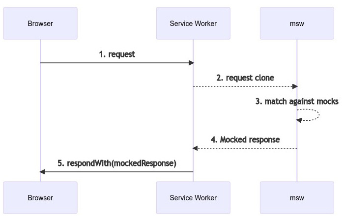
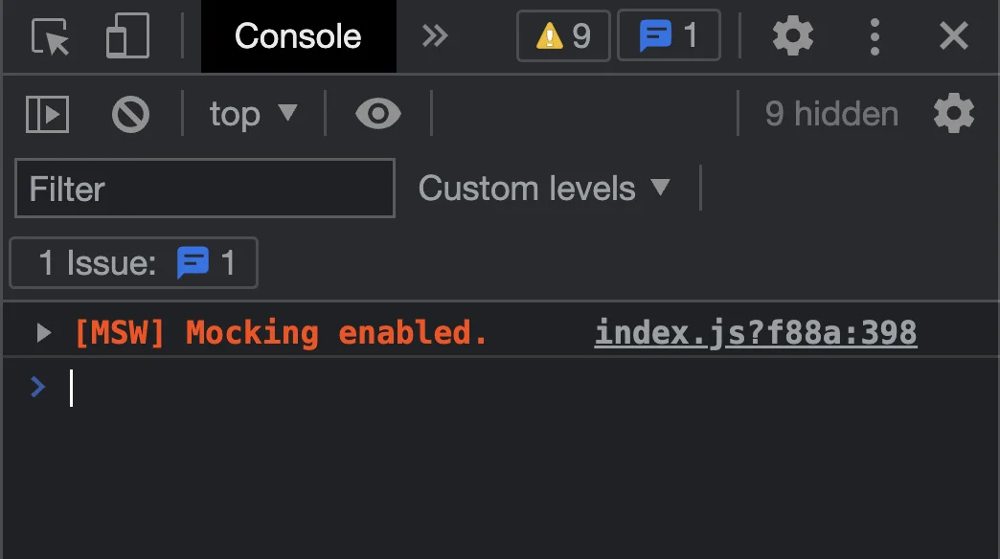
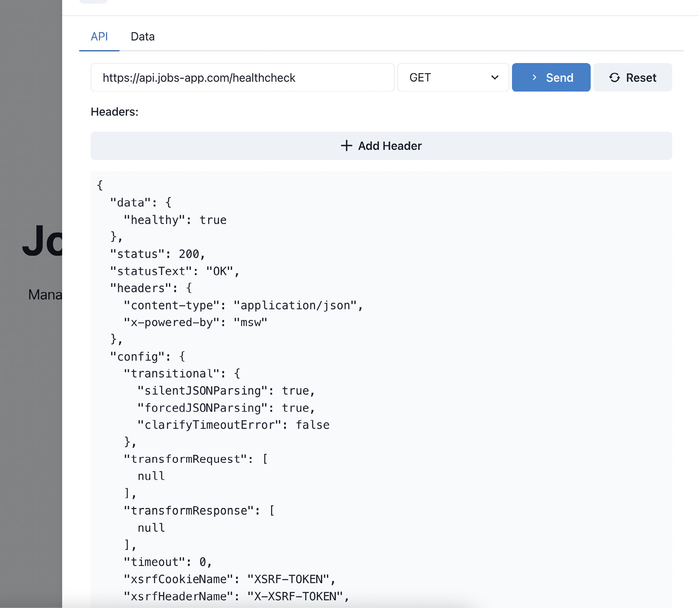
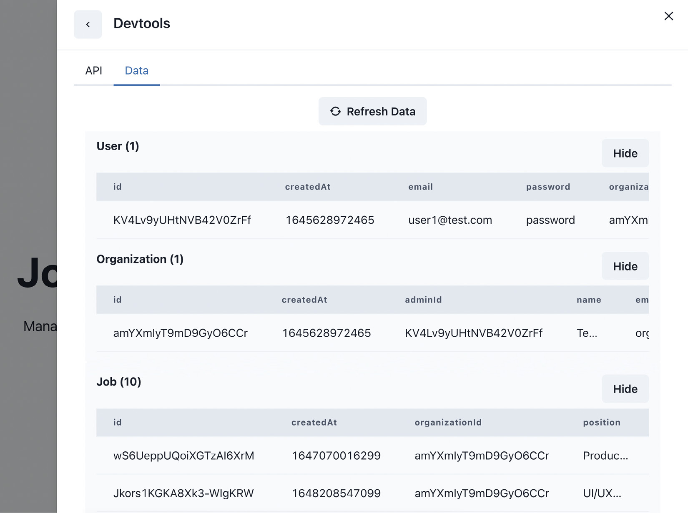
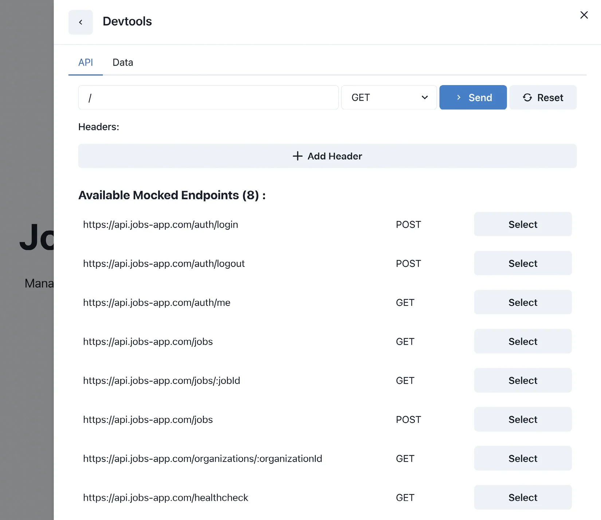

# Mocking API

## Table of contents

- [📖 Resources](#resources)
- [📚 Other Useful resources](#other-useful-resources)
- [🎯 Learning Objectives](#learning-objectives)
- [📝 Notes](#notes)

## Resources

> ☞ TODO: Add resources links

## Other Useful resources

> ☞ TODO: Add resources links

## Learning Objectives

- We will learn what mocking is and why it is useful.

- We will learn how to mock the API endpoints with the msw library, a great tool that allows us to create mocked API endpoints that behave as real-world API endpoints.

- We will also learn how to model the data of our application entities with the @mswjs/data library.

**We will learn how to generate fully featured mocked APIs with data models set in place, which will make our code base less dependent on external APIs during development.**

## Notes

### Why is mocking useful?

Mocking is the process of simulating parts of the system, meaning they are not production-ready but fake versions that are useful for development and testing.

There are several benefits of having the API mocked:

- `Independence of external services during development`: A web application usually consists of many different parts such as the frontend, the backend, external third-party APIs, and so on. When developing our frontends, we want to be as autonomous as possible without getting blocked by some parts of the system that are not functional. If the API of our application is broken or unfinished, we should still be able to proceed with developing the frontend part of the application.

- `Good for quick prototyping`: Mocked endpoints allow us to prototype the application quicker since they don't require any additional setup such as the backend server, database, and so on. Very useful for building proofs of concept (POCs) and minimum viable product (MVP) applications.

- `Offline development`: Having mocked API endpoints allows us to develop our application without an internet connection

- `Testing`: We do not want to hit our real services while testing our frontends. That’s where mocked APIs become useful. We can build and test the entire functionality as if we were building it against a real API and then switch to the real one when in production.

### Introduction to MSW

It works as a `service worker that intercepts any API request` that has its mocked version defined.

We can inspect the requests and responses in the Network tab of our browser the same way as if we were calling the real API.

To get a high-level overview of how it works, let’s take a look at the diagram provided on their website



One great thing about MSW is that our application will behave the same as if it were using a real API, and it’s pretty trivial to switch to using the real API by turning mocked endpoints off and not intercepting requests.

Another great thing is that since the interception happens at the network level, we will still be able to inspect our requests in the Network tab of the browser dev tools.

#### Configuration overview

The `msw` mocked API can be configured to work both in the browser and on the server.

##### Browser

The browser version of the mocked API can be used `for running mocked endpoints during the development of the application`.

###### Initialization

The first thing that needs to be done is to `create a service worker`. This can be done `by executing the following command`:

```sh
npx msw init public/ --save
```

The preceding command will `create a service worker at public/mockServiceWorker.js`, which will `intercept our requests in the browser and modify the responses accordingly`

###### Configuring the worker for the browser

We can now `configure our worker to use the endpoints` we will define in a couple of moments. Let’s open the `src/testing/mocks/browser.ts` file and add the following:

```ts
import { setupWorker } from 'msw'
import { handlers } from './handlers'
export const worker = setupWorker(...handlers)
```

##### Server

The server version is `used mostly during running automated tests` since our `test runner works in the Node environment` instead of the browser.

The server version is also `useful for API calls executed on the server`, which we will have for `our application during server-side rendering`

###### Configuring MSW for the server

Let’s open the `src/testing/mocks/server.ts` file and add the following:

```tsx
import { setupServer } from 'msw/node'
import { handlers } from './handlers'
export const server = setupServer(...handlers)
```

##### Running MSW in the application

Now that we have configured MSW, we `need to make it run in our application`. To do that, let’s `open`the `src/testing/mocks/initialize.ts` file and `modify the initializeMocks function to the following`:

```ts
import { IS_SERVER } from '@/config/constants'
const initializeMocks = () => {
  if (IS_SERVER) {
    const { server } = require('./server')
    server.listen()
  } else {
    const { worker } = require('./browser')
    worker.start()
  }
}
initializeMocks()
```

The `initializeMocks` function is `in charge of calling the proper MSW setup based on the environment it is being called in`. If it is `executed on the server, it will run the server` version. `Otherwise, it will start the browser version`.

Now, we need to integrate our mocks.

Let’s create an `src/lib/msw.tsx` file and add the following:

```ts
import { MSWDevTools } from 'msw-devtools'
import { ReactNode } from 'react'
import { IS_DEVELOPMENT } from '@/config/constants'
import { db, handlers } from '@/testing/mocks'
export type MSWWrapperProps = {
  children: ReactNode
}
require('@/testing/mocks/initialize')
export const MSWWrapper = ({ children }: MSWWrapperProps) => {
  return (
    <>
      {IS_DEVELOPMENT && <MSWDevTools db={db} handlers={handlers} />}
      {children}
          
    </>
  )
}
```

Here we `defined MSWWrapper`, which is a `component that will wrap our application` and `initialize MSW and the MSW dev tools` into the wrapped application.

Now we can `integrate it into our application` by opening src/pages/\_app.tsx.

We want to add new imports:

```tsx
import dynamic from 'next/dynamic'
import { API_MOCKING } from '@/config/constants'
import { MSWWrapperProps } from '@/lib/msw'
```

Then, we want to `load MSWWrapper` dynamically:

```tsx
const MSWWrapper = dynamic<MSWWrapperProps>(() =>
  import('@/lib/msw').then(({ MSWWrapper }) => MSWWrapper)
)
```

Finally, let’s modify the return statement of our App component as follows:

```tsx
return (
  <AppProvider>
    {API_MOCKING ? <MSWWrapper>{pageContent}</MSWWrapper> : pageContent}
  </AppProvider>
)
```

We will `load the MSWWrapper component` and `wrap the content of the page` only `if the mocks are enabled`

We are doing this to exclude MSW-related code for the production version of the application, which uses the real API and does not need the redundant MSW-related code.

To verify that MSW is running, let’s open the console. We should see something like this:



#### Writing our first handler

To define mocked endpoints, we `need to create request handlers`. Think of request handlers as `functions` that `determine whether a request should be intercepted and modified` by mocking their responses.

Let’s create our first handler in the `src/testing/mocks/handlers/index.ts` file by adding the following:

```ts
import { rest } from 'msw'
import { API_URL } from '@/config/constants'
export const handlers = [
  rest.get(`${API_URL}/healthcheck`, (req, res, ctx) => {
    return res(ctx.status(200), ctx.json({ healthy: true }))
  }),
]
```

We are `using the rest helper` provided by msw `to define our rest endpoints`.

We are `using the get method`, which `accepts the path`, and `a callback`, which will `modify the response`.

The handler callback will `return a response with a status code of 200` and the response data set as `{ healthy: true }`.

To verify that our handler is working, let’s open the dev tools in the bottom-right corner and then select the health check endpoint:


Sending the request should give us a response, as shown here :



The Devtools widget is going to `give us the ability to test our handlers without creating the UI` in the application right away.

### Configuring data models

For data modeling our application, we will be using the data library from MSW, which is very useful and simple to use to manipulate the data in a similar way an object-relational mapper (ORM) on the backend would.

We could just hardcode the responses, but where is the fun in that? With MSW and its data library, we can build a mocked backend that is fully functional with the business logic included should we decide to implement it.

To configure our data models, let’s open the `src/testing/mocks/db.ts` file and add the following:

```ts
import { factory, primaryKey } from '@mswjs/data'
import { uid } from '@/utils/uid'
const models = {
  user: {
    id: primaryKey(uid),
    createdAt: Date.now,
    email: String,
    password: String,
    organizationId: String,
  },
  organization: {
    id: primaryKey(uid),
    createdAt: Date.now,
    adminId: String,
    name: String,
    email: String,
    phone: String,
    info: String,
  },
  job: {
    id: primaryKey(uid),
    createdAt: Date.now,
    organizationId: String,
    position: String,
    info: String,
    location: String,
    department: String,
  },
}
export const db = factory(models)
```

- The primaryKey function `allows us to define primary keys` in our mocked database,

- and the factory function `creates an in-memory database` that we can use for testing.

We can then access a bunch of different methods on each model that allow us to manipulate our data more easily, as follows:

```js
db.job.findFirst
db.job.findMany
db.job.create
db.job.update
db.job.delete
```

Let's pre-fill some data in the database so that we always had something to show in our application. To do that, we should seed the database.

open the `src/testing/mocks/seed-db.ts` file and add the following:

```ts
import { db } from './db'
import { testData } from '../test-data'
export const seedDb = () => {
  const userCount = db.user.count()
  if (userCount > 0) return
  testData.users.forEach((user) => db.user.create(user))
  testData.organizations.forEach((organization) =>
    db.organization.create(organization)
  )
  testData.jobs.forEach((job) => db.job.create(job))
}
```

The `seedDb` function will populate the database with test data.

Let’s execute it after our mocked endpoints have been initialized. Open `src/testing/mocks/initialize.ts` and call the function, as follows:

```ts
import { IS_SERVER } from '@/config/constants'
import { seedDb } from './seed-db'
const initializeMocks = () => {
  if (IS_SERVER) {
    const { server } = require('./server')
    server.listen()
  } else {
    const { worker } = require('./browser')
    worker.start()
  }
  seedDb()
}
initializeMocks()
```

To inspect the data in our database, we can open the Data tab in Devtools:



Now, we have our database pre-filled with some test data. We can now create request handlers, which will interact with the database and consume the data.

### Configuring request handlers for API endpoints

A handler in MSW is a function that, if defined, will intercept any matching requests, and instead of sending the requests to the network, it will modify them and return the mocked response.

#### API utils

Before getting started, let’s take a quick look at the `src/testing/mocks/utils.ts` file, which includes some utilities we will be using for handling the business logic of our API handlers:

- `authenticate`: accepts user credentials, and if they are valid, it will return the user from the database together with the authentication token.

- `getUser`: returns a test user object.

- `requireAuth`: returns the current user if the token in the cookie is available. It can optionally throw an error if the token does not exist.

Before getting started, let’s `include all handlers in the configuration`. Open the s`rc/testing/mocks/handlers/index.ts` file and change it to the following:

```ts
import { rest } from 'msw'
import { API_URL } from '@/config/constants'
import { authHandlers } from './auth'
import { jobsHandlers } from './jobs'
import { organizationsHandlers } from './organizations'
export const handlers = [
  ...authHandlers,
  ...jobsHandlers,
  ...organizationsHandlers,
  rest.get(`${API_URL}/healthcheck`, (req, res, ctx) => {
    return res(ctx.status(200), ctx.json({ healthy: true }))
  }),
]
```

Now, we can start working on the request handlers for our application

#### Auth handlers

For the auth feature, we will need the following endpoints:

- POST /auth/login
- POST /auth/logout
- GET /auth/me

The endpoints for auth will be defined in the `src/test/mocks/handlers/auth.ts` file.

importing the dependencies :

```tsx
import { rest } from 'msw'
import { API_URL } from '@/config/constants'
import { authenticate, requireAuth, AUTH_COOKIE } from '../utils'
```

Then, let’s create a request handler for logging in:

```tsx
const loginHandler = rest.post(
  `${API_URL}/auth/login`,
  async (req, res, ctx) => {
    const credentials = await req.json()
    const { user, jwt } = authenticate(credentials)
    return res(
      ctx.delay(300),
      ctx.cookie(AUTH_COOKIE, jwt, {
        path: '/',
        httpOnly: true,
      }),
      ctx.json({ user })
    )
  }
)
```

- We are extracting the credentials and using them to get the user info and the token
- Then, we attach the token to the cookie and return the user in the response with a 300 ms delay as the real API

We are using the httpOnly cookie because it is safer since it is not accessible from the client

Then, let’s create a logout handler:

```tsx
const logoutHandler = rest.post(
  `${API_URL}/auth/logout`,
  async (req, res, ctx) => {
    return res(
      ctx.delay(300),
      ctx.cookie(AUTH_COOKIE, '', {
        path: '/',
        httpOnly: true,
      }),
      ctx.json({ success: true })
    )
  }
)
```

The handler will j`ust empty the cookie and return the response`. Any subsequent requests to protected handlers will throw an error.

Finally, we have an endpoint for fetching the currently authenticated user:

```tsx
const meHandler = rest.get(`${API_URL}/auth/me`, async (req, res, ctx) => {
  const user = requireAuth({ req, shouldThrow: false })
  return res(ctx.delay(300), ctx.json(user))
})
```

The endpoint will extract the user from the token and return it in the response. In the end, we should export the handlers in order for them to be consumed by MSW:

```tsx
export const authHandlers = [loginHandler, logoutHandler, meHandler]
```

#### Job handlers

We will need the following endpoints :

- GET /jobs
- GET /jobs/:jobId
- POST /jobs

The endpoints for jobs will be defined in the `src/test/mocks/handlers/jobs.ts` file.

```tsx
import { rest } from 'msw'
import { API_URL } from '@/config/constants'
import { db } from '../db'
import { requireAuth } from '../utils'
// We are getting the organization ID from the search parameters and using that to get jobs for a given organization, which we return in the response.
const getJobsHandler = rest.get(`${API_URL}/jobs`, async (req, res, ctx) => {
  const organizationId = req.url.searchParams.get('organizationId') as string
  const jobs = db.job.findMany({
    where: {
      organizationId: {
        equals: organizationId,
      },
    },
  })
  return res(ctx.delay(300), ctx.status(200), ctx.json(jobs))
})
```

Another endpoint we want to create is a job details endpoint. We can do that by creating the following handler:

```tsx
const getJobHandler = rest.get(
  `${API_URL}/jobs/:jobId`,
  async (req, res, ctx) => {
    const jobId = req.params.jobId as string
    const job = db.job.findFirst({
      where: {
        id: {
          equals: jobId,
        },
      },
    })
    if (!job) {
      return res(
        ctx.delay(300),
        ctx.status(404),
        ctx.json({ message: 'Not found!' })
      )
    }
    return res(ctx.delay(300), ctx.status(200), ctx.json(job))
  }
)
```

- We are getting the job ID from the URL parameters and using that to retrieve the given job from the database. If the job is not found, we return a 404 error. Otherwise, we return the job in the response.

```tsx
const createJobHandler = rest.post(`${API_URL}/jobs`, async (req, res, ctx) => {
  const user = requireAuth({ req })
  const jobData = await req.json()
  const job = db.job.create({
    ...jobData,
    organizationId: user?.organizationId,
  })
  return res(ctx.delay(300), ctx.status(200), ctx.json(job))
})
```

- We are first checking whether the user is authenticated since we don’t want to allow creation for unauthenticated users. Then, we get the job data from the request and use that to create a new job, which we then return in the response

Finally, we want to export the handlers to make them available for MSW:

```tsx
export const jobsHandlers = [getJobsHandler, getJobHandler, createJobHandler]
```

#### Organizations handlers

For the organizations feature, we will need the

- GET /organizations/:organizationId endpoint.

All handlers for this feature will be defined in the `src/test/mocks/handlers/organizations.ts`file.

Let’s start by importing all required dependencies:

```tsx
import { rest } from 'msw'
import { API_URL } from '@/config/constants'
import { db } from '../db'
```

Then, we can implement the endpoint for getting organization details by adding the following:

```tsx
const getOrganizationHandler = rest.get(
  `${API_URL}/organizations/:organizationId`,
  (req, res, ctx) => {
    const organizationId = req.params.organizationId as string
    const organization = db.organization.findFirst({
      where: {
        id: {
          equals: organizationId,
        },
      },
    })
    if (!organization) {
      return res(ctx.status(404), ctx.json({ message: 'Not found!' }))
    }
    return res(ctx.delay(300), ctx.status(200), ctx.json(organization))
  }
)
```

We are getting the organization ID from URL parameters and using that to retrieve the given organization. If it doesn’t exist in the database, the handler will return a 404 error; otherwise, it will return the found organization.

In the end, we must export the handler:

```tsx
export const organizationsHandlers = [getOrganizationHandler]
```

To verify that we have all handlers defined, we can visit Devtools again:


