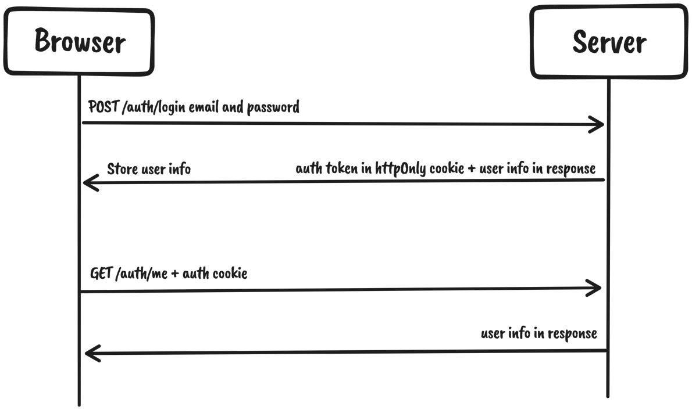

# Implementing User Authentication and Global Notifications

## Table of contents

- [📖 Resources](#resources)
- [📚 Other Useful resources](#other-useful-resources)
- [🎯 Learning Objectives](#learning-objectives)
- [📝 Notes](#notes)

## Resources

> ☞ TODO: Add resources links

## Other Useful resources

> ☞ TODO: Add resources links

## Learning Objectives

In the previous chapters, we configured the pages, created mocked APIs, and made the API calls from our application. However, the application still relies on test data when it comes to the authentication of the users in the admin dashboard.

- We will build the application’s authentication system, allowing users to authenticate and access protected resources in the admin dashboard.

- We will also be creating a toast notification system to provide feedback to users if an action happens that we want to notify them about.

**We will have learned how to authenticate users in our application and also how to handle the global application state with Zustand.**

## Notes

### Implementing the authentication system

Authentication is the process of identifying who the user on a platform is. In our application, we need to identify users when they access the admin dashboard.

#### Authentication system overview

We are going to authenticate the users with a token-based authentication system.

That means the `API will expect the user to send their authentication token with the request to access protected resources`.

Let’s take a look at the following diagram and the subsequent steps:



1. The user submits the login form with the credentials by creating a request to the /auth/login endpoint.

2. If the user exists and the credentials are valid, a response with the user data returns. In addition to the response data, we are also attaching an httpOnly cookie, which will be used from this point onward for authenticated requests.

3. Whenever the user authenticates, we will store the user object from the response in react-query’s cache and make it available to the application.

4. Since the authentication is cookie-based with httpOnly cookies, we do not need to handle the authentication token on the frontend. Any subsequent requests will include the token automatically.

5. Persisting user data on page refreshes will be handled by calling the /auth/me endpoint, which will fetch the user data and store it in the same react-query cache.

To implement this system, we need the following:

- Auth features (login, logout, and accessing the authenticated user)

- Protect resources that require the user to be authenticated

#### Building authentication features

We already have the endpoints implemented.

##### Logging in

To allow users to log in to the dashboard, we’ll require them to enter their email and password and submit the form.

To implement the login feature, we will need to make an API call to the login endpoint on the server. Let’s create the `src/features/auth/api/login.ts` file and add the following:

```ts
import { useMutation } from '@tanstack/react-query'
import { apiClient } from '@/lib/api-client'
import { queryClient } from '@/lib/react-query'
import { AuthUser, LoginData } from '../types'
export const login = (
  data: LoginData
): Promise<{
  user: AuthUser
}> => {
  return apiClient.post('/auth/login', data)
}
type UseLoginOptions = {
  onSuccess?: (user: AuthUser) => void
}
export const useLogin = ({ onSuccess }: UseLoginOptions = {}) => {
  const { mutate: submit, isLoading } = useMutation({
    mutationFn: login,
    onSuccess: ({ user }) => {
      queryClient.setQueryData(['auth-user'], user)
      onSuccess?.(user)
    },
  })
  return { submit, isLoading }
}
```

- We are defining the API request and the API mutation hook, allowing us to call the API from our application.

- Then, we can update the login form to make the API call. Let’s modify `src/features/auth/components/login-form/login-form.tsx`.

First, let’s import the useLogin hook:

```tsx
import { useLogin } from '../../api/login'
```

Then, inside the LoginForm component body, we want to `initialize the login mutation and submit it in the submit handler`:

```tsx
export const LoginForm = ({ onSuccess }: LoginFormProps) => {
  const login = useLogin({ onSuccess })
  const { register, handleSubmit, formState } = useForm<LoginData>()
  const onSubmit = (data: LoginData) => {
    login.submit(data)
  } // rest of the component body
}
```

We should also indicate that the action is being submitted by disabling the Submit button:

```tsx
<Button isLoading={login.isLoading} isDisabled={login.isLoading} type="submit">
    Log in
</Button>
```

When the form is submitted, it will call the login endpoint, which will authenticate the user if the credentials are valid.

##### Logging out

To implement the logout feature, we need to `call the logout endpoint`, which will `clear the auth cookie`. Let’s create the `src/features/auth/api/logout.ts` file and add the following:

### Implementing notifications
