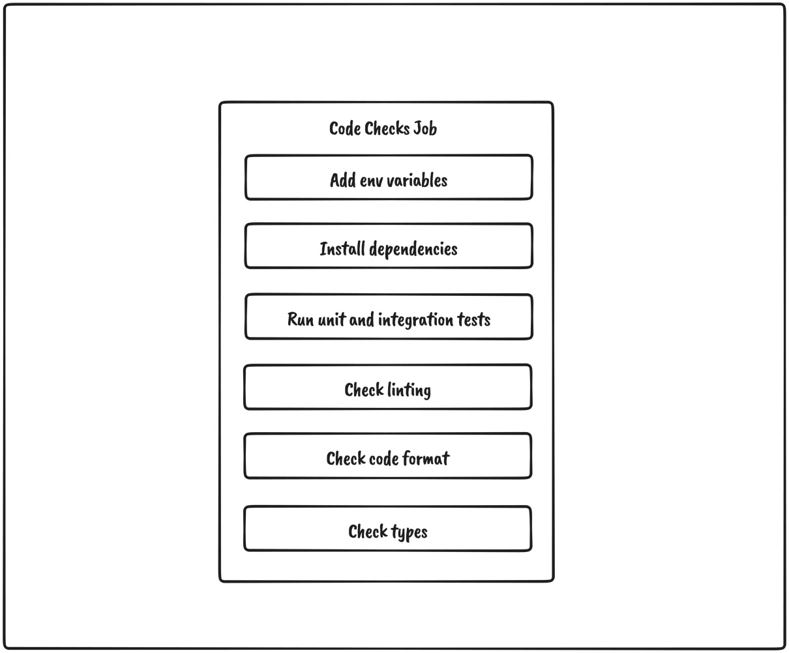

# Configuring CI/CD for Testing and Deployment

## Table of contents

- [📖 Resources](#resources)
- [📚 Other Useful resources](#other-useful-resources)
- [🎯 Learning Objectives](#learning-objectives)
- [📝 Notes](#notes)

## Resources

> ☞ TODO: Add resources links

## Other Useful resources

> ☞ TODO: Add resources links

## Learning Objectives

Our application is finally ready to go to production and meet its first users. We have built its features and implemented all the required checks, such as linting, testing, and so on, which will give us the confidence that the application code is working correctly.

However, `currently, all those checks must be executed on our local machine`. Whenever `we want to push a new feature to production, we need to run all the scripts and then redeploy the application manually, which is a very tedious process`.

- we will learn what CI/CD is.
- Then, we will learn what GitHub Actions is and what are the main parts of a GitHub Actions pipeline.
- We will then learn how to create a CI/CD pipeline that will automate the verification and deployment of the application to Vercel.

**We will know how to configure the CI/CD pipeline with GitHub Actions and deploy the application to Vercel.**

## Notes

### What is CI/CD?

Continuous integration/continuous deployment (CI/CD) is a method of `delivering application changes to its users in an automated way`. CI/CD should usually consist of the following parts :

- `Continuous Integration` is the automated process of verifying that the code has been built, tested, and merged into a repository
- `Continuous Delivery` means delivering changes to the repository
- `Continuous Deployment` means publishing the changes to the production server, where the changes are made available to the users

Now, let’s think about how we could implement CI/CD for our application. We already have all the parts – we just need to put them together. The process would work like this:

- Run all code checks for the application (unit and integration testing, linting, type checking, format checking, and so on)
- Build the application and run end-to-end tests
- If both processes finish successfully, we can deploy our application


This process will ensure our application is always in the best condition possible and that the changes get frequently and easily released to production. This is especially useful when working in larger teams where many changes are being introduced to the application on a daily basis.

To run the CI/CD pipeline, we need proper infrastructure. Since we keep the repository on GitHub, we can use GitHub Actions to handle CI/CD.

### Using GitHub Actions

GitHub Actions is a CI/CD tool that allows us to automate, build, test, and deploy pipelines. We can `create workflows that run on a specific event in the repository`.

To understand how it works, let’s have a look at some of its components in the following sections.

#### Workflows

A workflow is a `process that can run one or more jobs`. We can `define them in YAML format within the .github/workflows folder`. Workflows `can be run when a specified event is triggered`. We can also re-run workflows manually directly from GitHub. A repository can have as many workflows as we want.

### Events

An event, when fired, will cause the workflow to run. GitHub activities can trigger events, such as pushing to the repository or creating a pull request. Besides that, they can also be started on a schedule or via HTTP POST requests.

### Jobs

A job defines a series of steps that will be executed in a workflow. A step can be either an action or a script that can be executed.

A workflow can have many jobs that can run in parallel, or they can wait for dependent jobs to finish before starting.

### Actions

An action is an application that runs on GitHub Actions to perform a repetitive task. We can use already built actions available on `<https://github.com/marketplace?type=actions>`, or we can create our own. We will be using a couple of pre-made actions in our pipeline.

### Runners

A runner is a server that runs workflows when they get triggered. It can be hosted on GitHub, but it can also be self-hosted.

Now that we are familiar with the basics of GitHub Actions, we can start working on creating the workflow for our application.

Let’s create the `.github/workflows/main.yml` file and the initial code:

```yml
name: CI/CD
on:
  - push
jobs:
# add jobs here
```

- we are providing the name of the workflow. If we omit it, the name will be assigned to the name of the workflow file.

- Here, we are defining the push event, which will cause the workflow to run whenever code changes get pushed to the repository.

We will define the jobs in the following sections.

For every job we define, we will provide the following:

```yml
name: Name of the job
runs-on: ubuntu-latest
```

These properties will be common for all the jobs:

- name sets the name of the running job
- runs-on sets the runner, which will run the job

### Configuring the pipeline for testing

Our testing pipeline will consist of two jobs that should do the following:

- Run all code checks such as linting, type checking, unit and integration testing, and so on
- Build the application and run end-to-end tests

#### Code checks job

The code checks job should work as shown in the following diagram :



As we can see, the job should be straightforward:

- First, we need to provide environment variables to the application.
- Then, we need to install the dependencies.
- Next, we must run unit and integration tests.
- Then, we must run linting.
- After, we must check the code format.
- Finally, we must run type checking

Within jobs, let’s add the job that runs these tasks:

```yml
jobs:
  code-checks:
    name: Code Checks
    runs-on: ubuntu-latest
    steps:
      - uses: actions/checkout@v3
      - uses: actions/setup-node@v3
        with:
          node-version: 16
      - run: mv .env.example .env
      - run: npm install
      - run: npm run test
      - run: npm run lint
      - run: npm run format:check
      - run: npm run types:check
```

There are a couple of things worth mentioning about the job:

- We use the actions/checkout@v3 action from the marketplace to allow the job to access the repository
- We use the actions/setup-node action to configure which node version to run
- We execute the scripts to verify that everything works as expected

#### End-to-end testing job

Our second job related to testing is the end-to-end job, where we want to build the application and run the end-to-end tests we defined in the previous chapter.

It should work as shown in the following diagram:


As we can see, the job will work as follows:

- First, we need to add the environment variables.
- Then, the dependencies for the applications need to be installed.
- Then, we need to create the production build of the application.
- Finally, the production code gets end-to-end tested.

To implement this job, let’s add the following code:

```yml
jobs:
  # previous jobs
  e2e:
    name: E2E Tests
    runs-on: ubuntu-latest
    steps:
      - uses: actions/checkout@v3
      - run: mv .env.example .env
      - uses: cypress-io/github-action@v4
        with:
          build: npm run build
          start: npm run start
```

There are a couple of things worth mentioning about the job:

- We use the actions/checkout@v3 action to check out the repository.
- We use the cypress-io/github-action@v4 action, which will abstract away the end-to-end testing. It will install all dependencies, build the application, and then start and run all Cypress tests.

We configured the pipeline for running code checks such as linting, formatting, type checking, and testing, we can start working on deploying the application

### Configuring the pipeline for deploying to Vercel

When our testing jobs finish, we want to deploy the application to Vercel. To start deploying to Vercel from GitHub Actions, we need to do a couple of things:

- Have a Vercel account
- Disable GitHub integration for Vercel
- Link the project to Vercel
- Provide environment variables to GitHub Actions
- Create the job that will deploy the application

#### Have a Vercel account

Vercel is straightforward to get started with. Visit `<https://vercel.com/signup>` and create an account if you don’t have one.

#### Disable GitHub integration for Vercel

ercel is a platform that has excellent integration with GitHub out of the box. This means that whenever we push changes to the repository, a new version of the application will be deployed to Vercel automatically. However, in our case, we want to verify that our application works as expected before the deployment step so that we can perform this task from the CI/CD pipeline.

To do this, we need to disable GitHub integration in Vercel. This can be done by creating the vercel.json file with the following content:

```json
{
  "version": 2,
  "github": {
    "enabled": false
  }
}
```

#### Link the project to Vercel

Since we have disabled GitHub integration, we need to link the project in Vercel to our repository. This can be done by using the Vercel CLI.

Let’s execute the following command:

```sh
npx vercel
# The CLI will ask us a series of questions, as follows:
? Set up and deploy "~/web/project-name"? [Y/n] y
? Which scope do you want to deploy to? org-name
? Link to existing project? [y/N] n
? What's your project's name? project-name
? In which directory is your code located? ./
```

Once the CLI process finishes, the .vercel folder will be generated. It is a folder that should never be tracked by the repository. Inside the `.vercel/project.json` file, we will find our project credentials, as follows:

```json
{ "orgId": "example_org_id", "projectId": "example_project_id" }
```

#### Provide environment variables to GitHub Actions

For our pipeline, we need a couple of environment variables:

- `VERCEL_ORG_ID`, which we can get from the .vercel/project.json file
- `VERCEL_PROJECT_ID`, which we can also get from the .vercel/project.json file
- `VERCEL_TOKEN` which we can get from `<https://vercel.com/account/tokens>`

Once we have these values, we can add them to GitHub Actions for our project:


#### Create the job that will deploy the application

Now that everything has been set, we can start working on the job that will do all the work. We can see how it should work in the following diagram:


As we can see, it will go through a couple of steps:

- Check the repository owner since we do not want to deploy if the workflow is triggered from a repository fork.
- Set the deployment status to start.
- Deploy to Vercel.
- Set the deployment status to finish.

Let’s add the deploy job to the workflow file, below the other jobs we defined previously:

```yml
jobs:
  # previous jobs
  deploy:
    name: Deploy To Vercel
    runs-on: ubuntu-latest
    needs: [code-checks, e2e]
    if: github.repository_owner == 'my-username'
    permissions:
      contents: read
      deployments: write
    steps:
      - name: start deployment
        uses: bobheadxi/deployments@v1
        id: deployment
        with:
          step: start
          token: ${{ secrets.GITHUB_TOKEN }}
          env: ${{ fromJSON('["Production", "Preview"]')
            [github.ref != 'refs/heads/master'] }}
      - uses: actions/checkout@v3
      - run: mv .env.example .env
      - uses: amondnet/vercel-action@v25
        with:
          vercel-token: ${{ secrets.VERCEL_TOKEN }}
          vercel-args: ${{ fromJSON('["--prod", ""]')
            [github.ref != 'refs/heads/master'] }}
          vercel-org-id: ${{ secrets.VERCEL_ORG_ID}}
          vercel-project-id: ${{ secrets.
            VERCEL_PROJECT_ID}}
          scope: ${{ secrets.VERCEL_ORG_ID}}
          working-directory: ./
      - name: update deployment status
        uses: bobheadxi/deployments@v1
        if: always()
        with:
          step: finish
          token: ${{ secrets.GITHUB_TOKEN }}
          status: ${{ job.status }}
          env: ${{ steps.deployment.outputs.env }}
          deployment_id: ${{ steps.deployment.outputs.
            deployment_id }}
```

- We set this job to depend on the previous two by adding needs: [code-checks, e2e]. This means that this job will wait until those jobs complete successfully before starting. If some of those jobs fail, this job will never run.
- With if: github.repository_owner == 'my-username', we check if the repository owner is the owner of the project. This check should prevent repository forks from deploying the application.
- We are using the bobheadxi/deployments@v1 action before and after the deploying task to update the deployment status in GitHub.
- We are using the amondnet/vercel-action@v25 action to deploy to Vercel. Depending on which branch got updated, it will be deployed either to a preview or production environment.

Our pipeline should look like this:


We can track the deployment status of each environment in the bottom-right corner of the repository page:


Awesome! Our application is now in production and available for users. Configuring the pipeline might take a bit more effort initially, but it saves a lot of time in the long run as we don’t have to worry about all these steps. They all just got automated.

### Summary

In this chapter, we learned that a CI/CD pipeline is a process that allows the automation of code changes and delivery. We also got introduced to GitHub Actions and the parts that allow us to create the CI/CD pipeline to automate testing and deploying our application.

After that, we defined three jobs for the workflow. With these jobs, we automated the process of running all the required checks, tests, and deployments. Finally, we learned how to deploy to Vercel from the CI/CD pipeline and deliver the application to the users.

This concludes the MVP version of our application
